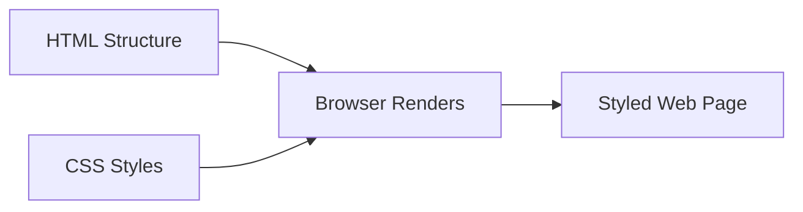
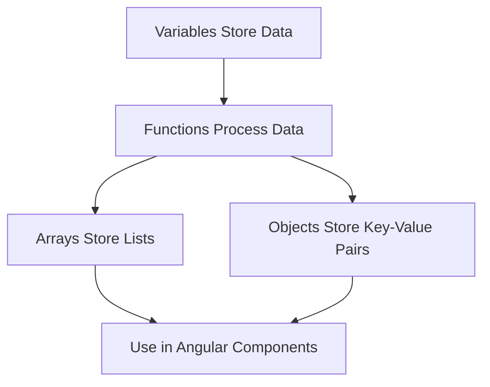
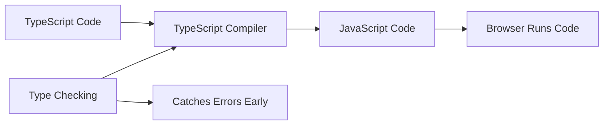
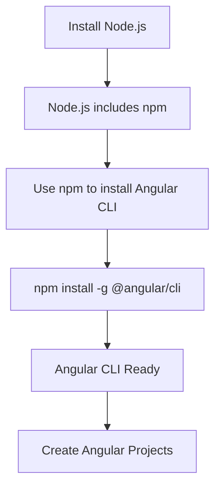
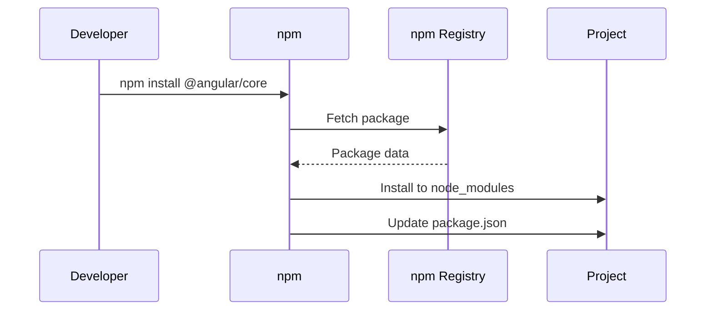

# 0) Before Angular (must-have basics)

[← Back to Overview](./overview.md) | [Next: Setup & Installation →](./01-setup-and-installation.md)

---

### HTML/CSS Basics — structure + styling of UI

**Explanation:**
HTML (HyperText Markup Language) provides the structure of web pages, while CSS (Cascading Style Sheets) controls the visual appearance. In Angular, you'll write HTML templates and CSS styles for your components.

**Key Concepts:**
- HTML elements: `<div>`, `<button>`, `<input>`, `<p>`, etc.
- CSS selectors: classes (`.class-name`), IDs (`#id-name`), element selectors
- CSS properties: `color`, `margin`, `padding`, `display`, `flexbox`, `grid`

**Code Sample:**
```html
<!-- HTML Structure -->
<div class="container">
  <h1>Welcome</h1>
  <button class="btn-primary">Click Me</button>
</div>
```

```css
/* CSS Styling */
.container {
  padding: 20px;
  background-color: #f0f0f0;
}

.btn-primary {
  background-color: #007bff;
  color: white;
  padding: 10px 20px;
  border: none;
  border-radius: 4px;
}
```

**Flow Diagram:**


---

### JavaScript Fundamentals — variables, functions, arrays, objects

**Explanation:**
JavaScript is the programming language that adds interactivity to web pages. Angular is built with TypeScript (which compiles to JavaScript), so understanding JavaScript fundamentals is essential.

**Key Concepts:**
- Variables: `let`, `const`, `var`
- Functions: regular functions, arrow functions
- Arrays: `[1, 2, 3]` with methods like `map()`, `filter()`, `forEach()`
- Objects: `{ name: 'John', age: 30 }` for storing related data

**Code Sample:**
```javascript
// Variables
let userName = "John";
const age = 30;

// Functions
function greet(name) {
  return `Hello, ${name}!`;
}

// Arrow function (common in Angular)
const greetArrow = (name) => `Hello, ${name}!`;

// Arrays
const numbers = [1, 2, 3, 4, 5];
const doubled = numbers.map(n => n * 2); // [2, 4, 6, 8, 10]

// Objects
const user = {
  name: "John",
  age: 30,
  email: "john@example.com"
};
```

**Data Flow:**


---

### TypeScript Basics — typed JavaScript used in Angular (interfaces, types, classes)

**Explanation:**
TypeScript adds type safety to JavaScript. Angular uses TypeScript to catch errors early and make code more maintainable. Key features include interfaces (shape of objects), types (custom type definitions), and classes (blueprints for objects).

**Key Concepts:**
- Types: `string`, `number`, `boolean`, `any`, `void`
- Interfaces: define object shapes
- Classes: object-oriented programming with constructors and methods
- Type annotations: `let name: string = "John"`

**Code Sample:**
```typescript
// Basic Types
let name: string = "John";
let age: number = 30;
let isActive: boolean = true;

// Interface (defines object shape)
interface User {
  id: number;
  name: string;
  email: string;
  isActive?: boolean; // Optional property
}

// Using interface
const user: User = {
  id: 1,
  name: "John",
  email: "john@example.com"
};

// Class
class UserService {
  private users: User[] = [];

  addUser(user: User): void {
    this.users.push(user);
  }

  getUsers(): User[] {
    return this.users;
  }
}
```

**TypeScript Flow:**


---

### Node.js + npm — runtime + package manager needed to install Angular tooling

**Explanation:**
Node.js is a JavaScript runtime that runs on your computer (not just in the browser). npm (Node Package Manager) is used to install and manage Angular and other JavaScript libraries. Angular CLI requires Node.js to run.

**Key Concepts:**
- Node.js: executes JavaScript outside the browser
- npm: package manager for installing libraries
- `package.json`: lists project dependencies
- `node_modules/`: folder containing installed packages

**Installation Flow:**


**Code Sample:**
```bash
# Check if Node.js is installed
node --version

# Check if npm is installed
npm --version

# Install Angular CLI globally
npm install -g @angular/cli

# Verify installation
ng version
```

**Package Management Flow:**


---

[← Back to Overview](./overview.md) | [Next: Setup & Installation →](./01-setup-and-installation.md)