# 2) Angular Core Concepts (What/Why)

[← Previous: Setup & Installation](./01-setup-and-installation.md) | [Next: Basic Syntax in Templates (Daily-use) →](./03-basic-syntax-in-templates-daily-use.md)

---

### What is Angular? — a framework to build large, structured web apps

**Explanation:**
Angular is a comprehensive framework (not just a library) for building dynamic, single-page web applications. It provides structure, tools, and patterns to create maintainable, scalable applications.

**Key Features:**
- Component-based architecture
- Two-way data binding
- Dependency injection
- Built-in routing
- TypeScript support
- CLI tooling

**Angular vs Other Frameworks:**
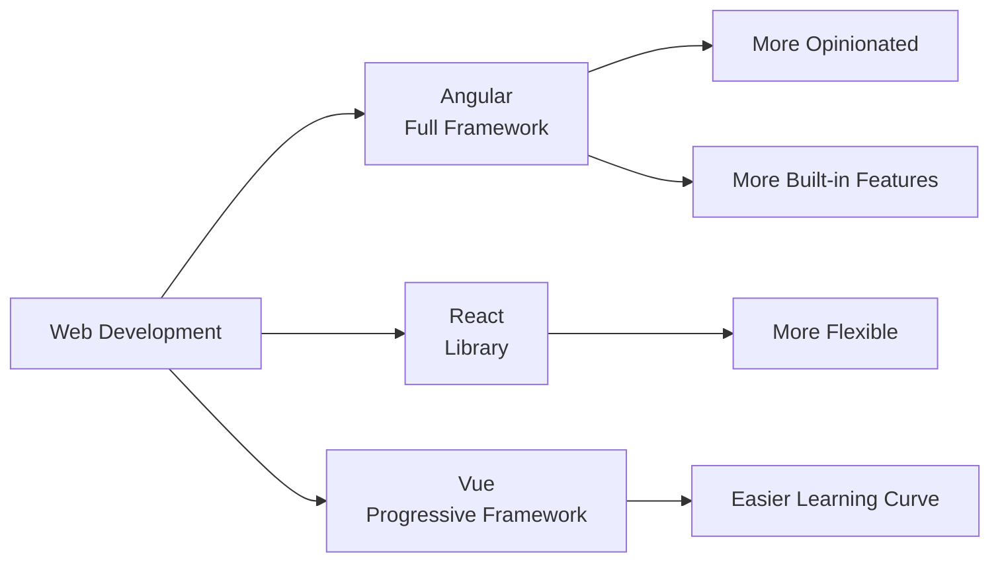

**Angular Architecture:**
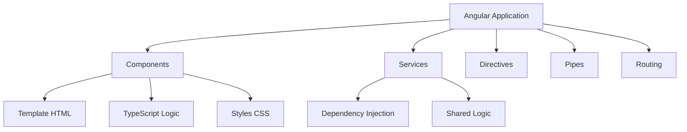

---

### SPA (Single Page App) — app runs in browser; routing swaps views without full reload

**Explanation:**
A Single Page Application (SPA) loads once and dynamically updates content without full page reloads. Angular handles routing client-side, making navigation fast and smooth.

**Traditional vs SPA:**
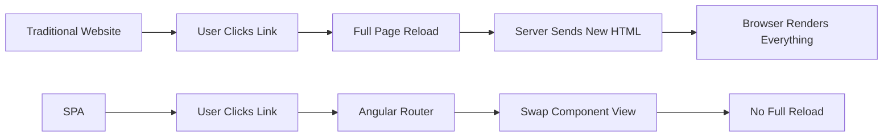

**SPA Flow:**
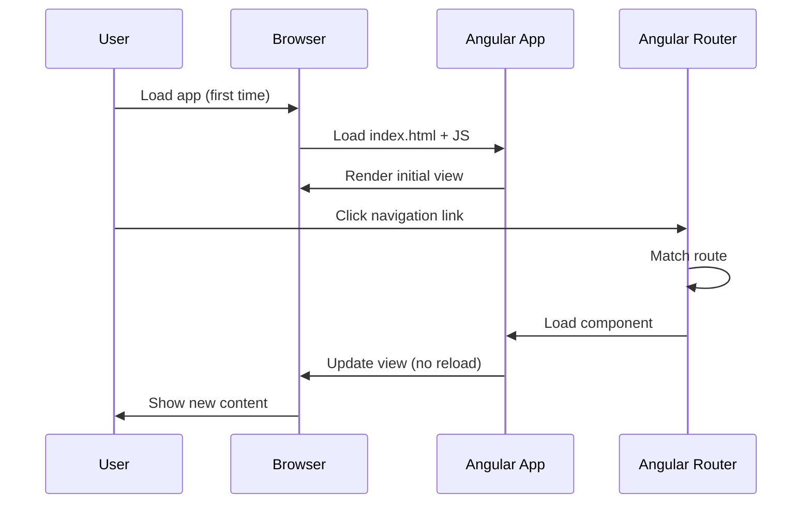

**Code Sample - SPA Routing:**
```typescript
// app.config.ts - Configure routes
import { ApplicationConfig } from '@angular/core';
import { provideRouter } from '@angular/router';
import { routes } from './app.routes';

export const appConfig: ApplicationConfig = {
  providers: [
    provideRouter(routes) // Enables SPA routing
  ]
};
```

```typescript
// app.routes.ts - Define routes
import { Routes } from '@angular/router';
import { HomeComponent } from './home/home.component';
import { AboutComponent } from './about/about.component';

export const routes: Routes = [
  { path: '', component: HomeComponent },
  { path: 'about', component: AboutComponent }
];
```

---

### Modules vs Standalone — ways to organize features (modern Angular prefers standalone)

**Explanation:**
Angular offers two ways to organize code: NgModules (traditional) and Standalone components (modern). Standalone is the recommended approach in Angular 14+ as it's simpler and more flexible.

**Comparison:**
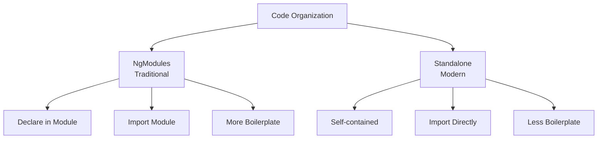

**Module vs Standalone Flow:**
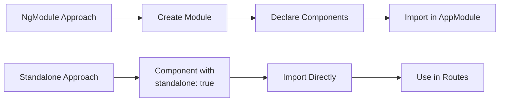

**Code Sample - NgModule (Traditional):**
```typescript
// app.module.ts (NgModules - older approach)
import { NgModule } from '@angular/core';
import { BrowserModule } from '@angular/platform-browser';
import { AppComponent } from './app.component';
import { UserComponent } from './user/user.component';

@NgModule({
  declarations: [AppComponent, UserComponent],
  imports: [BrowserModule],
  providers: [],
  bootstrap: [AppComponent]
})
export class AppModule { }
```

**Code Sample - Standalone (Modern):**
```typescript
// app.component.ts (Standalone - recommended)
import { Component } from '@angular/core';
import { CommonModule } from '@angular/common';
import { UserComponent } from './user/user.component';

@Component({
  selector: 'app-root',
  standalone: true, // Standalone component
  imports: [CommonModule, UserComponent], // Import what you need
  templateUrl: './app.component.html',
  styleUrls: ['./app.component.css']
})
export class AppComponent {
  title = 'My App';
}
```

---

### Component — reusable UI block (HTML + TS + CSS)

**Explanation:**
A component is the fundamental building block of Angular applications. It combines HTML (template), TypeScript (logic), and CSS (styles) into a reusable, self-contained unit.

**Component Structure:**
```mermaid
graph TD
    A[Component] --> B[TypeScript File<br/>.component.ts]
    A --> C[Template File<br/>.component.html]
    A --> D[Style File<br/>.component.css]
    
    B --> E[Class with Logic]
    B --> F[@Component Decorator]
    
    C --> G[HTML with Angular Syntax]
    
    D --> H[Scoped Styles]
```

**Component Lifecycle:**
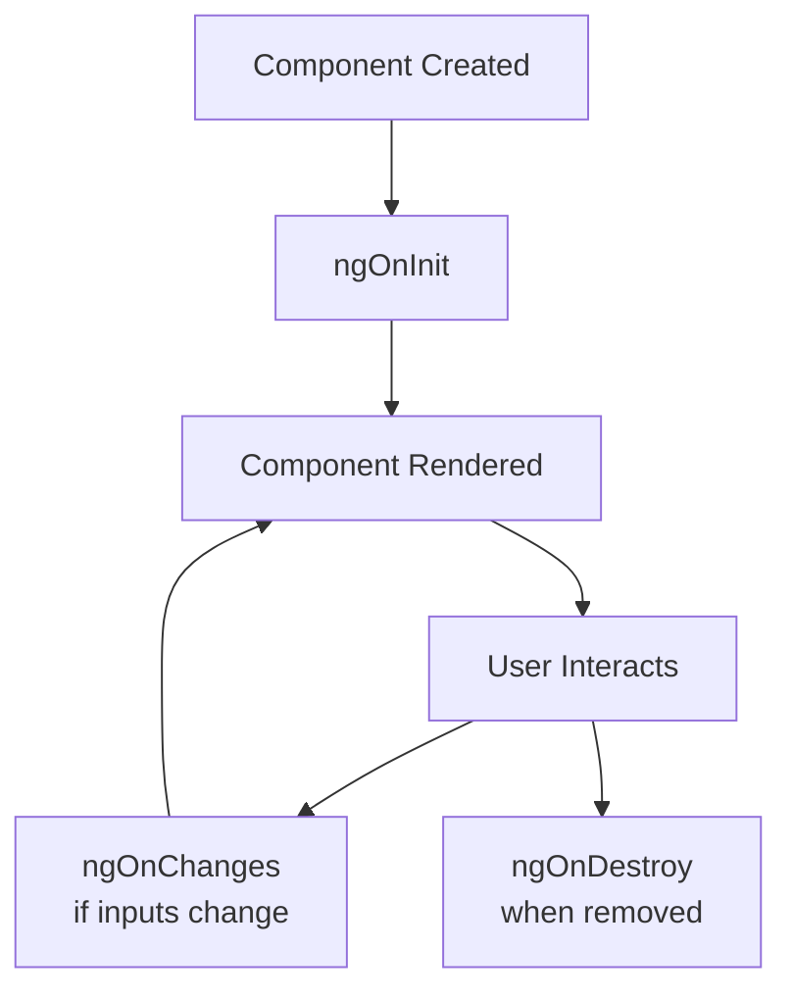

**Code Sample - Complete Component:**
```typescript
// user.component.ts
import { Component, Input, OnInit } from '@angular/core';

@Component({
  selector: 'app-user',
  standalone: true,
  templateUrl: './user.component.html',
  styleUrls: ['./user.component.css']
})
export class UserComponent implements OnInit {
  @Input() userName: string = '';
  @Input() userAge: number = 0;

  ngOnInit(): void {
    console.log('Component initialized');
  }

  greet(): string {
    return `Hello, ${this.userName}!`;
  }
}
```

```html
<!-- user.component.html -->
<div class="user-card">
  <h2>{{ userName }}</h2>
  <p>Age: {{ userAge }}</p>
  <p>{{ greet() }}</p>
  <button (click)="onClick()">Click Me</button>
</div>
```

```css
/* user.component.css */
.user-card {
  border: 1px solid #ccc;
  padding: 20px;
  border-radius: 8px;
  margin: 10px;
}

.user-card h2 {
  color: #333;
}
```

**Component Usage Flow:**
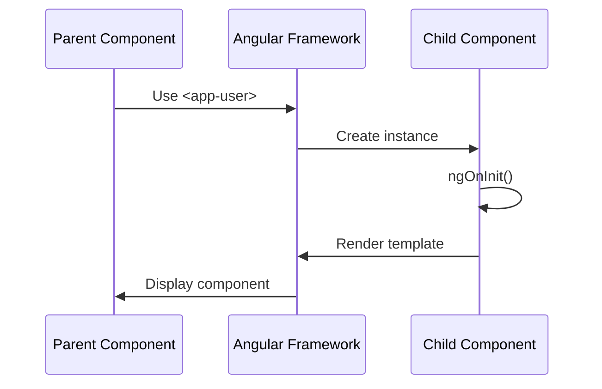

---

### Template — HTML with Angular syntax

**Explanation:**
A template is HTML enhanced with Angular-specific syntax like interpolation `{{ }}`, property binding `[ ]`, event binding `( )`, and directives like `*ngIf` and `*ngFor`.

**Template Features:**
```mermaid
graph LR
    A[Template] --> B[Interpolation<br/>{{ value }}]
    A --> C[Property Binding<br/>[property]]
    A --> D[Event Binding<br/>(event)]
    A --> E[Directives<br/>*ngIf, *ngFor]
    A --> F[Pipes<br/>| pipe]
```

**Template Processing Flow:**
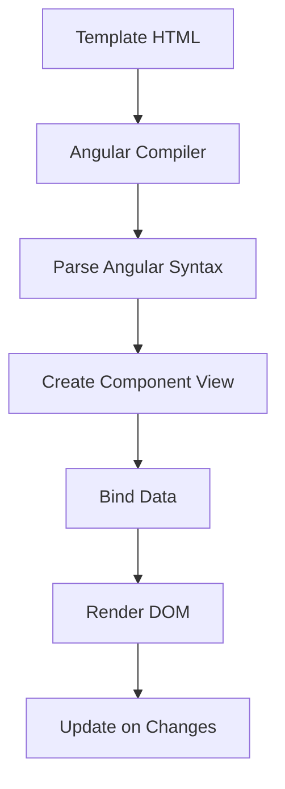

**Code Sample:**
```html
<!-- Example template with various Angular features -->
<div class="container">
  <!-- Interpolation -->
  <h1>Welcome, {{ userName }}!</h1>
  
  <!-- Property Binding -->
  
  <button [disabled]="isLoading">Submit</button>
  
  <!-- Event Binding -->
  <button (click)="handleClick()">Click Me</button>
  <input (input)="onInput($event)">
  
  <!-- Structural Directives -->
  <div *ngIf="isVisible">This is visible</div>
  <ul>
    <li *ngFor="let item of items">{{ item.name }}</li>
  </ul>
  
  <!-- Pipes -->
  <p>Date: {{ currentDate | date:'short' }}</p>
  <p>Price: {{ price | currency:'USD' }}</p>
</div>
```

---

### Decorator — metadata like @Component() that tells Angular how to use a class

**Explanation:**
Decorators are special functions that add metadata to classes, methods, or properties. The `@Component()` decorator tells Angular that a class is a component and provides configuration.

**Decorator Types:**
```mermaid
graph TD
    A[Decorators] --> B[@Component<br/>Marks as Component]
    A --> C[@Injectable<br/>Marks as Service]
    A --> D[@Input<br/>Accepts Parent Data]
    A --> E[@Output<br/>Emits Events]
    A --> F[@Directive<br/>Marks as Directive]
```

**Decorator Flow:**
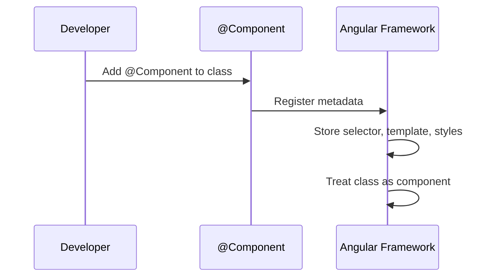

**Code Sample:**
```typescript
import { Component, Input, Output, EventEmitter } from '@angular/core';

// @Component decorator provides metadata
@Component({
  selector: 'app-button',        // How to use in HTML: <app-button>
  templateUrl: './button.component.html',  // Template file
  styleUrls: ['./button.component.css'],   // Style files
  standalone: true
})
export class ButtonComponent {
  // @Input decorator - accepts data from parent
  @Input() label: string = 'Click';
  @Input() disabled: boolean = false;

  // @Output decorator - emits events to parent
  @Output() clicked = new EventEmitter<void>();

  onClick(): void {
    if (!this.disabled) {
      this.clicked.emit();
    }
  }
}
```

**Decorator Metadata Structure:**
```mermaid
graph LR
    A[@Component] --> B[selector]
    A --> C[templateUrl]
    A --> D[styleUrls]
    A --> E[standalone]
    A --> F[imports]
    
    B --> G[HTML Tag Name]
    C --> H[Template File]
    D --> I[Style Files]
```

---

### Data Binding — connect TS data to UI (sync between logic and template)

**Explanation:**
Data binding creates a connection between component data (TypeScript) and the template (HTML). Angular supports one-way and two-way binding to keep the UI and data synchronized.

**Binding Types:**
```mermaid
graph TD
    A[Data Binding] --> B[One-Way Binding]
    A --> C[Two-Way Binding]
    
    B --> D[TS → HTML<br/>Interpolation {{ }}]
    B --> E[TS → HTML<br/>Property [ ]]
    B --> F[HTML → TS<br/>Event ( )]
    
    C --> G[TS ↔ HTML<br/>[(ngModel)]]
```

**Data Binding Flow:**
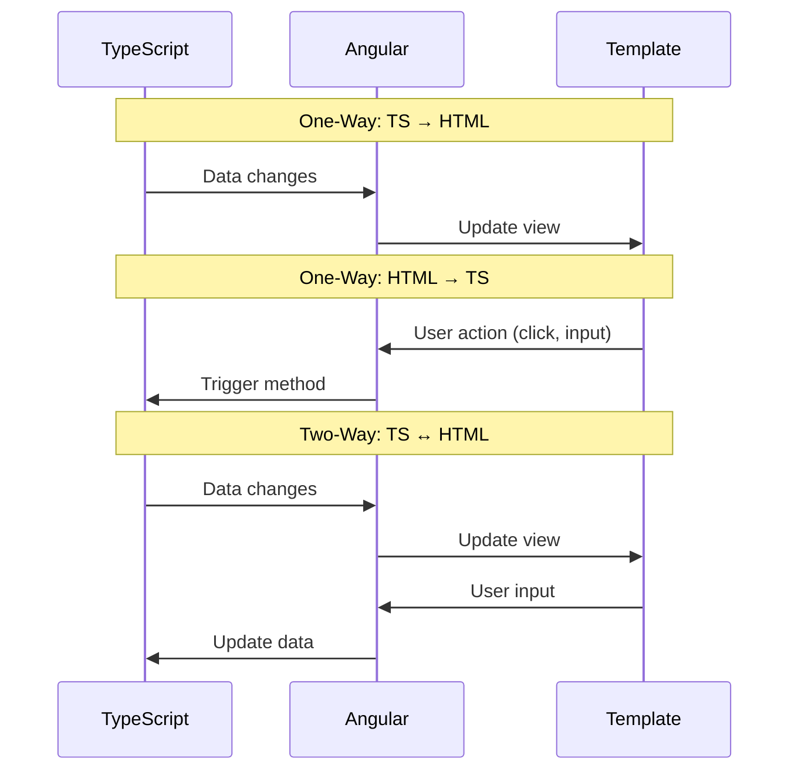

**Code Sample - All Binding Types:**
```typescript
// component.ts
export class DataBindingComponent {
  // One-way: TS → HTML
  title: string = 'Hello Angular';
  imageUrl: string = 'assets/logo.png';
  isActive: boolean = true;
  
  // Two-way binding data
  userName: string = 'John';
  
  // Event handler
  onClick(): void {
    console.log('Button clicked!');
    this.isActive = !this.isActive;
  }
  
  onInput(event: Event): void {
    const input = event.target as HTMLInputElement;
    console.log('Input value:', input.value);
  }
}
```

```html
<!-- component.html -->
<div>
  <!-- Interpolation: TS → HTML -->
  <h1>{{ title }}</h1>
  
  <!-- Property Binding: TS → HTML -->
  
  <button [disabled]="!isActive">Submit</button>
  
  <!-- Event Binding: HTML → TS -->
  <button (click)="onClick()">Toggle</button>
  <input (input)="onInput($event)">
  
  <!-- Two-Way Binding: TS ↔ HTML -->
  <input [(ngModel)]="userName">
  <p>You typed: {{ userName }}</p>
</div>
```

**Change Detection Flow:**
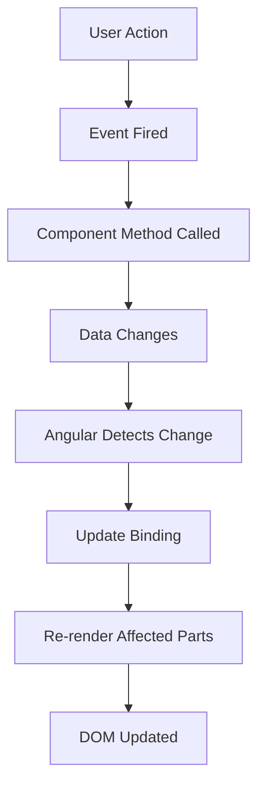

---

[← Previous: Setup & Installation](./01-setup-and-installation.md) | [Next: Basic Syntax in Templates (Daily-use) →](./03-basic-syntax-in-templates-daily-use.md)