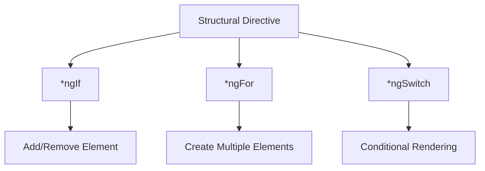
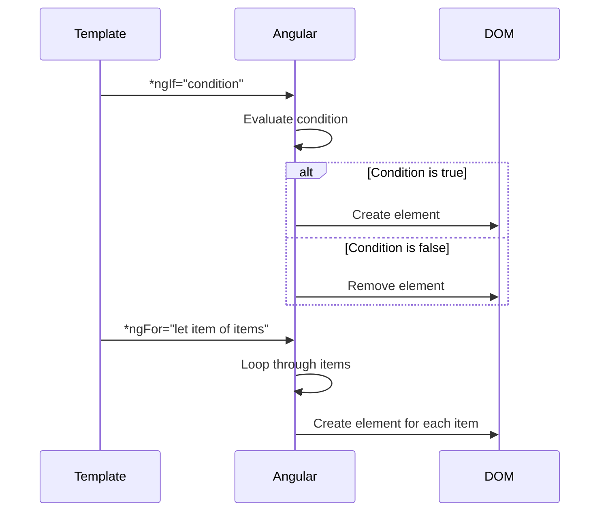
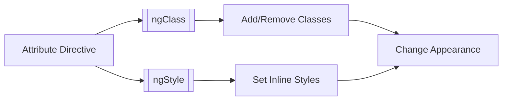
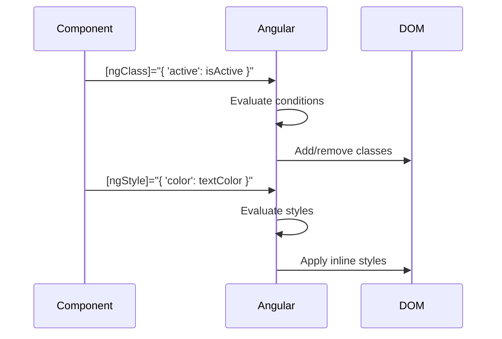
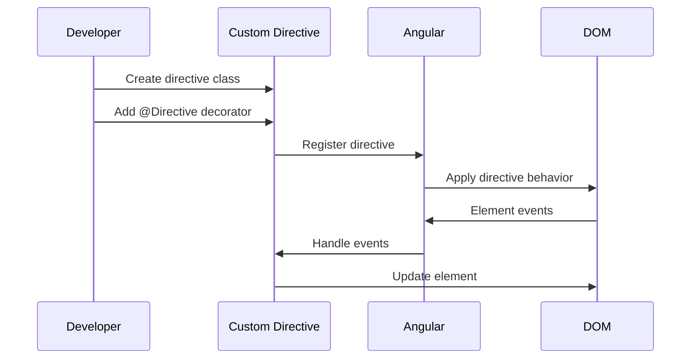
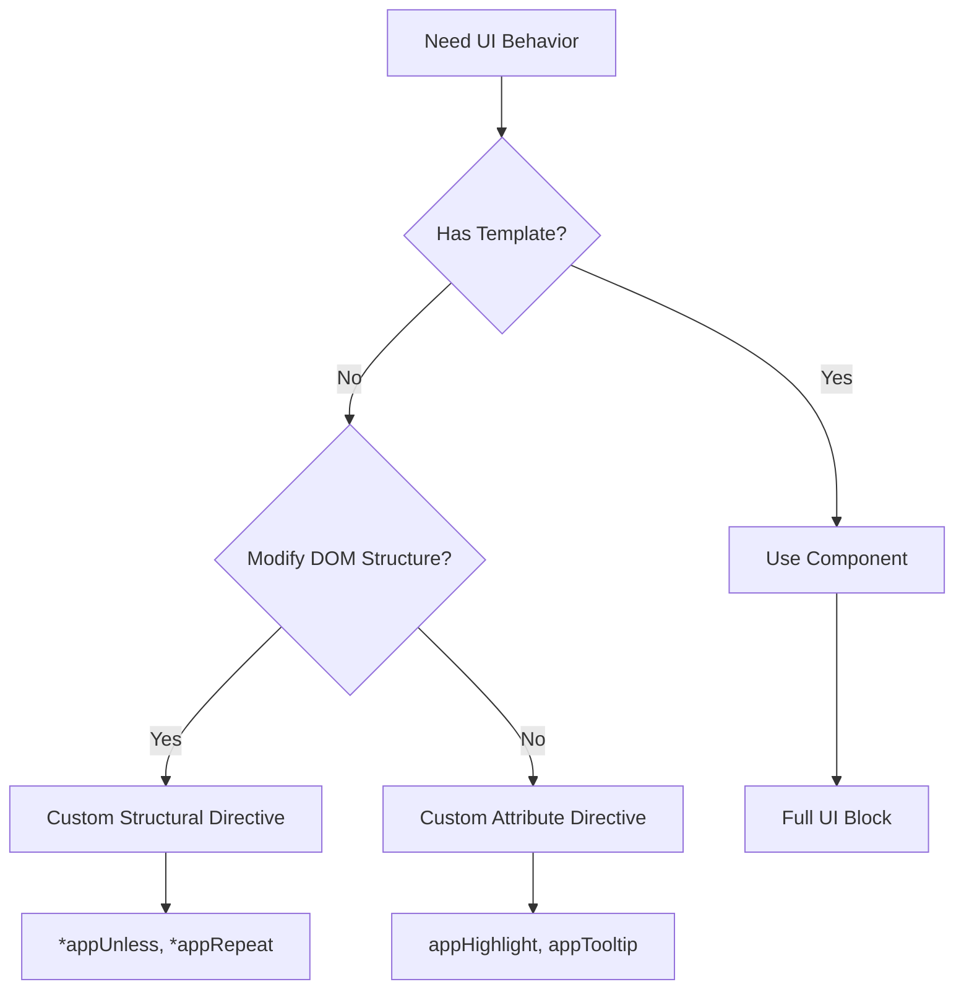

# 4) Directives (Control the UI)

[← Previous: Basic Syntax in Templates (Daily-use)](./03-basic-syntax-in-templates-daily-use.md) | [Next: Components Communication (How components talk) →](./05-components-communication-how-components-talk.md)

---

### Structural Directives — change DOM structure (*ngIf, *ngFor, *ngSwitch)

**Explanation:**
Structural directives change the DOM structure by adding, removing, or manipulating elements. They use the `*` prefix and are the most powerful directives in Angular.

**Key Structural Directives:**
- `*ngIf` - Conditionally add/remove elements
- `*ngFor` - Loop through arrays to create elements
- `*ngSwitch` - Multi-conditional rendering

**Structural Directive Flow:**


**Code Sample - *ngIf:**
```typescript
// component.ts
export class NgIfComponent {
  isLoggedIn: boolean = true;
  userRole: string = 'admin';
  items: any[] = [];
  
  toggleLogin(): void {
    this.isLoggedIn = !this.isLoggedIn;
  }
}
```

```html
<!-- component.html -->
<div>
  <!-- Basic *ngIf -->
  <div *ngIf="isLoggedIn">
    <p>Welcome! You are logged in.</p>
  </div>
  
  <!-- *ngIf with else -->
  <div *ngIf="isLoggedIn; else loginPrompt">
    <p>Dashboard content</p>
  </div>
  <ng-template #loginPrompt>
    <p>Please log in to continue.</p>
  </ng-template>
  
  <!-- *ngIf with then/else -->
  <div *ngIf="isLoggedIn; then loggedIn; else loggedOut"></div>
  <ng-template #loggedIn>
    <p>User is logged in</p>
  </ng-template>
  <ng-template #loggedOut>
    <p>User is logged out</p>
  </ng-template>
  
  <!-- Check array length -->
  <div *ngIf="items.length > 0">
    <p>You have {{ items.length }} items</p>
  </div>
</div>
```

**Code Sample - *ngFor:**
```typescript
// component.ts
export class NgForComponent {
  users: { id: number; name: string; email: string }[] = [
    { id: 1, name: 'John', email: 'john@example.com' },
    { id: 2, name: 'Jane', email: 'jane@example.com' },
    { id: 3, name: 'Bob', email: 'bob@example.com' }
  ];
  
  items: string[] = ['Apple', 'Banana', 'Cherry'];
  
  trackByUserId(index: number, user: any): number {
    return user.id;
  }
}
```

```html
<!-- component.html -->
<div>
  <!-- Basic *ngFor -->
  <ul>
    <li *ngFor="let item of items">{{ item }}</li>
  </ul>
  
  <!-- *ngFor with index -->
  <ul>
    <li *ngFor="let user of users; let i = index">
      {{ i + 1 }}. {{ user.name }} - {{ user.email }}
    </li>
  </ul>
  
  <!-- *ngFor with trackBy (performance optimization) -->
  <ul>
    <li *ngFor="let user of users; trackBy: trackByUserId">
      {{ user.name }}
    </li>
  </ul>
  
  <!-- *ngFor with first, last, even, odd -->
  <div *ngFor="let user of users; let first = first; let last = last; let even = even; let odd = odd"
       [class.first]="first"
       [class.last]="last"
       [class.even]="even"
       [class.odd]="odd">
    {{ user.name }}
  </div>
  
  <!-- Nested *ngFor -->
  <div *ngFor="let user of users">
    <h3>{{ user.name }}</h3>
    <ul>
      <li *ngFor="let item of items">{{ item }}</li>
    </ul>
  </div>
</div>
```

**Code Sample - *ngSwitch:**
```typescript
// component.ts
export class NgSwitchComponent {
  status: string = 'active';
  userRole: string = 'admin';
  
  changeStatus(newStatus: string): void {
    this.status = newStatus;
  }
}
```

```html
<!-- component.html -->
<div>
  <!-- Basic *ngSwitch -->
  <div [ngSwitch]="status">
    <p *ngSwitchCase="'active'">Status: Active</p>
    <p *ngSwitchCase="'inactive'">Status: Inactive</p>
    <p *ngSwitchCase="'pending'">Status: Pending</p>
    <p *ngSwitchDefault>Status: Unknown</p>
  </div>
  
  <!-- *ngSwitch with user roles -->
  <div [ngSwitch]="userRole">
    <div *ngSwitchCase="'admin'">
      <h2>Admin Dashboard</h2>
      <button>Delete User</button>
      <button>Manage Settings</button>
    </div>
    <div *ngSwitchCase="'user'">
      <h2>User Dashboard</h2>
      <button>View Profile</button>
    </div>
    <div *ngSwitchCase="'guest'">
      <h2>Guest View</h2>
      <p>Please log in for full access</p>
    </div>
    <div *ngSwitchDefault>
      <p>Invalid role</p>
    </div>
  </div>
</div>
```

**Structural Directive Processing Flow:**


---

### Attribute Directives — change look/behavior ([ngClass], [ngStyle])

**Explanation:**
Attribute directives change the appearance or behavior of existing elements without changing the DOM structure. They modify element properties, classes, or styles.

**Key Attribute Directives:**
- `[ngClass]` - Dynamically add/remove CSS classes
- `[ngStyle]` - Dynamically set inline styles

**Attribute Directive Flow:**


**Code Sample - [ngClass]:**
```typescript
// component.ts
export class NgClassComponent {
  isActive: boolean = true;
  isDisabled: boolean = false;
  currentTheme: string = 'dark';
  status: 'success' | 'error' | 'warning' = 'success';
  
  toggleActive(): void {
    this.isActive = !this.isActive;
  }
}
```

```html
<!-- component.html -->
<div>
  <!-- [ngClass] with object syntax -->
  <button [ngClass]="{ 'active': isActive, 'disabled': isDisabled }">
    Click Me
  </button>
  
  <!-- [ngClass] with string -->
  <div [ngClass]="currentTheme">
    Themed content
  </div>
  
  <!-- [ngClass] with array -->
  <div [ngClass]="['base-class', 'additional-class', status]">
    Multiple classes
  </div>
  
  <!-- [ngClass] with conditional object -->
  <div [ngClass]="{
    'success': status === 'success',
    'error': status === 'error',
    'warning': status === 'warning'
  }">
    Status message
  </div>
  
  <!-- Combining with class binding -->
  <div class="base" 
       [ngClass]="{ 'highlight': isActive }"
       [class.special]="isActive">
    Combined classes
  </div>
</div>
```

```css
/* component.css */
.active {
  background-color: #007bff;
  color: white;
}

.disabled {
  opacity: 0.5;
  cursor: not-allowed;
}

.success {
  background-color: #28a745;
  color: white;
}

.error {
  background-color: #dc3545;
  color: white;
}

.warning {
  background-color: #ffc107;
  color: black;
}
```

**Code Sample - [ngStyle]:**
```typescript
// component.ts
export class NgStyleComponent {
  fontSize: number = 16;
  textColor: string = 'black';
  backgroundColor: string = 'white';
  isHighlighted: boolean = false;
  
  dynamicStyles: { [key: string]: string } = {
    'color': 'blue',
    'font-weight': 'bold',
    'text-decoration': 'underline'
  };
}
```

```html
<!-- component.html -->
<div>
  <!-- [ngStyle] with object syntax -->
  <p [ngStyle]="{ 'font-size': fontSize + 'px', 'color': textColor }">
    Dynamic styled text
  </div>
  
  <!-- [ngStyle] with conditional styles -->
  <div [ngStyle]="{
    'background-color': isHighlighted ? 'yellow' : 'transparent',
    'padding': isHighlighted ? '10px' : '0px'
  }">
    Conditional styling
  </div>
  
  <!-- [ngStyle] with property object -->
  <div [ngStyle]="dynamicStyles">
    Predefined styles
  </div>
  
  <!-- Individual style properties -->
  <div [style.color]="textColor"
       [style.font-size.px]="fontSize"
       [style.background-color]="backgroundColor">
    Individual properties
  </div>
  
  <!-- Combining ngStyle with ngClass -->
  <div [ngClass]="{ 'card': true }"
       [ngStyle]="{ 'border': '1px solid #ccc', 'border-radius': '8px' }">
    Combined styling
  </div>
</div>
```

**Attribute Directive Processing Flow:**


---

### Built-in vs Custom Directive — when you create your own UI behavior

**Explanation:**
Angular provides built-in directives, but you can create custom directives to add specific behaviors to elements. Custom directives are useful for reusable UI behaviors that don't need a full component.

**When to Use Custom Directives:**
- Reusable behavior without template
- DOM manipulation
- Event handling patterns
- Shared styling logic

**Directive Types Comparison:**
```mermaid
graph TD
    A[Directives] --> B[Built-in Directives]
    A --> C[Custom Directives]
    
    B --> D[*ngIf, *ngFor, *ngSwitch]
    B --> E[[ngClass], [ngStyle]]
    
    C --> F[Attribute Directives]
    C --> G[Structural Directives]
    
    F --> H[Modify Element]
    G --> I[Change DOM Structure]
```

**Code Sample - Custom Attribute Directive:**
```typescript
// highlight.directive.ts
import { Directive, ElementRef, Input, OnInit, OnDestroy, Renderer2 } from '@angular/core';

@Directive({
  selector: '[appHighlight]',
  standalone: true
})
export class HighlightDirective implements OnInit, OnDestroy {
  @Input() appHighlight: string = 'yellow';
  @Input() defaultColor: string = 'transparent';
  
  private mouseEnterListener?: () => void;
  private mouseLeaveListener?: () => void;
  
  constructor(
    private el: ElementRef,
    private renderer: Renderer2
  ) {}
  
  ngOnInit(): void {
    this.setBackgroundColor(this.defaultColor);
  }
  
  ngOnDestroy(): void {
    // Clean up listeners if needed
  }
  
  @HostListener('mouseenter') onMouseEnter(): void {
    this.setBackgroundColor(this.appHighlight || 'yellow');
  }
  
  @HostListener('mouseleave') onMouseLeave(): void {
    this.setBackgroundColor(this.defaultColor);
  }
  
  private setBackgroundColor(color: string): void {
    this.renderer.setStyle(this.el.nativeElement, 'background-color', color);
  }
}
```

```typescript
// component.ts
import { HighlightDirective } from './highlight.directive';

@Component({
  standalone: true,
  imports: [HighlightDirective],
  // ...
})
export class MyComponent { }
```

```html
<!-- component.html -->
<div>
  <!-- Using custom directive -->
  <p appHighlight="yellow" defaultColor="transparent">
    Hover over me to highlight
  </p>
  
  <div appHighlight="lightblue" defaultColor="white">
    Another highlighted element
  </div>
</div>
```

**Code Sample - Custom Structural Directive:**
```typescript
// unless.directive.ts
import { Directive, Input, TemplateRef, ViewContainerRef } from '@angular/core';

@Directive({
  selector: '[appUnless]',
  standalone: true
})
export class UnlessDirective {
  private hasView = false;
  
  constructor(
    private templateRef: TemplateRef<any>,
    private viewContainer: ViewContainerRef
  ) {}
  
  @Input() set appUnless(condition: boolean) {
    if (!condition && !this.hasView) {
      this.viewContainer.createEmbeddedView(this.templateRef);
      this.hasView = true;
    } else if (condition && this.hasView) {
      this.viewContainer.clear();
      this.hasView = false;
    }
  }
}
```

```html
<!-- component.html -->
<div>
  <!-- Custom structural directive (opposite of *ngIf) -->
  <div *appUnless="isLoggedIn">
    <p>Please log in</p>
  </div>
</div>
```

**Directive Creation Flow:**


**When to Use Each:**


---

[← Previous: Basic Syntax in Templates (Daily-use)](./03-basic-syntax-in-templates-daily-use.md) | [Next: Components Communication (How components talk) →](./05-components-communication-how-components-talk.md)