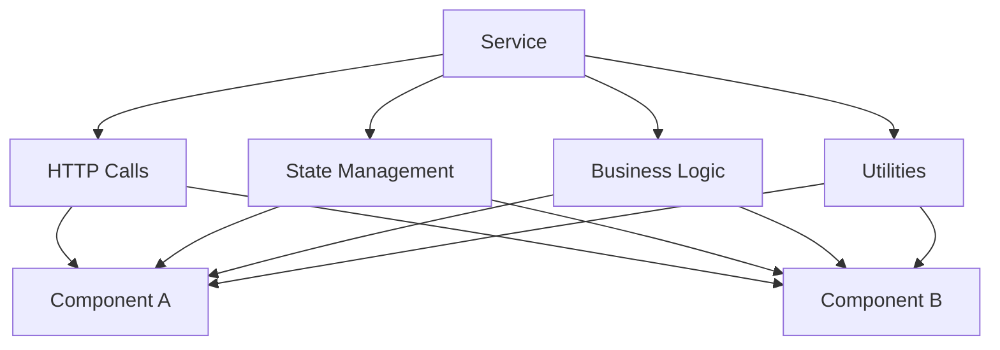
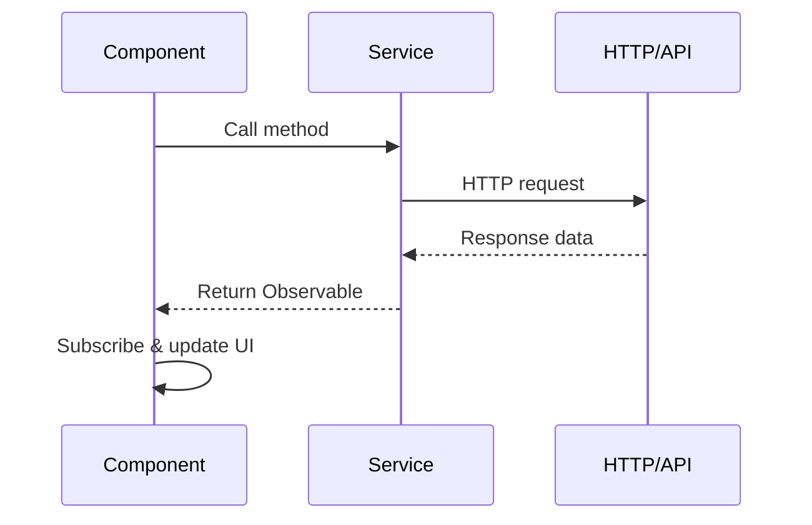
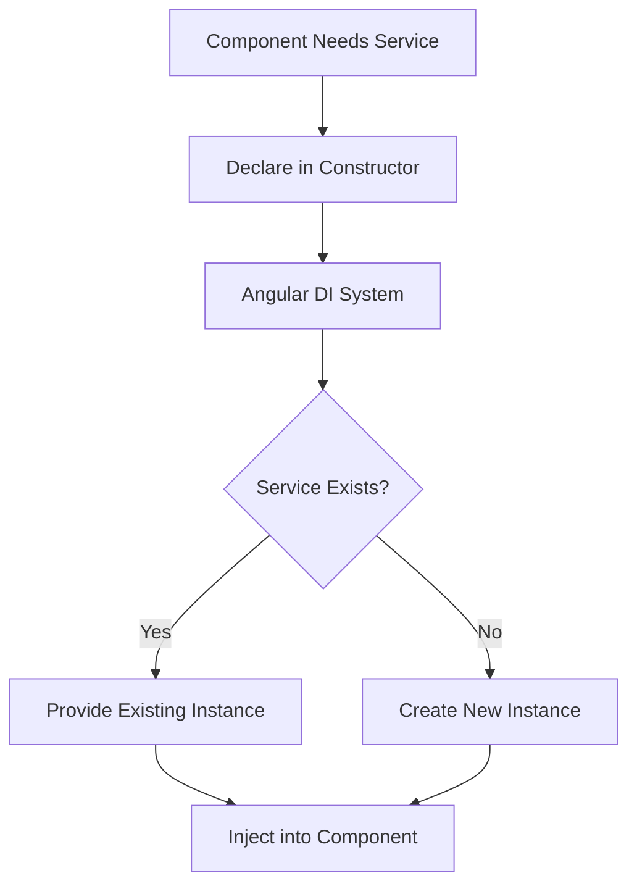
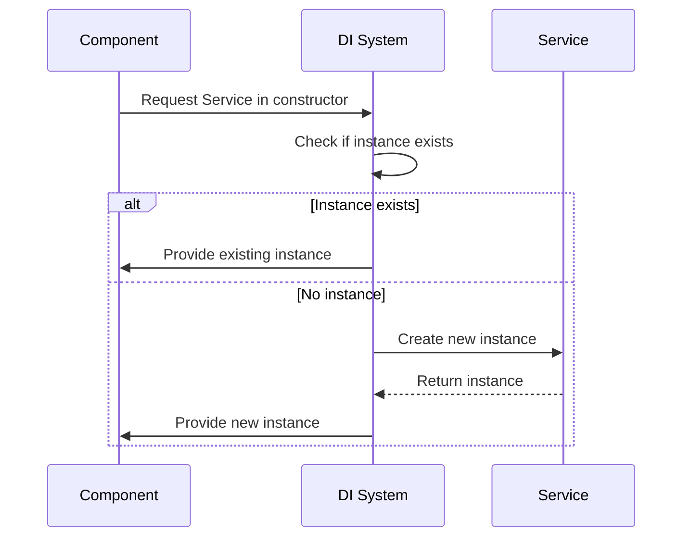
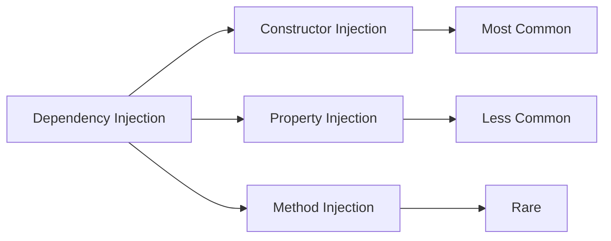
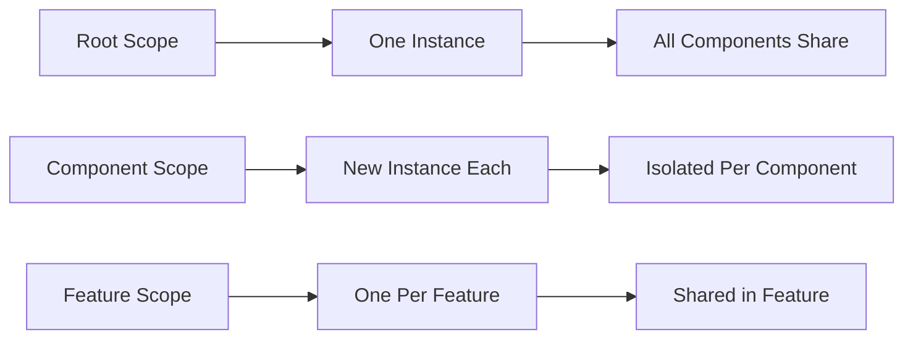
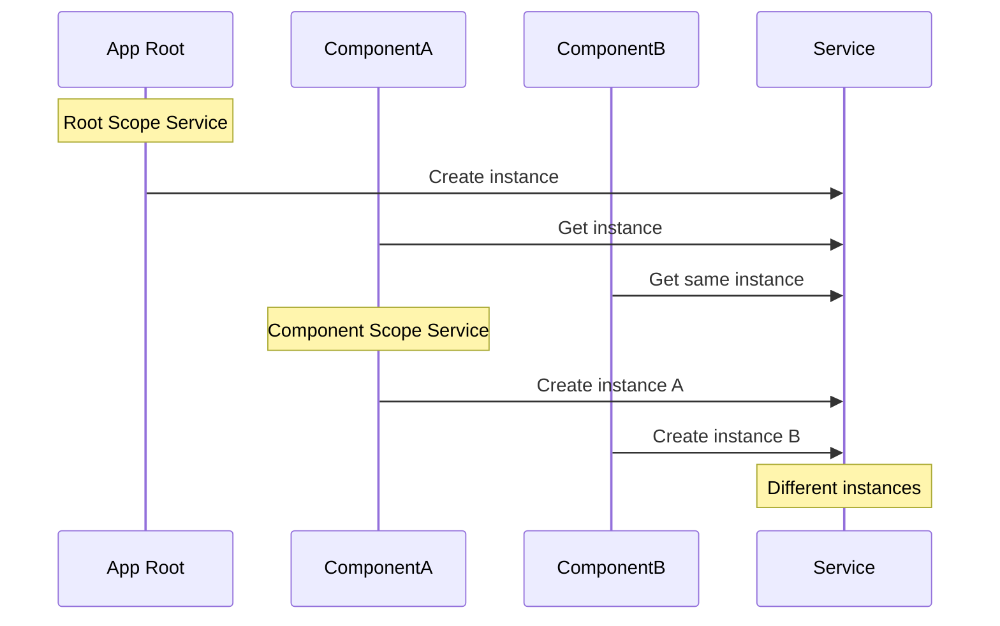
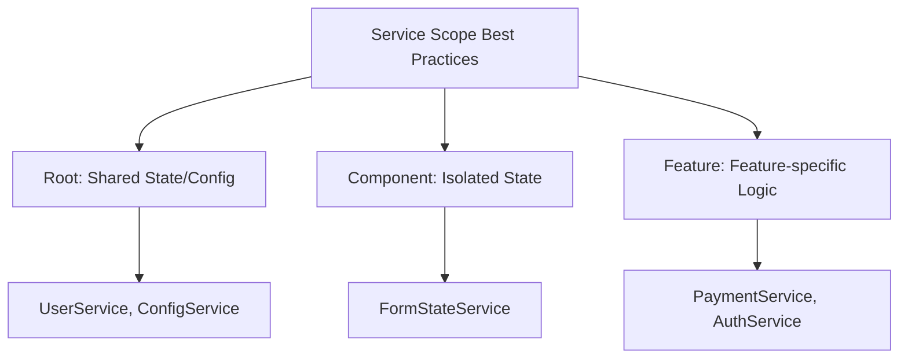

# 6) Services & Dependency Injection (DI)

[← Previous: Components Communication (How components talk)](./05-components-communication-how-components-talk.md) | [Next: Routing (Multiple pages inside SPA) →](./07-routing-multiple-pages-inside-spa.md)

---

### Service — reusable logic (API calls, state, utilities)

**Explanation:**
Services in Angular are classes that contain reusable business logic, data access, and shared functionality. They're used to organize code that doesn't belong in components, making it reusable across multiple components.

**Service Purpose:**
- Share data and logic between components
- Handle HTTP requests and API calls
- Manage application state
- Provide utility functions
- Encapsulate business logic

**Service Architecture:**


**Code Sample - Basic Service:**
```typescript
// user.service.ts
import { Injectable } from '@angular/core';
import { HttpClient } from '@angular/common/http';
import { Observable } from 'rxjs';

export interface User {
  id: number;
  name: string;
  email: string;
}

@Injectable({
  providedIn: 'root' // Makes service available app-wide
})
export class UserService {
  private apiUrl = 'https://api.example.com/users';
  
  // In-memory storage (for demo)
  private users: User[] = [
    { id: 1, name: 'John Doe', email: 'john@example.com' },
    { id: 2, name: 'Jane Smith', email: 'jane@example.com' }
  ];
  
  constructor(private http: HttpClient) {}
  
  // Get all users
  getUsers(): Observable<User[]> {
    return this.http.get<User[]>(this.apiUrl);
    // Or return in-memory data:
    // return of(this.users);
  }
  
  // Get user by ID
  getUserById(id: number): Observable<User> {
    return this.http.get<User>(`${this.apiUrl}/${id}`);
  }
  
  // Add new user
  addUser(user: User): Observable<User> {
    return this.http.post<User>(this.apiUrl, user);
  }
  
  // Update user
  updateUser(id: number, user: User): Observable<User> {
    return this.http.put<User>(`${this.apiUrl}/${id}`, user);
  }
  
  // Delete user
  deleteUser(id: number): Observable<void> {
    return this.http.delete<void>(`${this.apiUrl}/${id}`);
  }
  
  // Utility method
  validateEmail(email: string): boolean {
    const emailRegex = /^[^\s@]+@[^\s@]+\.[^\s@]+$/;
    return emailRegex.test(email);
  }
}
```

**Code Sample - Using Service in Component:**
```typescript
// user-list.component.ts
import { Component, OnInit } from '@angular/core';
import { UserService, User } from './user.service';

@Component({
  selector: 'app-user-list',
  standalone: true,
  template: `
    <div>
      <h2>Users</h2>
      <ul>
        <li *ngFor="let user of users">
          {{ user.name }} - {{ user.email }}
          <button (click)="deleteUser(user.id)">Delete</button>
        </li>
      </ul>
      <button (click)="loadUsers()">Refresh</button>
    </div>
  `
})
export class UserListComponent implements OnInit {
  users: User[] = [];
  
  // Inject service in constructor
  constructor(private userService: UserService) {}
  
  ngOnInit(): void {
    this.loadUsers();
  }
  
  loadUsers(): void {
    this.userService.getUsers().subscribe({
      next: (users) => {
        this.users = users;
      },
      error: (error) => {
        console.error('Error loading users:', error);
      }
    });
  }
  
  deleteUser(id: number): void {
    this.userService.deleteUser(id).subscribe({
      next: () => {
        this.loadUsers(); // Refresh list
      },
      error: (error) => {
        console.error('Error deleting user:', error);
      }
    });
  }
}
```

**Service Usage Flow:**


---

### Dependency Injection — Angular provides service instances automatically

**Explanation:**
Dependency Injection (DI) is a design pattern where Angular automatically provides dependencies (services) to components, services, or other classes. Instead of creating instances manually, you declare what you need, and Angular's DI system provides it.

**DI Benefits:**
- Loose coupling between classes
- Easier testing (can inject mock services)
- Single responsibility principle
- Centralized instance management

**Dependency Injection Flow:**


**DI System Architecture:**


**Code Sample - Basic DI:**
```typescript
// logger.service.ts
import { Injectable } from '@angular/core';

@Injectable({
  providedIn: 'root'
})
export class LoggerService {
  log(message: string): void {
    console.log(`[LOG] ${new Date().toISOString()}: ${message}`);
  }
  
  error(message: string): void {
    console.error(`[ERROR] ${new Date().toISOString()}: ${message}`);
  }
  
  warn(message: string): void {
    console.warn(`[WARN] ${new Date().toISOString()}: ${message}`);
  }
}
```

```typescript
// component.ts
import { Component } from '@angular/core';
import { LoggerService } from './logger.service';

@Component({
  selector: 'app-example',
  standalone: true,
  template: `<button (click)="doSomething()">Click Me</button>`
})
export class ExampleComponent {
  // Dependency injection via constructor
  constructor(private logger: LoggerService) {
    // Angular automatically provides LoggerService instance
    this.logger.log('Component created');
  }
  
  doSomething(): void {
    this.logger.log('Button clicked');
  }
}
```

**Code Sample - Service Injecting Another Service:**
```typescript
// api.service.ts
import { Injectable } from '@angular/core';
import { HttpClient } from '@angular/common/http';
import { LoggerService } from './logger.service';

@Injectable({
  providedIn: 'root'
})
export class ApiService {
  // Inject multiple services
  constructor(
    private http: HttpClient,
    private logger: LoggerService
  ) {
    this.logger.log('ApiService initialized');
  }
  
  fetchData(url: string): void {
    this.logger.log(`Fetching data from ${url}`);
    // Use http service
  }
}
```

**DI Injection Points:**


---

### Provider Scope — app-wide vs feature vs component-level instance

**Explanation:**
Provider scope determines where and how many instances of a service are created. You can provide services at different levels: root (app-wide singleton), feature module, or component level (separate instance per component).

**Provider Scope Levels:**
```mermaid
graph TD
    A[Provider Scope] --> B[Root Level<br/>providedIn: 'root']
    A --> C[Component Level<br/>providers: []]
    A --> D[Feature Level<br/>providedIn: FeatureModule]
    
    B --> E[Single Instance<br/>App-wide]
    C --> F[New Instance<br/>Per Component]
    D --> G[Single Instance<br/>Per Feature]
```

**Scope Comparison:**


**Code Sample - Root Level (App-wide Singleton):**
```typescript
// config.service.ts
import { Injectable } from '@angular/core';

@Injectable({
  providedIn: 'root' // Single instance for entire app
})
export class ConfigService {
  private config = {
    apiUrl: 'https://api.example.com',
    appName: 'My App',
    version: '1.0.0'
  };
  
  getConfig(): any {
    return this.config;
  }
  
  getApiUrl(): string {
    return this.config.apiUrl;
  }
}

// All components get the SAME instance
// Component A
@Component({...})
export class ComponentA {
  constructor(private config: ConfigService) {
    console.log('ComponentA config:', this.config.getApiUrl());
  }
}

// Component B
@Component({...})
export class ComponentB {
  constructor(private config: ConfigService) {
    // Same instance as ComponentA
    console.log('ComponentB config:', this.config.getApiUrl());
  }
}
```

**Code Sample - Component Level (Separate Instance):**
```typescript
// counter.service.ts
import { Injectable } from '@angular/core';

@Injectable() // No providedIn
export class CounterService {
  private count: number = 0;
  
  increment(): void {
    this.count++;
  }
  
  getCount(): number {
    return this.count;
  }
}

// Component with its own instance
@Component({
  selector: 'app-counter-a',
  standalone: true,
  providers: [CounterService], // New instance for this component
  template: `
    <div>
      <p>Count: {{ count }}</p>
      <button (click)="increment()">Increment</button>
    </div>
  `
})
export class CounterAComponent {
  count: number = 0;
  
  constructor(private counterService: CounterService) {}
  
  increment(): void {
    this.counterService.increment();
    this.count = this.counterService.getCount();
  }
}

// Another component with separate instance
@Component({
  selector: 'app-counter-b',
  standalone: true,
  providers: [CounterService], // Different instance
  template: `
    <div>
      <p>Count: {{ count }}</p>
      <button (click)="increment()">Increment</button>
    </div>
  `
})
export class CounterBComponent {
  count: number = 0;
  
  constructor(private counterService: CounterService) {
    // This is a DIFFERENT instance than CounterAComponent
  }
  
  increment(): void {
    this.counterService.increment();
    this.count = this.counterService.getCount();
  }
}
```

**Code Sample - Feature Level:**
```typescript
// feature.service.ts
import { Injectable } from '@angular/core';

@Injectable({
  providedIn: 'any' // Creates instance per lazy-loaded module
})
export class FeatureService {
  private data: string = 'Feature data';
  
  getData(): string {
    return this.data;
  }
}

// Or provide in feature module
@NgModule({
  providers: [FeatureService] // Shared within this module
})
export class FeatureModule {}
```

**Provider Scope Decision Flow:**
```mermaid
graph TD
    A[Need Service?] --> B{Shared Across App?}
    B -->|Yes| C[providedIn: 'root']
    B -->|No| D{Isolated Per Component?}
    D -->|Yes| E[providers: [Service]]
    D -->|No| F{Feature Specific?}
    F -->|Yes| G[providedIn: FeatureModule]
    F -->|No| C
```

**Instance Lifecycle:**


**Best Practices:**


---

[← Previous: Components Communication (How components talk)](./05-components-communication-how-components-talk.md) | [Next: Routing (Multiple pages inside SPA) →](./07-routing-multiple-pages-inside-spa.md)