# Beginner-friendly Angular Guide — Roadmap (Step-by-step Topics)

## 0) Before Angular (must-have basics)

### HTML/CSS Basics — structure + styling of UI

**Explanation:**
HTML (HyperText Markup Language) provides the structure of web pages, while CSS (Cascading Style Sheets) controls the visual appearance. In Angular, you'll write HTML templates and CSS styles for your components.

**Key Concepts:**
- HTML elements: `<div>`, `<button>`, `<input>`, `<p>`, etc.
- CSS selectors: classes (`.class-name`), IDs (`#id-name`), element selectors
- CSS properties: `color`, `margin`, `padding`, `display`, `flexbox`, `grid`

**Code Sample:**
```html
<!-- HTML Structure -->
<div class="container">
  <h1>Welcome</h1>
  <button class="btn-primary">Click Me</button>
</div>
```

```css
/* CSS Styling */
.container {
  padding: 20px;
  background-color: #f0f0f0;
}

.btn-primary {
  background-color: #007bff;
  color: white;
  padding: 10px 20px;
  border: none;
  border-radius: 4px;
}
```

**Flow Diagram:**
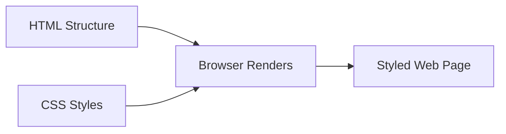

---

### JavaScript Fundamentals — variables, functions, arrays, objects

**Explanation:**
JavaScript is the programming language that adds interactivity to web pages. Angular is built with TypeScript (which compiles to JavaScript), so understanding JavaScript fundamentals is essential.

**Key Concepts:**
- Variables: `let`, `const`, `var`
- Functions: regular functions, arrow functions
- Arrays: `[1, 2, 3]` with methods like `map()`, `filter()`, `forEach()`
- Objects: `{ name: 'John', age: 30 }` for storing related data

**Code Sample:**
```javascript
// Variables
let userName = "John";
const age = 30;

// Functions
function greet(name) {
  return `Hello, ${name}!`;
}

// Arrow function (common in Angular)
const greetArrow = (name) => `Hello, ${name}!`;

// Arrays
const numbers = [1, 2, 3, 4, 5];
const doubled = numbers.map(n => n * 2); // [2, 4, 6, 8, 10]

// Objects
const user = {
  name: "John",
  age: 30,
  email: "john@example.com"
};
```

**Data Flow:**
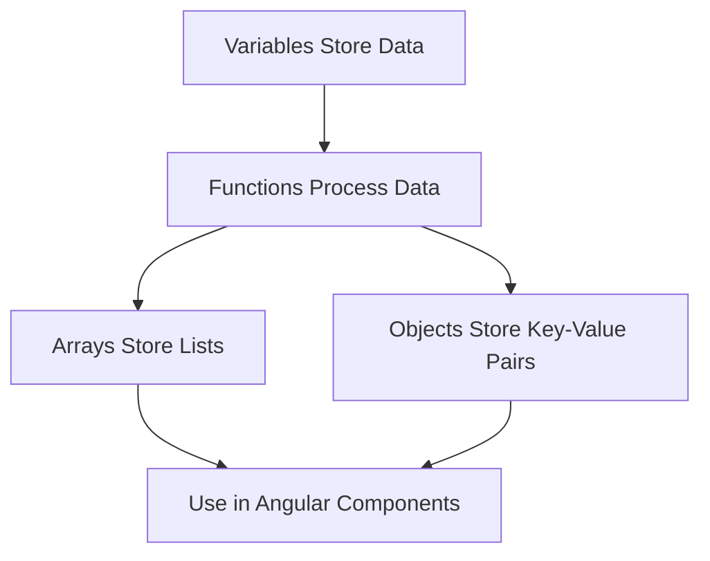

---

### TypeScript Basics — typed JavaScript used in Angular (interfaces, types, classes)

**Explanation:**
TypeScript adds type safety to JavaScript. Angular uses TypeScript to catch errors early and make code more maintainable. Key features include interfaces (shape of objects), types (custom type definitions), and classes (blueprints for objects).

**Key Concepts:**
- Types: `string`, `number`, `boolean`, `any`, `void`
- Interfaces: define object shapes
- Classes: object-oriented programming with constructors and methods
- Type annotations: `let name: string = "John"`

**Code Sample:**
```typescript
// Basic Types
let name: string = "John";
let age: number = 30;
let isActive: boolean = true;

// Interface (defines object shape)
interface User {
  id: number;
  name: string;
  email: string;
  isActive?: boolean; // Optional property
}

// Using interface
const user: User = {
  id: 1,
  name: "John",
  email: "john@example.com"
};

// Class
class UserService {
  private users: User[] = [];

  addUser(user: User): void {
    this.users.push(user);
  }

  getUsers(): User[] {
    return this.users;
  }
}
```

**TypeScript Flow:**
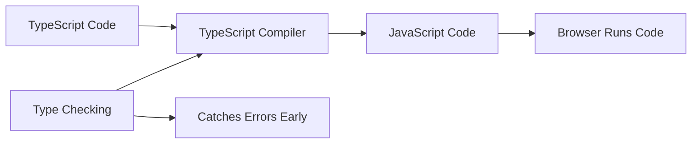

---

### Node.js + npm — runtime + package manager needed to install Angular tooling

**Explanation:**
Node.js is a JavaScript runtime that runs on your computer (not just in the browser). npm (Node Package Manager) is used to install and manage Angular and other JavaScript libraries. Angular CLI requires Node.js to run.

**Key Concepts:**
- Node.js: executes JavaScript outside the browser
- npm: package manager for installing libraries
- `package.json`: lists project dependencies
- `node_modules/`: folder containing installed packages

**Installation Flow:**
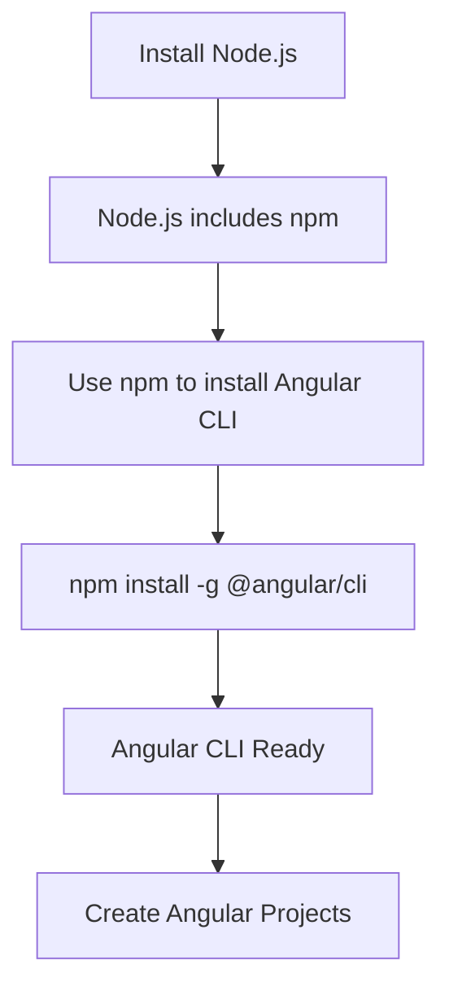

**Code Sample:**
```bash
# Check if Node.js is installed
node --version

# Check if npm is installed
npm --version

# Install Angular CLI globally
npm install -g @angular/cli

# Verify installation
ng version
```

**Package Management Flow:**
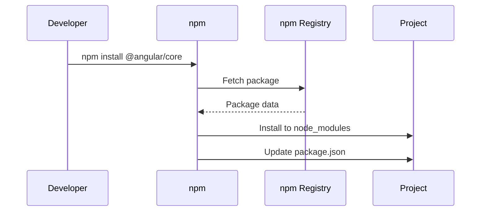

## 1) Setup & Installation

### Install Node.js (LTS) — required to run Angular tools

**Explanation:**
Node.js LTS (Long Term Support) is the stable version recommended for Angular development. It provides the JavaScript runtime environment needed to run Angular CLI and build tools.

**Why LTS?**
- Stable and reliable
- Long-term support and security updates
- Compatible with Angular tooling

**Installation Steps:**
1. Visit [nodejs.org](https://nodejs.org)
2. Download LTS version (recommended)
3. Run installer (Windows/Mac) or use package manager (Linux)
4. Verify installation

**Code Sample:**
```bash
# Check Node.js version (should be 18.x or 20.x LTS)
node --version

# Check npm version (comes with Node.js)
npm --version
```

**Installation Flow:**
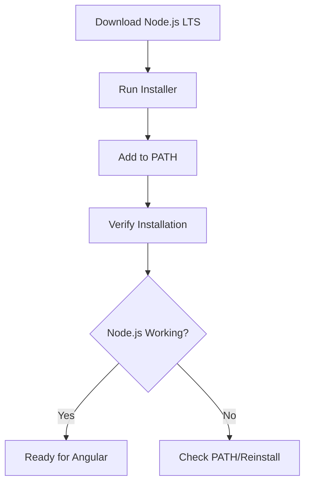

---

### Install Angular CLI — command-line tool to create/run/build Angular apps

**Explanation:**
Angular CLI (Command Line Interface) is a powerful tool that automates common development tasks. It generates components, services, modules, and handles building/testing your application.

**Key Commands:**
- `ng new` - Create new project
- `ng generate` (or `ng g`) - Generate components, services, etc.
- `ng serve` - Run development server
- `ng build` - Build for production
- `ng test` - Run tests

**Code Sample:**
```bash
# Install Angular CLI globally
npm install -g @angular/cli

# Verify installation
ng version

# Get help
ng help
```

**CLI Architecture:**
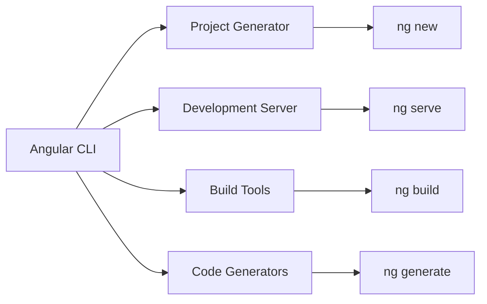

---

### Create New Project — ng new generates a starter Angular app

**Explanation:**
The `ng new` command creates a complete Angular project structure with all necessary configuration files, dependencies, and a sample component to get you started.

**What Gets Created:**
- Project folder structure
- Configuration files (`angular.json`, `tsconfig.json`, etc.)
- Sample app component
- Dependencies in `package.json`
- Basic routing setup (if selected)

**Code Sample:**
```bash
# Create new Angular project
ng new my-angular-app

# During creation, you'll be asked:
# - Would you like to add Angular routing? (Yes/No)
# - Which stylesheet format? (CSS/SCSS/SASS/Less)

# Navigate to project
cd my-angular-app
```

**Project Creation Flow:**
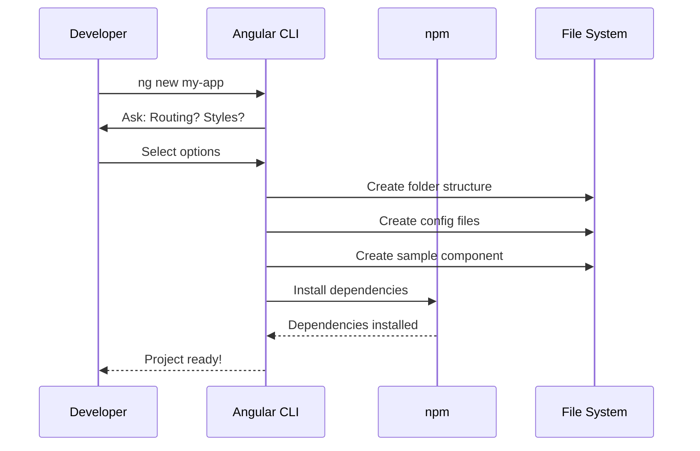

**Project Structure Created:**
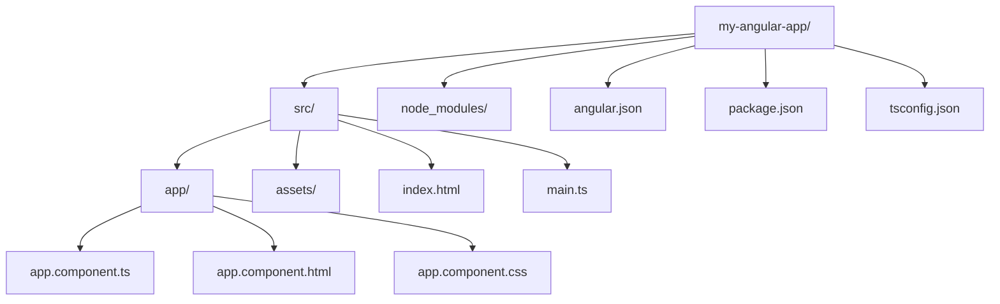

---

### Run Dev Server — ng serve runs the app locally with live reload

**Explanation:**
`ng serve` starts a development server that compiles your Angular app and serves it locally. It watches for file changes and automatically reloads the browser (Hot Module Replacement).

**Features:**
- Live reload on file changes
- Source maps for debugging
- Fast compilation
- Accessible at `http://localhost:4200` by default

**Code Sample:**
```bash
# Start development server
ng serve

# Or with options
ng serve --port 4200 --open

# --port: specify port (default: 4200)
# --open: automatically open browser
```

**Development Server Flow:**
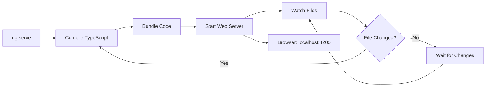

**Request Flow:**
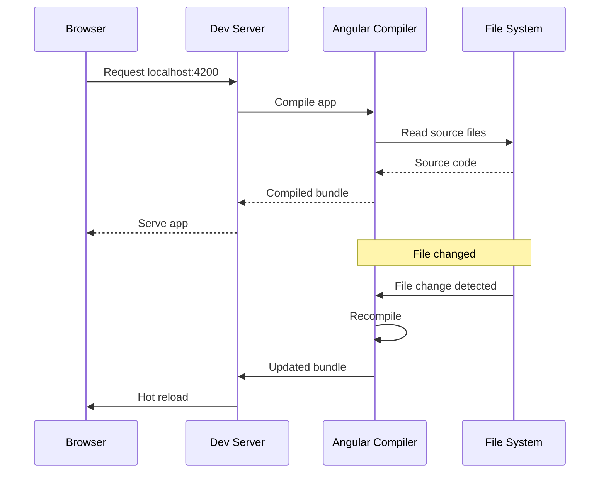

---

### Project Structure Overview — know where components, assets, configs live

**Explanation:**
Understanding the Angular project structure helps you navigate and organize your code effectively. Each folder and file has a specific purpose.

**Key Directories:**
- `src/` - Source code
- `src/app/` - Application components, services, modules
- `src/assets/` - Static files (images, fonts, etc.)
- `node_modules/` - Installed dependencies
- Root config files - Build and TypeScript configuration

**Detailed Structure:**
```
my-angular-app/
├── src/                          # Source code
│   ├── app/                      # Main application folder
│   │   ├── app.component.ts      # Root component TypeScript
│   │   ├── app.component.html    # Root component template
│   │   ├── app.component.css     # Root component styles
│   │   └── app.config.ts         # App configuration
│   ├── assets/                   # Static assets
│   │   └── .gitkeep
│   ├── index.html                # Main HTML file
│   ├── main.ts                   # Application entry point
│   └── styles.css                # Global styles
├── node_modules/                 # Dependencies (auto-generated)
├── angular.json                  # Angular CLI configuration
├── package.json                  # Project dependencies
├── tsconfig.json                 # TypeScript configuration
└── README.md                     # Project documentation
```

**File Purpose Flow:**
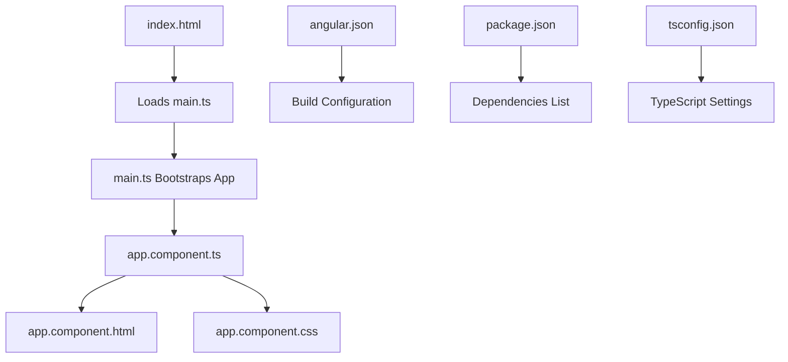

**Component File Relationship:**
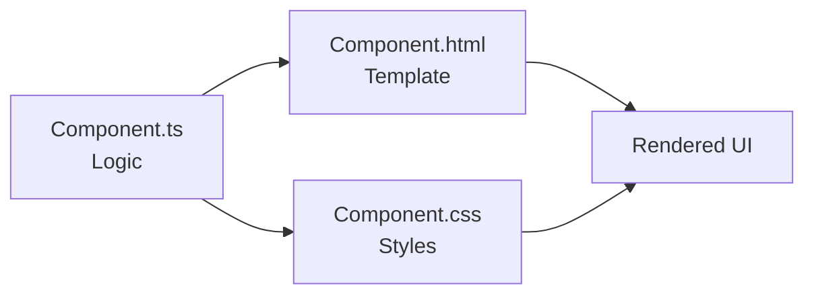

**Code Sample - Understanding Entry Point:**
```typescript
// main.ts - Application entry point
import { bootstrapApplication } from '@angular/platform-browser';
import { AppComponent } from './app/app.component';
import { appConfig } from './app/app.config';

bootstrapApplication(AppComponent, appConfig)
  .catch(err => console.error(err));
```

```typescript
// app.component.ts - Root component
import { Component } from '@angular/core';

@Component({
  selector: 'app-root',
  templateUrl: './app.component.html',
  styleUrls: ['./app.component.css']
})
export class AppComponent {
  title = 'my-angular-app';
}
```

```html
<!-- app.component.html - Root template -->
<div class="container">
  <h1>{{ title }}</h1>
  <p>Welcome to Angular!</p>
</div>
```

## 2) Angular Core Concepts (What/Why)

### What is Angular? — a framework to build large, structured web apps

**Explanation:**
Angular is a comprehensive framework (not just a library) for building dynamic, single-page web applications. It provides structure, tools, and patterns to create maintainable, scalable applications.

**Key Features:**
- Component-based architecture
- Two-way data binding
- Dependency injection
- Built-in routing
- TypeScript support
- CLI tooling

**Angular vs Other Frameworks:**
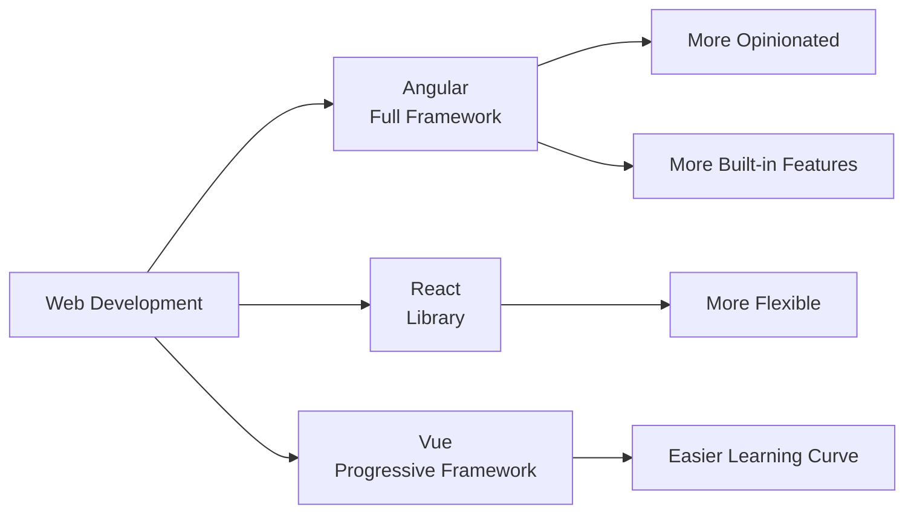

**Angular Architecture:**
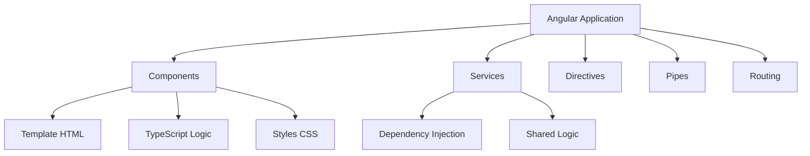

---

### SPA (Single Page App) — app runs in browser; routing swaps views without full reload

**Explanation:**
A Single Page Application (SPA) loads once and dynamically updates content without full page reloads. Angular handles routing client-side, making navigation fast and smooth.

**Traditional vs SPA:**
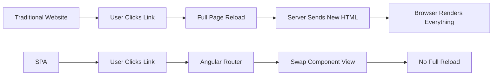

**SPA Flow:**
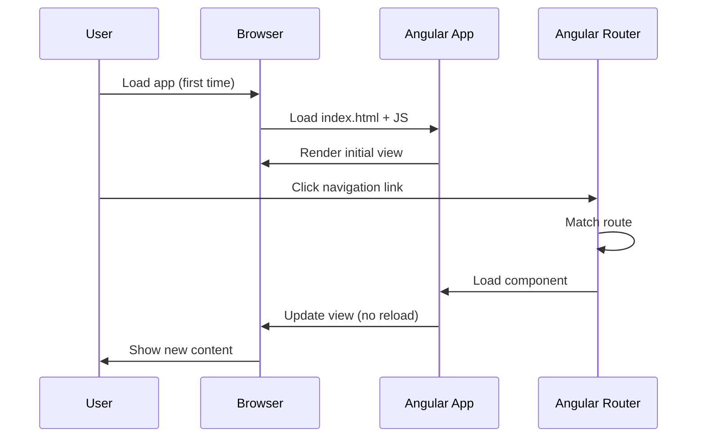

**Code Sample - SPA Routing:**
```typescript
// app.config.ts - Configure routes
import { ApplicationConfig } from '@angular/core';
import { provideRouter } from '@angular/router';
import { routes } from './app.routes';

export const appConfig: ApplicationConfig = {
  providers: [
    provideRouter(routes) // Enables SPA routing
  ]
};
```

```typescript
// app.routes.ts - Define routes
import { Routes } from '@angular/router';
import { HomeComponent } from './home/home.component';
import { AboutComponent } from './about/about.component';

export const routes: Routes = [
  { path: '', component: HomeComponent },
  { path: 'about', component: AboutComponent }
];
```

---

### Modules vs Standalone — ways to organize features (modern Angular prefers standalone)

**Explanation:**
Angular offers two ways to organize code: NgModules (traditional) and Standalone components (modern). Standalone is the recommended approach in Angular 14+ as it's simpler and more flexible.

**Comparison:**
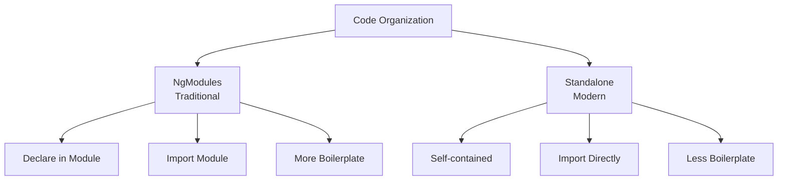

**Module vs Standalone Flow:**
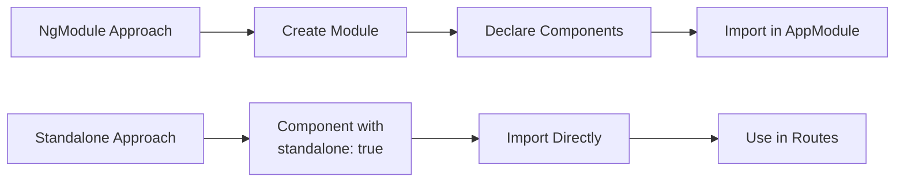

**Code Sample - NgModule (Traditional):**
```typescript
// app.module.ts (NgModules - older approach)
import { NgModule } from '@angular/core';
import { BrowserModule } from '@angular/platform-browser';
import { AppComponent } from './app.component';
import { UserComponent } from './user/user.component';

@NgModule({
  declarations: [AppComponent, UserComponent],
  imports: [BrowserModule],
  providers: [],
  bootstrap: [AppComponent]
})
export class AppModule { }
```

**Code Sample - Standalone (Modern):**
```typescript
// app.component.ts (Standalone - recommended)
import { Component } from '@angular/core';
import { CommonModule } from '@angular/common';
import { UserComponent } from './user/user.component';

@Component({
  selector: 'app-root',
  standalone: true, // Standalone component
  imports: [CommonModule, UserComponent], // Import what you need
  templateUrl: './app.component.html',
  styleUrls: ['./app.component.css']
})
export class AppComponent {
  title = 'My App';
}
```

---

### Component — reusable UI block (HTML + TS + CSS)

**Explanation:**
A component is the fundamental building block of Angular applications. It combines HTML (template), TypeScript (logic), and CSS (styles) into a reusable, self-contained unit.

**Component Structure:**
```mermaid
graph TD
    A[Component] --> B[TypeScript File<br/>.component.ts]
    A --> C[Template File<br/>.component.html]
    A --> D[Style File<br/>.component.css]
    
    B --> E[Class with Logic]
    B --> F[@Component Decorator]
    
    C --> G[HTML with Angular Syntax]
    
    D --> H[Scoped Styles]
```

**Component Lifecycle:**
```mermaid
graph TD
    A[Component Created] --> B[ngOnInit]
    B --> C[Component Rendered]
    C --> D[User Interacts]
    D --> E[ngOnChanges<br/>if inputs change]
    E --> C
    D --> F[ngOnDestroy<br/>when removed]
```

**Code Sample - Complete Component:**
```typescript
// user.component.ts
import { Component, Input, OnInit } from '@angular/core';

@Component({
  selector: 'app-user',
  standalone: true,
  templateUrl: './user.component.html',
  styleUrls: ['./user.component.css']
})
export class UserComponent implements OnInit {
  @Input() userName: string = '';
  @Input() userAge: number = 0;

  ngOnInit(): void {
    console.log('Component initialized');
  }

  greet(): string {
    return `Hello, ${this.userName}!`;
  }
}
```

```html
<!-- user.component.html -->
<div class="user-card">
  <h2>{{ userName }}</h2>
  <p>Age: {{ userAge }}</p>
  <p>{{ greet() }}</p>
  <button (click)="onClick()">Click Me</button>
</div>
```

```css
/* user.component.css */
.user-card {
  border: 1px solid #ccc;
  padding: 20px;
  border-radius: 8px;
  margin: 10px;
}

.user-card h2 {
  color: #333;
}
```

**Component Usage Flow:**
```mermaid
sequenceDiagram
    participant Parent as Parent Component
    participant Angular as Angular Framework
    participant Child as Child Component

    Parent->>Angular: Use <app-user>
    Angular->>Child: Create instance
    Child->>Child: ngOnInit()
    Child->>Angular: Render template
    Angular->>Parent: Display component
```

---

### Template — HTML with Angular syntax

**Explanation:**
A template is HTML enhanced with Angular-specific syntax like interpolation `{{ }}`, property binding `[ ]`, event binding `( )`, and directives like `*ngIf` and `*ngFor`.

**Template Features:**
```mermaid
graph LR
    A[Template] --> B[Interpolation<br/>{{ value }}]
    A --> C[Property Binding<br/>[property]]
    A --> D[Event Binding<br/>(event)]
    A --> E[Directives<br/>*ngIf, *ngFor]
    A --> F[Pipes<br/>| pipe]
```

**Template Processing Flow:**
```mermaid
graph TD
    A[Template HTML] --> B[Angular Compiler]
    B --> C[Parse Angular Syntax]
    C --> D[Create Component View]
    D --> E[Bind Data]
    E --> F[Render DOM]
    F --> G[Update on Changes]
```

**Code Sample:**
```html
<!-- Example template with various Angular features -->
<div class="container">
  <!-- Interpolation -->
  <h1>Welcome, {{ userName }}!</h1>
  
  <!-- Property Binding -->
  
  <button [disabled]="isLoading">Submit</button>
  
  <!-- Event Binding -->
  <button (click)="handleClick()">Click Me</button>
  <input (input)="onInput($event)">
  
  <!-- Structural Directives -->
  <div *ngIf="isVisible">This is visible</div>
  <ul>
    <li *ngFor="let item of items">{{ item.name }}</li>
  </ul>
  
  <!-- Pipes -->
  <p>Date: {{ currentDate | date:'short' }}</p>
  <p>Price: {{ price | currency:'USD' }}</p>
</div>
```

---

### Decorator — metadata like @Component() that tells Angular how to use a class

**Explanation:**
Decorators are special functions that add metadata to classes, methods, or properties. The `@Component()` decorator tells Angular that a class is a component and provides configuration.

**Decorator Types:**
```mermaid
graph TD
    A[Decorators] --> B[@Component<br/>Marks as Component]
    A --> C[@Injectable<br/>Marks as Service]
    A --> D[@Input<br/>Accepts Parent Data]
    A --> E[@Output<br/>Emits Events]
    A --> F[@Directive<br/>Marks as Directive]
```

**Decorator Flow:**
```mermaid
sequenceDiagram
    participant Dev as Developer
    participant Decorator as @Component
    participant Angular as Angular Framework

    Dev->>Decorator: Add @Component to class
    Decorator->>Angular: Register metadata
    Angular->>Angular: Store selector, template, styles
    Angular->>Angular: Treat class as component
```

**Code Sample:**
```typescript
import { Component, Input, Output, EventEmitter } from '@angular/core';

// @Component decorator provides metadata
@Component({
  selector: 'app-button',        // How to use in HTML: <app-button>
  templateUrl: './button.component.html',  // Template file
  styleUrls: ['./button.component.css'],   // Style files
  standalone: true
})
export class ButtonComponent {
  // @Input decorator - accepts data from parent
  @Input() label: string = 'Click';
  @Input() disabled: boolean = false;

  // @Output decorator - emits events to parent
  @Output() clicked = new EventEmitter<void>();

  onClick(): void {
    if (!this.disabled) {
      this.clicked.emit();
    }
  }
}
```

**Decorator Metadata Structure:**
```mermaid
graph LR
    A[@Component] --> B[selector]
    A --> C[templateUrl]
    A --> D[styleUrls]
    A --> E[standalone]
    A --> F[imports]
    
    B --> G[HTML Tag Name]
    C --> H[Template File]
    D --> I[Style Files]
```

---

### Data Binding — connect TS data to UI (sync between logic and template)

**Explanation:**
Data binding creates a connection between component data (TypeScript) and the template (HTML). Angular supports one-way and two-way binding to keep the UI and data synchronized.

**Binding Types:**
```mermaid
graph TD
    A[Data Binding] --> B[One-Way Binding]
    A --> C[Two-Way Binding]
    
    B --> D[TS → HTML<br/>Interpolation {{ }}]
    B --> E[TS → HTML<br/>Property [ ]]
    B --> F[HTML → TS<br/>Event ( )]
    
    C --> G[TS ↔ HTML<br/>[(ngModel)]]
```

**Data Binding Flow:**
```mermaid
sequenceDiagram
    participant TS as TypeScript
    participant Angular as Angular
    participant HTML as Template

    Note over TS,HTML: One-Way: TS → HTML
    TS->>Angular: Data changes
    Angular->>HTML: Update view
    
    Note over TS,HTML: One-Way: HTML → TS
    HTML->>Angular: User action (click, input)
    Angular->>TS: Trigger method
    
    Note over TS,HTML: Two-Way: TS ↔ HTML
    TS->>Angular: Data changes
    Angular->>HTML: Update view
    HTML->>Angular: User input
    Angular->>TS: Update data
```

**Code Sample - All Binding Types:**
```typescript
// component.ts
export class DataBindingComponent {
  // One-way: TS → HTML
  title: string = 'Hello Angular';
  imageUrl: string = 'assets/logo.png';
  isActive: boolean = true;
  
  // Two-way binding data
  userName: string = 'John';
  
  // Event handler
  onClick(): void {
    console.log('Button clicked!');
    this.isActive = !this.isActive;
  }
  
  onInput(event: Event): void {
    const input = event.target as HTMLInputElement;
    console.log('Input value:', input.value);
  }
}
```

```html
<!-- component.html -->
<div>
  <!-- Interpolation: TS → HTML -->
  <h1>{{ title }}</h1>
  
  <!-- Property Binding: TS → HTML -->
  
  <button [disabled]="!isActive">Submit</button>
  
  <!-- Event Binding: HTML → TS -->
  <button (click)="onClick()">Toggle</button>
  <input (input)="onInput($event)">
  
  <!-- Two-Way Binding: TS ↔ HTML -->
  <input [(ngModel)]="userName">
  <p>You typed: {{ userName }}</p>
</div>
```

**Change Detection Flow:**
```mermaid
graph TD
    A[Data Changes] --> B[Angular Detects Change]
    B --> C[Update Binding]
    C --> D[Re-render Affected Parts]
    D --> E[DOM Updated]
    
    F[User Action] --> G[Event Fired]
    G --> H[Component Method Called]
    H --> A
```

## 3) Basic Syntax in Templates (Daily-use)

### Interpolation {{ }} — show TS value in HTML

**Explanation:**
Interpolation is the simplest way to display component data in templates. Use double curly braces `{{ }}` to embed TypeScript expressions that Angular evaluates and displays.

**How It Works:**
```mermaid
graph LR
    A[Component Property] --> B[{{ expression }}]
    B --> C[Angular Evaluates]
    C --> D[Display in HTML]
```

**Code Sample:**
```typescript
// component.ts
export class InterpolationComponent {
  title: string = 'Welcome';
  count: number = 42;
  isActive: boolean = true;
  user: { name: string; age: number } = {
    name: 'John',
    age: 30
  };
  
  getGreeting(): string {
    return `Hello, ${this.user.name}!`;
  }
}
```

```html
<!-- component.html -->
<div>
  <!-- Simple property -->
  <h1>{{ title }}</h1>
  
  <!-- Number -->
  <p>Count: {{ count }}</p>
  
  <!-- Boolean (shows true/false) -->
  <p>Active: {{ isActive }}</p>
  
  <!-- Object property -->
  <p>User: {{ user.name }}, Age: {{ user.age }}</p>
  
  <!-- Method call -->
  <p>{{ getGreeting() }}</p>
  
  <!-- Expression -->
  <p>Total: {{ count * 2 }}</p>
  
  <!-- Conditional expression -->
  <p>Status: {{ isActive ? 'Online' : 'Offline' }}</p>
</div>
```

**Interpolation Flow:**
```mermaid
sequenceDiagram
    participant Component
    participant Angular
    participant Template
    participant Browser

    Component->>Angular: title = "Welcome"
    Angular->>Template: Find {{ title }}
    Angular->>Angular: Evaluate expression
    Angular->>Browser: Render "Welcome"
    
    Note over Component: title changes to "Hello"
    Component->>Angular: title = "Hello"
    Angular->>Browser: Update to "Hello"
```

---

### Property Binding [prop] — set element property from TS

**Explanation:**
Property binding uses square brackets `[ ]` to set HTML element properties or Angular component/directive properties from TypeScript. It's one-way: data flows from component to template.

**When to Use:**
- Set element attributes: `[src]`, `[href]`, `[disabled]`
- Pass data to child components: `[user]="currentUser"`
- Set CSS classes conditionally: `[class.active]="isActive"`

**Property Binding Flow:**
```mermaid
graph LR
    A[Component Property] --> B[[property]="value"]
    B --> C[Angular Updates]
    C --> D[DOM Element Property]
```

**Code Sample:**
```typescript
// component.ts
export class PropertyBindingComponent {
  imageUrl: string = 'https://example.com/image.jpg';
  buttonDisabled: boolean = false;
  linkUrl: string = 'https://angular.io';
  isHighlighted: boolean = true;
  dynamicClass: string = 'btn-primary';
  
  toggleButton(): void {
    this.buttonDisabled = !this.buttonDisabled;
  }
}
```

```html
<!-- component.html -->
<div>
  <!-- Image source -->
  
  
  <!-- Button disabled state -->
  <button [disabled]="buttonDisabled">Submit</button>
  <button (click)="toggleButton()">Toggle</button>
  
  <!-- Link href -->
  <a [href]="linkUrl" target="_blank">Visit Angular</a>
  
  <!-- CSS class binding -->
  <div [class.highlight]="isHighlighted">Highlighted content</div>
  <div [class]="dynamicClass">Dynamic class</div>
  
  <!-- Style binding -->
  <div [style.color]="isHighlighted ? 'red' : 'black'">
    Colored text
  </div>
  <div [style.font-size.px]="16">Font size</div>
  
  <!-- Child component input -->
  <app-user [name]="'John'" [age]="30"></app-user>
</div>
```

**Property Binding vs Interpolation:**
```mermaid
graph TD
    A[Display Value] --> B[Use Interpolation<br/>{{ value }}]
    A --> C[Set Property] --> D[Use Property Binding<br/>[property]="value"]
    
    B --> E[Text Content]
    D --> F[Element Attributes]
    D --> G[Component Inputs]
```

---

### Event Binding (event) — run TS method on UI actions

**Explanation:**
Event binding uses parentheses `( )` to listen to DOM events (clicks, inputs, etc.) and execute component methods. Data flows from template to component.

**Common Events:**
- `(click)` - Mouse click
- `(input)` - Input field changes
- `(change)` - Form control changes
- `(keyup)`, `(keydown)` - Keyboard events
- `(focus)`, `(blur)` - Focus events

**Event Binding Flow:**
```mermaid
sequenceDiagram
    participant User
    participant DOM as DOM Element
    participant Angular
    participant Component

    User->>DOM: Click button
    DOM->>Angular: Event fired
    Angular->>Component: Call method
    Component->>Component: Execute logic
    Component->>Angular: Update if needed
    Angular->>DOM: Re-render
```

**Code Sample:**
```typescript
// component.ts
export class EventBindingComponent {
  message: string = '';
  count: number = 0;
  inputValue: string = '';
  
  onClick(): void {
    this.message = 'Button was clicked!';
    this.count++;
  }
  
  onInput(event: Event): void {
    const target = event.target as HTMLInputElement;
    this.inputValue = target.value;
  }
  
  onKeyUp(event: KeyboardEvent): void {
    if (event.key === 'Enter') {
      console.log('Enter pressed!');
    }
  }
  
  onMouseEnter(): void {
    console.log('Mouse entered');
  }
  
  onSubmit(event: Event): void {
    event.preventDefault();
    console.log('Form submitted');
  }
}
```

```html
<!-- component.html -->
<div>
  <!-- Click event -->
  <button (click)="onClick()">Click Me</button>
  <p>{{ message }}</p>
  <p>Clicked {{ count }} times</p>
  
  <!-- Input event -->
  <input 
    type="text" 
    (input)="onInput($event)"
    placeholder="Type something">
  <p>You typed: {{ inputValue }}</p>
  
  <!-- Keyboard events -->
  <input 
    type="text"
    (keyup)="onKeyUp($event)"
    placeholder="Press Enter">
  
  <!-- Mouse events -->
  <div (mouseenter)="onMouseEnter()" 
       (mouseleave)="onMouseLeave()">
    Hover over me
  </div>
  
  <!-- Form submission -->
  <form (submit)="onSubmit($event)">
    <input type="text" name="username">
    <button type="submit">Submit</button>
  </form>
  
  <!-- Inline event handling -->
  <button (click)="count = count + 1">
    Increment: {{ count }}
  </button>
</div>
```

**Event Object Usage:**
```mermaid
graph LR
    A[Event Fired] --> B[$event Object]
    B --> C[Event Properties]
    C --> D[event.target]
    C --> E[event.type]
    C --> F[event.key]
```

---

### Two-way Binding [(ngModel)] — input ↔ TS sync (forms)

**Explanation:**
Two-way binding combines property binding `[ ]` and event binding `( )` into `[(ngModel)]`. It keeps the component property and form input value synchronized in both directions.

**How Two-way Binding Works:**
```mermaid
graph LR
    A[Component Property] -->|Updates| B[Input Value]
    B -->|User Types| C[Component Property]
    A -.->|Sync| C
    C -.->|Sync| A
```

**Two-way Binding Flow:**
```mermaid
sequenceDiagram
    participant Component
    participant Angular
    participant Input as Input Field

    Component->>Angular: userName = "John"
    Angular->>Input: Set value to "John"
    
    Note over Input: User types "Jane"
    Input->>Angular: Value changed
    Angular->>Component: Update userName to "Jane"
    Component->>Angular: userName = "Jane"
    Angular->>Input: Confirm sync
```

**Code Sample:**
```typescript
// component.ts
import { FormsModule } from '@angular/forms';

@Component({
  standalone: true,
  imports: [FormsModule], // Required for ngModel
  // ...
})
export class TwoWayBindingComponent {
  userName: string = '';
  email: string = '';
  age: number = 0;
  isSubscribed: boolean = false;
  
  onSubmit(): void {
    console.log({
      userName: this.userName,
      email: this.email,
      age: this.age,
      isSubscribed: this.isSubscribed
    });
  }
}
```

```html
<!-- component.html -->
<form (ngSubmit)="onSubmit()">
  <!-- Text input -->
  <div>
    <label>Name:</label>
    <input type="text" [(ngModel)]="userName" name="userName">
    <p>Current value: {{ userName }}</p>
  </div>
  
  <!-- Email input -->
  <div>
    <label>Email:</label>
    <input type="email" [(ngModel)]="email" name="email">
  </div>
  
  <!-- Number input -->
  <div>
    <label>Age:</label>
    <input type="number" [(ngModel)]="age" name="age">
  </div>
  
  <!-- Checkbox -->
  <div>
    <label>
      <input type="checkbox" [(ngModel)]="isSubscribed" name="isSubscribed">
      Subscribe to newsletter
    </label>
  </div>
  
  <button type="submit">Submit</button>
</form>
```

**Note:** Two-way binding is shorthand for:
```html
<!-- This: -->
<input [(ngModel)]="userName">

<!-- Is equivalent to: -->
<input [ngModel]="userName" (ngModelChange)="userName = $event">
```

---

### Template Reference #ref — access element value quickly

**Explanation:**
Template reference variables (using `#` or `ref-`) create a reference to a DOM element or Angular component in the template. You can access it directly without using two-way binding.

**When to Use:**
- Get input value without binding
- Access child component methods
- Pass element to methods

**Template Reference Flow:**
```mermaid
graph LR
    A[#myRef] --> B[Create Reference]
    B --> C[Access in Template]
    C --> D[myRef.value]
    C --> E[Pass to Method]
```

**Code Sample:**
```typescript
// component.ts
export class TemplateRefComponent {
  onSubmit(inputRef: HTMLInputElement): void {
    console.log('Input value:', inputRef.value);
    // Use value without binding
  }
  
  logElement(element: HTMLElement): void {
    console.log('Element:', element);
  }
}
```

```html
<!-- component.html -->
<div>
  <!-- Reference to input element -->
  <input #nameInput type="text" placeholder="Enter name">
  <button (click)="onSubmit(nameInput)">Submit</button>
  
  <!-- Access value directly -->
  <input #emailInput type="email" placeholder="Email">
  <p>You entered: {{ emailInput.value }}</p>
  
  <!-- Reference to component -->
  <app-user #userComponent></app-user>
  <button (click)="userComponent.someMethod()">Call Method</button>
  
  <!-- Reference to any element -->
  <div #myDiv (click)="logElement(myDiv)">
    Click me to log element
  </div>
  
  <!-- Using ref- prefix (alternative syntax) -->
  <input ref-username type="text">
  <button (click)="onSubmit(username)">Submit</button>
</div>
```

**Template Reference vs Two-way Binding:**
```mermaid
graph TD
    A[Need Input Value] --> B{When to Access?}
    B -->|On Submit Only| C[Use Template Reference<br/>#ref]
    B -->|Always Sync| D[Use Two-way Binding<br/>[(ngModel)]]
    
    C --> E[Less Overhead]
    D --> F[Automatic Sync]
```

---

### Pipes | — format data in template (date, currency, custom)

**Explanation:**
Pipes transform data in templates. They format values for display without changing the original data. Angular provides built-in pipes and you can create custom ones.

**Pipe Flow:**
```mermaid
graph LR
    A[Raw Data] --> B[Pipe |]
    B --> C[Formatted Output]
    C --> D[Display in Template]
```

**Common Built-in Pipes:**
```mermaid
graph TD
    A[Pipes] --> B[Date Pipe<br/>| date]
    A --> C[Currency Pipe<br/>| currency]
    A --> D[UpperCase/LowerCase<br/>| uppercase]
    A --> E[JSON Pipe<br/>| json]
    A --> F[Slice Pipe<br/>| slice]
    A --> G[Async Pipe<br/>| async]
```

**Code Sample - Built-in Pipes:**
```typescript
// component.ts
export class PipesComponent {
  currentDate: Date = new Date();
  price: number = 99.99;
  message: string = 'Hello Angular';
  user: object = { name: 'John', age: 30 };
  items: string[] = ['Apple', 'Banana', 'Cherry', 'Date'];
  percentage: number = 0.85;
}
```

```html
<!-- component.html -->
<div>
  <!-- Date pipe -->
  <p>Today: {{ currentDate | date }}</p>
  <p>Short: {{ currentDate | date:'short' }}</p>
  <p>Full: {{ currentDate | date:'fullDate' }}</p>
  <p>Custom: {{ currentDate | date:'MM/dd/yyyy' }}</p>
  
  <!-- Currency pipe -->
  <p>Price: {{ price | currency }}</p>
  <p>USD: {{ price | currency:'USD' }}</p>
  <p>EUR: {{ price | currency:'EUR':'symbol':'1.2-2' }}</p>
  
  <!-- Uppercase/Lowercase -->
  <p>Upper: {{ message | uppercase }}</p>
  <p>Lower: {{ message | lowercase }}</p>
  <p>Title: {{ message | titlecase }}</p>
  
  <!-- JSON pipe (for debugging) -->
  <pre>{{ user | json }}</pre>
  
  <!-- Slice pipe (array/string) -->
  <p>First 3: {{ items | slice:0:3 }}</p>
  <p>Text: {{ message | slice:0:5 }}</p>
  
  <!-- Decimal pipe -->
  <p>Number: {{ percentage | number:'1.2-2' }}</p>
  <p>Percent: {{ percentage | percent }}</p>
  
  <!-- Chaining pipes -->
  <p>{{ currentDate | date:'fullDate' | uppercase }}</p>
</div>
```

**Code Sample - Custom Pipe:**
```typescript
// truncate.pipe.ts
import { Pipe, PipeTransform } from '@angular/core';

@Pipe({
  name: 'truncate',
  standalone: true
})
export class TruncatePipe implements PipeTransform {
  transform(value: string, limit: number = 20, trail: string = '...'): string {
    if (!value) return '';
    return value.length > limit 
      ? value.substring(0, limit) + trail 
      : value;
  }
}
```

```typescript
// component.ts
import { TruncatePipe } from './truncate.pipe';

@Component({
  standalone: true,
  imports: [TruncatePipe],
  // ...
})
export class MyComponent {
  longText: string = 'This is a very long text that needs to be truncated';
}
```

```html
<!-- component.html -->
<p>{{ longText | truncate:30 }}</p>
<!-- Output: "This is a very long text th..." -->
```

**Pipe Chaining Flow:**
```mermaid
graph LR
    A[Data] --> B[Pipe 1]
    B --> C[Pipe 2]
    C --> D[Pipe 3]
    D --> E[Final Output]
    
    F[date pipe] --> G[uppercase pipe]
    G --> H[Display]
```

## 4) Directives (Control the UI)

### Structural Directives — change DOM structure (*ngIf, *ngFor, *ngSwitch)

**Explanation:**
Structural directives change the DOM structure by adding, removing, or manipulating elements. They use the `*` prefix and are the most powerful directives in Angular.

**Key Structural Directives:**
- `*ngIf` - Conditionally add/remove elements
- `*ngFor` - Loop through arrays to create elements
- `*ngSwitch` - Multi-conditional rendering

**Structural Directive Flow:**
```mermaid
graph TD
    A[Structural Directive] --> B[*ngIf]
    A --> C[*ngFor]
    A --> D[*ngSwitch]
    
    B --> E[Add/Remove Element]
    C --> F[Create Multiple Elements]
    D --> G[Conditional Rendering]
```

**Code Sample - *ngIf:**
```typescript
// component.ts
export class NgIfComponent {
  isLoggedIn: boolean = true;
  userRole: string = 'admin';
  items: any[] = [];
  
  toggleLogin(): void {
    this.isLoggedIn = !this.isLoggedIn;
  }
}
```

```html
<!-- component.html -->
<div>
  <!-- Basic *ngIf -->
  <div *ngIf="isLoggedIn">
    <p>Welcome! You are logged in.</p>
  </div>
  
  <!-- *ngIf with else -->
  <div *ngIf="isLoggedIn; else loginPrompt">
    <p>Dashboard content</p>
  </div>
  <ng-template #loginPrompt>
    <p>Please log in to continue.</p>
  </ng-template>
  
  <!-- *ngIf with then/else -->
  <div *ngIf="isLoggedIn; then loggedIn; else loggedOut"></div>
  <ng-template #loggedIn>
    <p>User is logged in</p>
  </ng-template>
  <ng-template #loggedOut>
    <p>User is logged out</p>
  </ng-template>
  
  <!-- Check array length -->
  <div *ngIf="items.length > 0">
    <p>You have {{ items.length }} items</p>
  </div>
</div>
```

**Code Sample - *ngFor:**
```typescript
// component.ts
export class NgForComponent {
  users: { id: number; name: string; email: string }[] = [
    { id: 1, name: 'John', email: 'john@example.com' },
    { id: 2, name: 'Jane', email: 'jane@example.com' },
    { id: 3, name: 'Bob', email: 'bob@example.com' }
  ];
  
  items: string[] = ['Apple', 'Banana', 'Cherry'];
  
  trackByUserId(index: number, user: any): number {
    return user.id;
  }
}
```

```html
<!-- component.html -->
<div>
  <!-- Basic *ngFor -->
  <ul>
    <li *ngFor="let item of items">{{ item }}</li>
  </ul>
  
  <!-- *ngFor with index -->
  <ul>
    <li *ngFor="let user of users; let i = index">
      {{ i + 1 }}. {{ user.name }} - {{ user.email }}
    </li>
  </ul>
  
  <!-- *ngFor with trackBy (performance optimization) -->
  <ul>
    <li *ngFor="let user of users; trackBy: trackByUserId">
      {{ user.name }}
    </li>
  </ul>
  
  <!-- *ngFor with first, last, even, odd -->
  <div *ngFor="let user of users; let first = first; let last = last; let even = even; let odd = odd"
       [class.first]="first"
       [class.last]="last"
       [class.even]="even"
       [class.odd]="odd">
    {{ user.name }}
  </div>
  
  <!-- Nested *ngFor -->
  <div *ngFor="let user of users">
    <h3>{{ user.name }}</h3>
    <ul>
      <li *ngFor="let item of items">{{ item }}</li>
    </ul>
  </div>
</div>
```

**Code Sample - *ngSwitch:**
```typescript
// component.ts
export class NgSwitchComponent {
  status: string = 'active';
  userRole: string = 'admin';
  
  changeStatus(newStatus: string): void {
    this.status = newStatus;
  }
}
```

```html
<!-- component.html -->
<div>
  <!-- Basic *ngSwitch -->
  <div [ngSwitch]="status">
    <p *ngSwitchCase="'active'">Status: Active</p>
    <p *ngSwitchCase="'inactive'">Status: Inactive</p>
    <p *ngSwitchCase="'pending'">Status: Pending</p>
    <p *ngSwitchDefault>Status: Unknown</p>
  </div>
  
  <!-- *ngSwitch with user roles -->
  <div [ngSwitch]="userRole">
    <div *ngSwitchCase="'admin'">
      <h2>Admin Dashboard</h2>
      <button>Delete User</button>
      <button>Manage Settings</button>
    </div>
    <div *ngSwitchCase="'user'">
      <h2>User Dashboard</h2>
      <button>View Profile</button>
    </div>
    <div *ngSwitchCase="'guest'">
      <h2>Guest View</h2>
      <p>Please log in for full access</p>
    </div>
    <div *ngSwitchDefault>
      <p>Invalid role</p>
    </div>
  </div>
</div>
```

**Structural Directive Processing Flow:**
```mermaid
sequenceDiagram
    participant Template
    participant Angular
    participant DOM

    Template->>Angular: *ngIf="condition"
    Angular->>Angular: Evaluate condition
    alt Condition is true
        Angular->>DOM: Create element
    else Condition is false
        Angular->>DOM: Remove element
    end
    
    Template->>Angular: *ngFor="let item of items"
    Angular->>Angular: Loop through items
    Angular->>DOM: Create element for each item
```

---

### Attribute Directives — change look/behavior ([ngClass], [ngStyle])

**Explanation:**
Attribute directives change the appearance or behavior of existing elements without changing the DOM structure. They modify element properties, classes, or styles.

**Key Attribute Directives:**
- `[ngClass]` - Dynamically add/remove CSS classes
- `[ngStyle]` - Dynamically set inline styles

**Attribute Directive Flow:**
```mermaid
graph LR
    A[Attribute Directive] --> B[[ngClass]]
    A --> C[[ngStyle]]
    
    B --> D[Add/Remove Classes]
    C --> E[Set Inline Styles]
    
    D --> F[Change Appearance]
    E --> F
```

**Code Sample - [ngClass]:**
```typescript
// component.ts
export class NgClassComponent {
  isActive: boolean = true;
  isDisabled: boolean = false;
  currentTheme: string = 'dark';
  status: 'success' | 'error' | 'warning' = 'success';
  
  toggleActive(): void {
    this.isActive = !this.isActive;
  }
}
```

```html
<!-- component.html -->
<div>
  <!-- [ngClass] with object syntax -->
  <button [ngClass]="{ 'active': isActive, 'disabled': isDisabled }">
    Click Me
  </button>
  
  <!-- [ngClass] with string -->
  <div [ngClass]="currentTheme">
    Themed content
  </div>
  
  <!-- [ngClass] with array -->
  <div [ngClass]="['base-class', 'additional-class', status]">
    Multiple classes
  </div>
  
  <!-- [ngClass] with conditional object -->
  <div [ngClass]="{
    'success': status === 'success',
    'error': status === 'error',
    'warning': status === 'warning'
  }">
    Status message
  </div>
  
  <!-- Combining with class binding -->
  <div class="base" 
       [ngClass]="{ 'highlight': isActive }"
       [class.special]="isActive">
    Combined classes
  </div>
</div>
```

```css
/* component.css */
.active {
  background-color: #007bff;
  color: white;
}

.disabled {
  opacity: 0.5;
  cursor: not-allowed;
}

.success {
  background-color: #28a745;
  color: white;
}

.error {
  background-color: #dc3545;
  color: white;
}

.warning {
  background-color: #ffc107;
  color: black;
}
```

**Code Sample - [ngStyle]:**
```typescript
// component.ts
export class NgStyleComponent {
  fontSize: number = 16;
  textColor: string = 'black';
  backgroundColor: string = 'white';
  isHighlighted: boolean = false;
  
  dynamicStyles: { [key: string]: string } = {
    'color': 'blue',
    'font-weight': 'bold',
    'text-decoration': 'underline'
  };
}
```

```html
<!-- component.html -->
<div>
  <!-- [ngStyle] with object syntax -->
  <p [ngStyle]="{ 'font-size': fontSize + 'px', 'color': textColor }">
    Dynamic styled text
  </div>
  
  <!-- [ngStyle] with conditional styles -->
  <div [ngStyle]="{
    'background-color': isHighlighted ? 'yellow' : 'transparent',
    'padding': isHighlighted ? '10px' : '0px'
  }">
    Conditional styling
  </div>
  
  <!-- [ngStyle] with property object -->
  <div [ngStyle]="dynamicStyles">
    Predefined styles
  </div>
  
  <!-- Individual style properties -->
  <div [style.color]="textColor"
       [style.font-size.px]="fontSize"
       [style.background-color]="backgroundColor">
    Individual properties
  </div>
  
  <!-- Combining ngStyle with ngClass -->
  <div [ngClass]="{ 'card': true }"
       [ngStyle]="{ 'border': '1px solid #ccc', 'border-radius': '8px' }">
    Combined styling
  </div>
</div>
```

**Attribute Directive Processing Flow:**
```mermaid
sequenceDiagram
    participant Component
    participant Angular
    participant DOM

    Component->>Angular: [ngClass]="{ 'active': isActive }"
    Angular->>Angular: Evaluate conditions
    Angular->>DOM: Add/remove classes
    
    Component->>Angular: [ngStyle]="{ 'color': textColor }"
    Angular->>Angular: Evaluate styles
    Angular->>DOM: Apply inline styles
```

---

### Built-in vs Custom Directive — when you create your own UI behavior

**Explanation:**
Angular provides built-in directives, but you can create custom directives to add specific behaviors to elements. Custom directives are useful for reusable UI behaviors that don't need a full component.

**When to Use Custom Directives:**
- Reusable behavior without template
- DOM manipulation
- Event handling patterns
- Shared styling logic

**Directive Types Comparison:**
```mermaid
graph TD
    A[Directives] --> B[Built-in Directives]
    A --> C[Custom Directives]
    
    B --> D[*ngIf, *ngFor, *ngSwitch]
    B --> E[[ngClass], [ngStyle]]
    
    C --> F[Attribute Directives]
    C --> G[Structural Directives]
    
    F --> H[Modify Element]
    G --> I[Change DOM Structure]
```

**Code Sample - Custom Attribute Directive:**
```typescript
// highlight.directive.ts
import { Directive, ElementRef, Input, OnInit, OnDestroy, Renderer2 } from '@angular/core';

@Directive({
  selector: '[appHighlight]',
  standalone: true
})
export class HighlightDirective implements OnInit, OnDestroy {
  @Input() appHighlight: string = 'yellow';
  @Input() defaultColor: string = 'transparent';
  
  private mouseEnterListener?: () => void;
  private mouseLeaveListener?: () => void;
  
  constructor(
    private el: ElementRef,
    private renderer: Renderer2
  ) {}
  
  ngOnInit(): void {
    this.setBackgroundColor(this.defaultColor);
  }
  
  ngOnDestroy(): void {
    // Clean up listeners if needed
  }
  
  @HostListener('mouseenter') onMouseEnter(): void {
    this.setBackgroundColor(this.appHighlight || 'yellow');
  }
  
  @HostListener('mouseleave') onMouseLeave(): void {
    this.setBackgroundColor(this.defaultColor);
  }
  
  private setBackgroundColor(color: string): void {
    this.renderer.setStyle(this.el.nativeElement, 'background-color', color);
  }
}
```

```typescript
// component.ts
import { HighlightDirective } from './highlight.directive';

@Component({
  standalone: true,
  imports: [HighlightDirective],
  // ...
})
export class MyComponent { }
```

```html
<!-- component.html -->
<div>
  <!-- Using custom directive -->
  <p appHighlight="yellow" defaultColor="transparent">
    Hover over me to highlight
  </p>
  
  <div appHighlight="lightblue" defaultColor="white">
    Another highlighted element
  </div>
</div>
```

**Code Sample - Custom Structural Directive:**
```typescript
// unless.directive.ts
import { Directive, Input, TemplateRef, ViewContainerRef } from '@angular/core';

@Directive({
  selector: '[appUnless]',
  standalone: true
})
export class UnlessDirective {
  private hasView = false;
  
  constructor(
    private templateRef: TemplateRef<any>,
    private viewContainer: ViewContainerRef
  ) {}
  
  @Input() set appUnless(condition: boolean) {
    if (!condition && !this.hasView) {
      this.viewContainer.createEmbeddedView(this.templateRef);
      this.hasView = true;
    } else if (condition && this.hasView) {
      this.viewContainer.clear();
      this.hasView = false;
    }
  }
}
```

```html
<!-- component.html -->
<div>
  <!-- Custom structural directive (opposite of *ngIf) -->
  <div *appUnless="isLoggedIn">
    <p>Please log in</p>
  </div>
</div>
```

**Directive Creation Flow:**
```mermaid
sequenceDiagram
    participant Dev as Developer
    participant Directive as Custom Directive
    participant Angular
    participant DOM

    Dev->>Directive: Create directive class
    Dev->>Directive: Add @Directive decorator
    Directive->>Angular: Register directive
    Angular->>DOM: Apply directive behavior
    DOM->>Angular: Element events
    Angular->>Directive: Handle events
    Directive->>DOM: Update element
```

**When to Use Each:**
```mermaid
graph TD
    A[Need UI Behavior] --> B{Has Template?}
    B -->|Yes| C[Use Component]
    B -->|No| D{Modify DOM Structure?}
    D -->|Yes| E[Custom Structural Directive]
    D -->|No| F[Custom Attribute Directive]
    
    C --> G[Full UI Block]
    E --> H[*appUnless, *appRepeat]
    F --> I[appHighlight, appTooltip]
```

## 5) Components Communication (How components talk)

### @Input() — parent → child data

**Explanation:**
`@Input()` allows a parent component to pass data down to a child component. The child component receives and can use this data in its template and logic.

**Data Flow:**
```mermaid
graph LR
    A[Parent Component] -->|Passes Data| B[@Input Property]
    B --> C[Child Component]
    C --> D[Uses Data in Template]
```

**Communication Flow:**
```mermaid
sequenceDiagram
    participant Parent
    participant Angular
    participant Child

    Parent->>Angular: <app-child [data]="parentData">
    Angular->>Child: Set @Input() data
    Child->>Child: Use data in template/logic
    Note over Child: Data updates when parent changes
```

**Code Sample:**
```typescript
// child.component.ts
import { Component, Input, OnChanges, SimpleChanges } from '@angular/core';

@Component({
  selector: 'app-child',
  standalone: true,
  template: `
    <div class="child">
      <h3>Child Component</h3>
      <p>Name: {{ userName }}</p>
      <p>Age: {{ userAge }}</p>
      <p>Status: {{ isActive ? 'Active' : 'Inactive' }}</p>
      <p>User Object: {{ user | json }}</p>
    </div>
  `
})
export class ChildComponent implements OnChanges {
  // Basic input
  @Input() userName: string = '';
  
  // Input with alias
  @Input('userAge') age: number = 0;
  
  // Input with default value
  @Input() isActive: boolean = false;
  
  // Input with object
  @Input() user: { name: string; email: string } = { name: '', email: '' };
  
  // Watch for input changes
  ngOnChanges(changes: SimpleChanges): void {
    if (changes['userName']) {
      console.log('Name changed:', changes['userName'].currentValue);
    }
  }
}
```

```typescript
// parent.component.ts
import { Component } from '@angular/core';
import { ChildComponent } from './child/child.component';

@Component({
  selector: 'app-parent',
  standalone: true,
  imports: [ChildComponent],
  template: `
    <div class="parent">
      <h2>Parent Component</h2>
      <input [(ngModel)]="name" placeholder="Enter name">
      <input type="number" [(ngModel)]="age" placeholder="Enter age">
      <button (click)="toggleActive()">Toggle Status</button>
      
      <!-- Pass data to child -->
      <app-child 
        [userName]="name"
        [userAge]="age"
        [isActive]="active"
        [user]="userObject">
      </app-child>
    </div>
  `
})
export class ParentComponent {
  name: string = 'John Doe';
  age: number = 30;
  active: boolean = true;
  
  userObject = {
    name: 'John Doe',
    email: 'john@example.com'
  };
  
  toggleActive(): void {
    this.active = !this.active;
  }
}
```

**Input Property Binding Flow:**
```mermaid
graph TD
    A[Parent Property] --> B[Property Binding]
    B --> C[@Input Decorator]
    C --> D[Child Property]
    D --> E[Child Template]
    
    F[parentData] --> G[[data]="parentData"]
    G --> H[@Input data]
    H --> I[childData]
```

---

### @Output() + EventEmitter — child → parent events

**Explanation:**
`@Output()` with `EventEmitter` allows a child component to send data or events up to its parent component. The parent can listen to these events and react accordingly.

**Event Flow:**
```mermaid
graph LR
    A[Child Component] -->|Emits Event| B[@Output EventEmitter]
    B --> C[Parent Component]
    C --> D[Handles Event]
```

**Communication Flow:**
```mermaid
sequenceDiagram
    participant Child
    participant Angular
    participant Parent

    Child->>Child: User action (click, etc.)
    Child->>Angular: this.eventEmitter.emit(data)
    Angular->>Parent: (event)="handleEvent($event)"
    Parent->>Parent: Execute handler method
```

**Code Sample:**
```typescript
// child.component.ts
import { Component, Output, EventEmitter } from '@angular/core';

@Component({
  selector: 'app-child',
  standalone: true,
  template: `
    <div class="child">
      <h3>Child Component</h3>
      <input [(ngModel)]="message" placeholder="Enter message">
      <button (click)="sendMessage()">Send to Parent</button>
      <button (click)="notifyParent()">Notify Parent</button>
      <button (click)="deleteItem()">Delete</button>
    </div>
  `
})
export class ChildComponent {
  message: string = '';
  
  // Basic output event
  @Output() messageSent = new EventEmitter<string>();
  
  // Output with custom event name
  @Output('notify') notification = new EventEmitter<void>();
  
  // Output with data object
  @Output() itemDeleted = new EventEmitter<{ id: number; name: string }>();
  
  sendMessage(): void {
    if (this.message.trim()) {
      this.messageSent.emit(this.message);
      this.message = '';
    }
  }
  
  notifyParent(): void {
    this.notification.emit();
  }
  
  deleteItem(): void {
    this.itemDeleted.emit({ id: 1, name: 'Sample Item' });
  }
}
```

```typescript
// parent.component.ts
import { Component } from '@angular/core';
import { ChildComponent } from './child/child.component';

@Component({
  selector: 'app-parent',
  standalone: true,
  imports: [ChildComponent],
  template: `
    <div class="parent">
      <h2>Parent Component</h2>
      <p>Received message: {{ receivedMessage }}</p>
      <p>Notification count: {{ notificationCount }}</p>
      <p>Deleted item: {{ deletedItem | json }}</p>
      
      <!-- Listen to child events -->
      <app-child 
        (messageSent)="onMessageReceived($event)"
        (notify)="onNotification()"
        (itemDeleted)="onItemDeleted($event)">
      </app-child>
    </div>
  `
})
export class ParentComponent {
  receivedMessage: string = '';
  notificationCount: number = 0;
  deletedItem: any = null;
  
  onMessageReceived(message: string): void {
    this.receivedMessage = message;
    console.log('Message received:', message);
  }
  
  onNotification(): void {
    this.notificationCount++;
    alert('Notification received from child!');
  }
  
  onItemDeleted(item: { id: number; name: string }): void {
    this.deletedItem = item;
    console.log('Item deleted:', item);
  }
}
```

**Two-Way Binding with @Input/@Output:**
```typescript
// child.component.ts
import { Component, Input, Output, EventEmitter } from '@angular/core';

@Component({
  selector: 'app-counter',
  standalone: true,
  template: `
    <div>
      <button (click)="decrement()">-</button>
      <span>{{ count }}</span>
      <button (click)="increment()">+</button>
    </div>
  `
})
export class CounterComponent {
  @Input() count: number = 0;
  @Output() countChange = new EventEmitter<number>();
  
  increment(): void {
    this.count++;
    this.countChange.emit(this.count);
  }
  
  decrement(): void {
    this.count--;
    this.countChange.emit(this.count);
  }
}
```

```html
<!-- parent.component.html -->
<!-- Two-way binding with custom component -->
<app-counter [(count)]="counterValue"></app-counter>
<p>Parent counter: {{ counterValue }}</p>
```

**Output Event Flow:**
```mermaid
graph TD
    A[Child Action] --> B[EventEmitter.emit]
    B --> C[@Output Decorator]
    C --> D[Parent Event Binding]
    D --> E[Parent Handler Method]
    
    F[User Clicks] --> G[childMethod]
    G --> H[this.output.emit]
    H --> I[(output)="parentMethod"]
```

---

### Shared Service — sibling/any → any communication using a common service

**Explanation:**
A shared service acts as a central communication hub. Multiple components can inject the same service instance to share data and communicate with each other, regardless of their relationship in the component tree.

**Service Communication Flow:**
```mermaid
graph TD
    A[Service] --> B[Component A]
    A --> C[Component B]
    A --> D[Component C]
    
    B -->|Update Data| A
    A -->|Notify| C
    A -->|Notify| D
```

**Service Architecture:**
```mermaid
sequenceDiagram
    participant CompA as Component A
    participant Service as Shared Service
    participant CompB as Component B

    CompA->>Service: Update data
    Service->>Service: Store/Process data
    Service->>CompB: Notify subscribers
    CompB->>Service: Get updated data
```

**Code Sample:**
```typescript
// data.service.ts
import { Injectable } from '@angular/core';
import { BehaviorSubject, Observable } from 'rxjs';

@Injectable({
  providedIn: 'root' // Singleton service
})
export class DataService {
  // Private BehaviorSubject to store current value
  private messageSubject = new BehaviorSubject<string>('Initial message');
  
  // Public Observable for components to subscribe
  public message$: Observable<string> = this.messageSubject.asObservable();
  
  // Private data store
  private users: any[] = [];
  private usersSubject = new BehaviorSubject<any[]>([]);
  public users$: Observable<any[]> = this.usersSubject.asObservable();
  
  // Methods to update data
  setMessage(message: string): void {
    this.messageSubject.next(message);
  }
  
  getMessage(): string {
    return this.messageSubject.value;
  }
  
  addUser(user: any): void {
    this.users.push(user);
    this.usersSubject.next([...this.users]);
  }
  
  getUsers(): any[] {
    return this.users;
  }
}
```

```typescript
// component-a.component.ts
import { Component, OnInit, OnDestroy } from '@angular/core';
import { Subscription } from 'rxjs';
import { DataService } from './data.service';

@Component({
  selector: 'app-component-a',
  standalone: true,
  template: `
    <div>
      <h3>Component A</h3>
      <input [(ngModel)]="inputMessage" placeholder="Enter message">
      <button (click)="sendMessage()">Send Message</button>
      <p>Received: {{ receivedMessage }}</p>
    </div>
  `
})
export class ComponentA implements OnInit, OnDestroy {
  inputMessage: string = '';
  receivedMessage: string = '';
  private subscription?: Subscription;
  
  constructor(private dataService: DataService) {}
  
  ngOnInit(): void {
    // Subscribe to message changes
    this.subscription = this.dataService.message$.subscribe(
      message => {
        this.receivedMessage = message;
      }
    );
  }
  
  ngOnDestroy(): void {
    // Clean up subscription
    this.subscription?.unsubscribe();
  }
  
  sendMessage(): void {
    this.dataService.setMessage(this.inputMessage);
    this.inputMessage = '';
  }
}
```

```typescript
// component-b.component.ts
import { Component, OnInit, OnDestroy } from '@angular/core';
import { Subscription } from 'rxjs';
import { DataService } from './data.service';

@Component({
  selector: 'app-component-b',
  standalone: true,
  template: `
    <div>
      <h3>Component B</h3>
      <p>Message from service: {{ message }}</p>
      <ul>
        <li *ngFor="let user of users">{{ user.name }}</li>
      </ul>
    </div>
  `
})
export class ComponentB implements OnInit, OnDestroy {
  message: string = '';
  users: any[] = [];
  private subscriptions: Subscription[] = [];
  
  constructor(private dataService: DataService) {}
  
  ngOnInit(): void {
    // Subscribe to message
    const messageSub = this.dataService.message$.subscribe(
      msg => this.message = msg
    );
    this.subscriptions.push(messageSub);
    
    // Subscribe to users
    const usersSub = this.dataService.users$.subscribe(
      users => this.users = users
    );
    this.subscriptions.push(usersSub);
  }
  
  ngOnDestroy(): void {
    // Clean up all subscriptions
    this.subscriptions.forEach(sub => sub.unsubscribe());
  }
}
```

**Service Communication Patterns:**
```mermaid
graph TD
    A[Shared Service] --> B[BehaviorSubject]
    A --> C[Observable]
    A --> D[Methods]
    
    B --> E[Store Current Value]
    C --> F[Subscribe to Changes]
    D --> G[Update Data]
    
    E --> H[Components Get Data]
    F --> I[Components React to Changes]
    G --> J[Trigger Updates]
```

---

### Content Projection (ng-content) — pass HTML content into a component

**Explanation:**
Content projection (using `<ng-content>`) allows you to pass HTML content from a parent component into a child component. This is useful for creating reusable wrapper components.

**Content Projection Flow:**
```mermaid
graph LR
    A[Parent HTML] --> B[Child Component]
    B --> C[ng-content]
    C --> D[Rendered Content]
```

**Projection Types:**
```mermaid
graph TD
    A[Content Projection] --> B[Single Slot]
    A --> C[Multi-Slot]
    A --> D[Conditional]
    
    B --> E[<ng-content>]
    C --> F[<ng-content select>
    D --> G[*ngIf with ng-content]
```

**Code Sample - Single Slot Projection:**
```typescript
// card.component.ts
import { Component } from '@angular/core';

@Component({
  selector: 'app-card',
  standalone: true,
  template: `
    <div class="card">
      <div class="card-header">
        <h3>{{ title }}</h3>
      </div>
      <div class="card-body">
        <!-- Projected content goes here -->
        <ng-content></ng-content>
      </div>
      <div class="card-footer" *ngIf="showFooter">
        <ng-content select="[footer]"></ng-content>
      </div>
    </div>
  `,
  styles: [`
    .card {
      border: 1px solid #ccc;
      border-radius: 8px;
      padding: 16px;
      margin: 16px;
    }
    .card-header {
      border-bottom: 1px solid #eee;
      margin-bottom: 16px;
    }
    .card-footer {
      border-top: 1px solid #eee;
      margin-top: 16px;
      padding-top: 16px;
    }
  `]
})
export class CardComponent {
  @Input() title: string = 'Card Title';
  @Input() showFooter: boolean = false;
}
```

```html
<!-- parent.component.html -->
<app-card title="User Profile" [showFooter]="true">
  <!-- This content is projected into ng-content -->
  <p>Name: John Doe</p>
  <p>Email: john@example.com</p>
  <p>Age: 30</p>
  
  <!-- Footer content with selector -->
  <div footer>
    <button>Edit</button>
    <button>Delete</button>
  </div>
</app-card>
```

**Code Sample - Multi-Slot Projection:**
```typescript
// tab-container.component.ts
import { Component } from '@angular/core';

@Component({
  selector: 'app-tab-container',
  standalone: true,
  template: `
    <div class="tab-container">
      <div class="tab-headers">
        <button 
          *ngFor="let tab of tabs" 
          (click)="selectTab(tab)"
          [class.active]="activeTab === tab">
          {{ tab }}
        </button>
      </div>
      <div class="tab-content">
        <!-- Project header content -->
        <ng-content select="[tab-header]"></ng-content>
        
        <!-- Project body content -->
        <ng-content select="[tab-body]"></ng-content>
        
        <!-- Default projection (no selector) -->
        <ng-content></ng-content>
      </div>
    </div>
  `
})
export class TabContainerComponent {
  tabs: string[] = ['Tab 1', 'Tab 2', 'Tab 3'];
  activeTab: string = 'Tab 1';
  
  selectTab(tab: string): void {
    this.activeTab = tab;
  }
}
```

```html
<!-- parent.component.html -->
<app-tab-container>
  <div tab-header>
    <h2>Custom Header</h2>
  </div>
  
  <div tab-body>
    <p>This is the body content</p>
  </div>
  
  <p>This is default projected content</p>
</app-tab-container>
```

**Content Projection Processing Flow:**
```mermaid
sequenceDiagram
    participant Parent
    participant Angular
    participant Child
    participant DOM

    Parent->>Angular: <app-child>Content</app-child>
    Angular->>Child: Find <ng-content>
    Angular->>Child: Insert parent content
    Child->>DOM: Render with projected content
```

**Use Cases for Content Projection:**
```mermaid
graph TD
    A[Content Projection Use Cases] --> B[Wrapper Components]
    A --> C[Layout Components]
    A --> D[Modal/Dialog]
    A --> E[Card Components]
    
    B --> F[app-container]
    C --> G[app-layout]
    D --> H[app-modal]
    E --> I[app-card]
```

## 6) Services & Dependency Injection (DI)

### Service — reusable logic (API calls, state, utilities)

**Explanation:**
Services in Angular are classes that contain reusable business logic, data access, and shared functionality. They're used to organize code that doesn't belong in components, making it reusable across multiple components.

**Service Purpose:**
- Share data and logic between components
- Handle HTTP requests and API calls
- Manage application state
- Provide utility functions
- Encapsulate business logic

**Service Architecture:**
```mermaid
graph TD
    A[Service] --> B[HTTP Calls]
    A --> C[State Management]
    A --> D[Business Logic]
    A --> E[Utilities]
    
    B --> F[Component A]
    C --> F
    D --> F
    E --> F
    
    B --> G[Component B]
    C --> G
    D --> G
    E --> G
```

**Code Sample - Basic Service:**
```typescript
// user.service.ts
import { Injectable } from '@angular/core';
import { HttpClient } from '@angular/common/http';
import { Observable } from 'rxjs';

export interface User {
  id: number;
  name: string;
  email: string;
}

@Injectable({
  providedIn: 'root' // Makes service available app-wide
})
export class UserService {
  private apiUrl = 'https://api.example.com/users';
  
  // In-memory storage (for demo)
  private users: User[] = [
    { id: 1, name: 'John Doe', email: 'john@example.com' },
    { id: 2, name: 'Jane Smith', email: 'jane@example.com' }
  ];
  
  constructor(private http: HttpClient) {}
  
  // Get all users
  getUsers(): Observable<User[]> {
    return this.http.get<User[]>(this.apiUrl);
    // Or return in-memory data:
    // return of(this.users);
  }
  
  // Get user by ID
  getUserById(id: number): Observable<User> {
    return this.http.get<User>(`${this.apiUrl}/${id}`);
  }
  
  // Add new user
  addUser(user: User): Observable<User> {
    return this.http.post<User>(this.apiUrl, user);
  }
  
  // Update user
  updateUser(id: number, user: User): Observable<User> {
    return this.http.put<User>(`${this.apiUrl}/${id}`, user);
  }
  
  // Delete user
  deleteUser(id: number): Observable<void> {
    return this.http.delete<void>(`${this.apiUrl}/${id}`);
  }
  
  // Utility method
  validateEmail(email: string): boolean {
    const emailRegex = /^[^\s@]+@[^\s@]+\.[^\s@]+$/;
    return emailRegex.test(email);
  }
}
```

**Code Sample - Using Service in Component:**
```typescript
// user-list.component.ts
import { Component, OnInit } from '@angular/core';
import { UserService, User } from './user.service';

@Component({
  selector: 'app-user-list',
  standalone: true,
  template: `
    <div>
      <h2>Users</h2>
      <ul>
        <li *ngFor="let user of users">
          {{ user.name }} - {{ user.email }}
          <button (click)="deleteUser(user.id)">Delete</button>
        </li>
      </ul>
      <button (click)="loadUsers()">Refresh</button>
    </div>
  `
})
export class UserListComponent implements OnInit {
  users: User[] = [];
  
  // Inject service in constructor
  constructor(private userService: UserService) {}
  
  ngOnInit(): void {
    this.loadUsers();
  }
  
  loadUsers(): void {
    this.userService.getUsers().subscribe({
      next: (users) => {
        this.users = users;
      },
      error: (error) => {
        console.error('Error loading users:', error);
      }
    });
  }
  
  deleteUser(id: number): void {
    this.userService.deleteUser(id).subscribe({
      next: () => {
        this.loadUsers(); // Refresh list
      },
      error: (error) => {
        console.error('Error deleting user:', error);
      }
    });
  }
}
```

**Service Usage Flow:**
```mermaid
sequenceDiagram
    participant Component
    participant Service
    participant API as HTTP/API

    Component->>Service: Call method
    Service->>API: HTTP request
    API-->>Service: Response data
    Service-->>Component: Return Observable
    Component->>Component: Subscribe & update UI
```

---

### Dependency Injection — Angular provides service instances automatically

**Explanation:**
Dependency Injection (DI) is a design pattern where Angular automatically provides dependencies (services) to components, services, or other classes. Instead of creating instances manually, you declare what you need, and Angular's DI system provides it.

**DI Benefits:**
- Loose coupling between classes
- Easier testing (can inject mock services)
- Single responsibility principle
- Centralized instance management

**Dependency Injection Flow:**
```mermaid
graph TD
    A[Component Needs Service] --> B[Declare in Constructor]
    B --> C[Angular DI System]
    C --> D{Service Exists?}
    D -->|Yes| E[Provide Existing Instance]
    D -->|No| F[Create New Instance]
    E --> G[Inject into Component]
    F --> G
```

**DI System Architecture:**
```mermaid
sequenceDiagram
    participant Component
    participant DI as DI System
    participant Service

    Component->>DI: Request Service in constructor
    DI->>DI: Check if instance exists
    alt Instance exists
        DI->>Component: Provide existing instance
    else No instance
        DI->>Service: Create new instance
        Service-->>DI: Return instance
        DI->>Component: Provide new instance
    end
```

**Code Sample - Basic DI:**
```typescript
// logger.service.ts
import { Injectable } from '@angular/core';

@Injectable({
  providedIn: 'root'
})
export class LoggerService {
  log(message: string): void {
    console.log(`[LOG] ${new Date().toISOString()}: ${message}`);
  }
  
  error(message: string): void {
    console.error(`[ERROR] ${new Date().toISOString()}: ${message}`);
  }
  
  warn(message: string): void {
    console.warn(`[WARN] ${new Date().toISOString()}: ${message}`);
  }
}
```

```typescript
// component.ts
import { Component } from '@angular/core';
import { LoggerService } from './logger.service';

@Component({
  selector: 'app-example',
  standalone: true,
  template: `<button (click)="doSomething()">Click Me</button>`
})
export class ExampleComponent {
  // Dependency injection via constructor
  constructor(private logger: LoggerService) {
    // Angular automatically provides LoggerService instance
    this.logger.log('Component created');
  }
  
  doSomething(): void {
    this.logger.log('Button clicked');
  }
}
```

**Code Sample - Service Injecting Another Service:**
```typescript
// api.service.ts
import { Injectable } from '@angular/core';
import { HttpClient } from '@angular/common/http';
import { LoggerService } from './logger.service';

@Injectable({
  providedIn: 'root'
})
export class ApiService {
  // Inject multiple services
  constructor(
    private http: HttpClient,
    private logger: LoggerService
  ) {
    this.logger.log('ApiService initialized');
  }
  
  fetchData(url: string): void {
    this.logger.log(`Fetching data from ${url}`);
    // Use http service
  }
}
```

**DI Injection Points:**
```mermaid
graph LR
    A[Dependency Injection] --> B[Constructor Injection]
    A --> C[Property Injection]
    A --> D[Method Injection]
    
    B --> E[Most Common]
    C --> F[Less Common]
    D --> G[Rare]
```

---

### Provider Scope — app-wide vs feature vs component-level instance

**Explanation:**
Provider scope determines where and how many instances of a service are created. You can provide services at different levels: root (app-wide singleton), feature module, or component level (separate instance per component).

**Provider Scope Levels:**
```mermaid
graph TD
    A[Provider Scope] --> B[Root Level<br/>providedIn: 'root']
    A --> C[Component Level<br/>providers: []]
    A --> D[Feature Level<br/>providedIn: FeatureModule]
    
    B --> E[Single Instance<br/>App-wide]
    C --> F[New Instance<br/>Per Component]
    D --> G[Single Instance<br/>Per Feature]
```

**Scope Comparison:**
```mermaid
graph LR
    A[Root Scope] --> B[One Instance]
    B --> C[All Components Share]
    
    D[Component Scope] --> E[New Instance Each]
    E --> F[Isolated Per Component]
    
    G[Feature Scope] --> H[One Per Feature]
    H --> I[Shared in Feature]
```

**Code Sample - Root Level (App-wide Singleton):**
```typescript
// config.service.ts
import { Injectable } from '@angular/core';

@Injectable({
  providedIn: 'root' // Single instance for entire app
})
export class ConfigService {
  private config = {
    apiUrl: 'https://api.example.com',
    appName: 'My App',
    version: '1.0.0'
  };
  
  getConfig(): any {
    return this.config;
  }
  
  getApiUrl(): string {
    return this.config.apiUrl;
  }
}

// All components get the SAME instance
// Component A
@Component({...})
export class ComponentA {
  constructor(private config: ConfigService) {
    console.log('ComponentA config:', this.config.getApiUrl());
  }
}

// Component B
@Component({...})
export class ComponentB {
  constructor(private config: ConfigService) {
    // Same instance as ComponentA
    console.log('ComponentB config:', this.config.getApiUrl());
  }
}
```

**Code Sample - Component Level (Separate Instance):**
```typescript
// counter.service.ts
import { Injectable } from '@angular/core';

@Injectable() // No providedIn
export class CounterService {
  private count: number = 0;
  
  increment(): void {
    this.count++;
  }
  
  getCount(): number {
    return this.count;
  }
}

// Component with its own instance
@Component({
  selector: 'app-counter-a',
  standalone: true,
  providers: [CounterService], // New instance for this component
  template: `
    <div>
      <p>Count: {{ count }}</p>
      <button (click)="increment()">Increment</button>
    </div>
  `
})
export class CounterAComponent {
  count: number = 0;
  
  constructor(private counterService: CounterService) {}
  
  increment(): void {
    this.counterService.increment();
    this.count = this.counterService.getCount();
  }
}

// Another component with separate instance
@Component({
  selector: 'app-counter-b',
  standalone: true,
  providers: [CounterService], // Different instance
  template: `
    <div>
      <p>Count: {{ count }}</p>
      <button (click)="increment()">Increment</button>
    </div>
  `
})
export class CounterBComponent {
  count: number = 0;
  
  constructor(private counterService: CounterService) {
    // This is a DIFFERENT instance than CounterAComponent
  }
  
  increment(): void {
    this.counterService.increment();
    this.count = this.counterService.getCount();
  }
}
```

**Code Sample - Feature Level:**
```typescript
// feature.service.ts
import { Injectable } from '@angular/core';

@Injectable({
  providedIn: 'any' // Creates instance per lazy-loaded module
})
export class FeatureService {
  private data: string = 'Feature data';
  
  getData(): string {
    return this.data;
  }
}

// Or provide in feature module
@NgModule({
  providers: [FeatureService] // Shared within this module
})
export class FeatureModule {}
```

**Provider Scope Decision Flow:**
```mermaid
graph TD
    A[Need Service?] --> B{Shared Across App?}
    B -->|Yes| C[providedIn: 'root']
    B -->|No| D{Isolated Per Component?}
    D -->|Yes| E[providers: [Service]]
    D -->|No| F{Feature Specific?}
    F -->|Yes| G[providedIn: FeatureModule]
    F -->|No| C
```

**Instance Lifecycle:**
```mermaid
sequenceDiagram
    participant App as App Root
    participant ComponentA
    participant ComponentB
    participant Service

    Note over App: Root Scope Service
    App->>Service: Create instance
    ComponentA->>Service: Get instance
    ComponentB->>Service: Get same instance
    
    Note over ComponentA: Component Scope Service
    ComponentA->>Service: Create instance A
    ComponentB->>Service: Create instance B
    Note over Service: Different instances
```

**Best Practices:**
```mermaid
graph TD
    A[Service Scope Best Practices] --> B[Root: Shared State/Config]
    A --> C[Component: Isolated State]
    A --> D[Feature: Feature-specific Logic]
    
    B --> E[UserService, ConfigService]
    C --> F[FormStateService]
    D --> G[PaymentService, AuthService]
```

## 7) Routing (Multiple pages inside SPA)

### Router Basics — map URL → component

**Explanation:**
Angular Router maps URLs to components, enabling navigation in a Single Page Application without full page reloads. Routes define which component to display for each URL path.

**Routing Flow:**
```mermaid
graph LR
    A[URL Change] --> B[Angular Router]
    B --> C[Match Route]
    C --> D[Load Component]
    D --> E[Display in Router Outlet]
```

**Router Architecture:**
```mermaid
graph TD
    A[Router] --> B[Routes Configuration]
    A --> C[Router Outlet]
    A --> D[Navigation]
    
    B --> E[Path → Component Mapping]
    C --> F[Component Display Area]
    D --> G[RouterLink / navigate]
```

**Code Sample - Basic Routing Setup:**
```typescript
// app.routes.ts
import { Routes } from '@angular/router';
import { HomeComponent } from './home/home.component';
import { AboutComponent } from './about/about.component';
import { ContactComponent } from './contact/contact.component';
import { NotFoundComponent } from './not-found/not-found.component';

export const routes: Routes = [
  { 
    path: '', 
    component: HomeComponent,
    title: 'Home' // Page title
  },
  { 
    path: 'about', 
    component: AboutComponent,
    title: 'About Us'
  },
  { 
    path: 'contact', 
    component: ContactComponent,
    title: 'Contact'
  },
  { 
    path: '**', 
    component: NotFoundComponent,
    title: '404 - Not Found'
  }
];
```

```typescript
// app.config.ts
import { ApplicationConfig } from '@angular/core';
import { provideRouter } from '@angular/router';
import { routes } from './app.routes';

export const appConfig: ApplicationConfig = {
  providers: [
    provideRouter(routes) // Enable routing
  ]
};
```

```html
<!-- app.component.html -->
<nav>
  <a routerLink="/">Home</a>
  <a routerLink="/about">About</a>
  <a routerLink="/contact">Contact</a>
</nav>

<!-- Router outlet displays routed components -->
<router-outlet></router-outlet>
```

**Route Matching Flow:**
```mermaid
sequenceDiagram
    participant User
    participant Router
    participant Routes
    participant Component

    User->>Router: Navigate to /about
    Router->>Routes: Match path
    Routes->>Router: Found: AboutComponent
    Router->>Component: Load AboutComponent
    Component->>Router: Component ready
    Router->>User: Display in router-outlet
```

**Code Sample - Route with Data:**
```typescript
// app.routes.ts
export const routes: Routes = [
  {
    path: 'dashboard',
    component: DashboardComponent,
    data: { 
      title: 'Dashboard',
      requiresAuth: true 
    }
  }
];
```

```typescript
// dashboard.component.ts
import { Component, OnInit } from '@angular/core';
import { ActivatedRoute } from '@angular/router';

@Component({...})
export class DashboardComponent implements OnInit {
  constructor(private route: ActivatedRoute) {}
  
  ngOnInit(): void {
    // Access route data
    const title = this.route.snapshot.data['title'];
    const requiresAuth = this.route.snapshot.data['requiresAuth'];
    console.log('Route data:', { title, requiresAuth });
  }
}
```

---

### RouterLink — navigation without page reload

**Explanation:**
`routerLink` is a directive that creates navigation links in templates. It navigates to routes without full page reloads, providing smooth SPA navigation.

**RouterLink Types:**
```mermaid
graph TD
    A[RouterLink] --> B[Basic Link]
    A --> C[Active Link Styling]
    A --> D[Programmatic Navigation]
    
    B --> E[routerLink="/path"]
    C --> F[routerLinkActive]
    D --> G[Router.navigate()]
```

**Navigation Flow:**
```mermaid
sequenceDiagram
    participant User
    participant Link as RouterLink
    participant Router
    participant Component

    User->>Link: Click link
    Link->>Router: Navigate to route
    Router->>Router: Update URL (no reload)
    Router->>Component: Load component
    Component->>User: Display new view
```

**Code Sample - Basic RouterLink:**
```html
<!-- navigation.component.html -->
<nav>
  <!-- Basic routerLink -->
  <a routerLink="/">Home</a>
  <a routerLink="/about">About</a>
  <a routerLink="/contact">Contact</a>
  
  <!-- routerLink with array syntax -->
  <a [routerLink]="['/users', userId]">User Profile</a>
  
  <!-- routerLink with query params -->
  <a [routerLink]="['/products']" [queryParams]="{ category: 'electronics' }">
    Electronics
  </a>
  
  <!-- Active link styling -->
  <a routerLink="/dashboard" 
     routerLinkActive="active"
     [routerLinkActiveOptions]="{ exact: true }">
    Dashboard
  </a>
</nav>
```

```css
/* navigation.component.css */
.active {
  background-color: #007bff;
  color: white;
  font-weight: bold;
}
```

**Code Sample - Programmatic Navigation:**
```typescript
// component.ts
import { Component } from '@angular/core';
import { Router } from '@angular/router';

@Component({
  selector: 'app-navigation',
  standalone: true,
  template: `
    <div>
      <button (click)="goToHome()">Go Home</button>
      <button (click)="goToAbout()">Go About</button>
      <button (click)="goToUser(123)">View User</button>
      <button (click)="goBack()">Go Back</button>
    </div>
  `
})
export class NavigationComponent {
  constructor(private router: Router) {}
  
  goToHome(): void {
    this.router.navigate(['/']);
  }
  
  goToAbout(): void {
    this.router.navigate(['/about']);
  }
  
  goToUser(userId: number): void {
    this.router.navigate(['/users', userId]);
  }
  
  goBack(): void {
    this.router.navigate(['../'], { relativeTo: this.route });
  }
  
  // Navigate with query params
  searchProducts(category: string): void {
    this.router.navigate(['/products'], {
      queryParams: { category, page: 1 }
    });
  }
}
```

**RouterLink Options:**
```mermaid
graph LR
    A[RouterLink Options] --> B[routerLinkActive]
    A --> C[routerLinkActiveOptions]
    A --> D[queryParams]
    A --> E[fragment]
    
    B --> F[Add Class When Active]
    C --> G[Exact Match Options]
    D --> H[Query Parameters]
    E --> I[URL Fragment]
```

---

### Route Params — pass id like /users/10

**Explanation:**
Route parameters allow you to pass dynamic values in the URL path (e.g., `/users/10` where `10` is the user ID). These parameters are extracted from the URL and can be accessed in the component.

**Route Params Flow:**
```mermaid
graph LR
    A[URL: /users/10] --> B[Route: /users/:id]
    B --> C[Extract :id = 10]
    C --> D[Component Access]
```

**Param Types:**
```mermaid
graph TD
    A[Route Parameters] --> B[Path Params<br/>/users/:id]
    A --> C[Query Params<br/>?page=1]
    A --> D[Matrix Params<br/>/users;id=10]
    
    B --> E[Required]
    C --> F[Optional]
    D --> G[Optional]
```

**Code Sample - Route with Parameters:**
```typescript
// app.routes.ts
export const routes: Routes = [
  {
    path: 'users',
    component: UserListComponent
  },
  {
    path: 'users/:id', // :id is a route parameter
    component: UserDetailComponent
  },
  {
    path: 'users/:id/posts/:postId', // Multiple params
    component: UserPostComponent
  }
];
```

```typescript
// user-detail.component.ts
import { Component, OnInit } from '@angular/core';
import { ActivatedRoute, Router } from '@angular/router';

@Component({
  selector: 'app-user-detail',
  standalone: true,
  template: `
    <div *ngIf="user">
      <h2>User Details</h2>
      <p>ID: {{ userId }}</p>
      <p>Name: {{ user.name }}</p>
      <p>Email: {{ user.email }}</p>
      <button (click)="goToPosts()">View Posts</button>
      <button (click)="goBack()">Back</button>
    </div>
  `
})
export class UserDetailComponent implements OnInit {
  userId: number = 0;
  user: any = null;
  
  constructor(
    private route: ActivatedRoute,
    private router: Router
  ) {}
  
  ngOnInit(): void {
    // Get route parameter (snapshot - one time)
    this.userId = +this.route.snapshot.paramMap.get('id')!;
    
    // Or subscribe to param changes (for same route navigation)
    this.route.paramMap.subscribe(params => {
      this.userId = +params.get('id')!;
      this.loadUser();
    });
  }
  
  loadUser(): void {
    // Load user data based on ID
    // this.userService.getUser(this.userId).subscribe(...)
  }
  
  goToPosts(): void {
    this.router.navigate(['/users', this.userId, 'posts']);
  }
  
  goBack(): void {
    this.router.navigate(['/users']);
  }
}
```

**Code Sample - Multiple Route Parameters:**
```typescript
// user-post.component.ts
export class UserPostComponent implements OnInit {
  userId: number = 0;
  postId: number = 0;
  
  constructor(private route: ActivatedRoute) {}
  
  ngOnInit(): void {
    // Get multiple params
    this.userId = +this.route.snapshot.paramMap.get('id')!;
    this.postId = +this.route.snapshot.paramMap.get('postId')!;
    
    // Or subscribe to all param changes
    this.route.paramMap.subscribe(params => {
      this.userId = +params.get('id')!;
      this.postId = +params.get('postId')!;
      this.loadPost();
    });
  }
  
  loadPost(): void {
    // Load post data
  }
}
```

**Route Parameter Access Methods:**
```mermaid
graph TD
    A[Access Route Params] --> B[Snapshot]
    A --> C[Observable]
    
    B --> D[One-time Read]
    C --> E[Subscribe to Changes]
    
    D --> F[route.snapshot.paramMap]
    E --> G[route.paramMap.subscribe]
```

**Parameter Extraction Flow:**
```mermaid
sequenceDiagram
    participant URL
    participant Router
    participant Route
    participant Component

    URL->>Router: /users/123
    Router->>Route: Match /users/:id
    Route->>Router: Extract id=123
    Router->>Component: Provide paramMap
    Component->>Component: Get id from paramMap
```

---

### Query Params — filters like ?page=2

**Explanation:**
Query parameters are optional key-value pairs in the URL (e.g., `?page=2&sort=name`). They're used for filtering, pagination, and optional configuration without changing the route path.

**Query Params vs Route Params:**
```mermaid
graph LR
    A[URL Parameters] --> B[Route Params<br/>/users/:id]
    A --> C[Query Params<br/>?page=2]
    
    B --> D[Required in Path]
    C --> E[Optional in Query]
```

**Query Params Flow:**
```mermaid
graph LR
    A[URL: /products?page=2&sort=name] --> B[Extract Query Params]
    B --> C[page=2, sort=name]
    C --> D[Component Access]
```

**Code Sample - Using Query Params:**
```typescript
// product-list.component.ts
import { Component, OnInit } from '@angular/core';
import { ActivatedRoute, Router } from '@angular/router';

@Component({
  selector: 'app-product-list',
  standalone: true,
  template: `
    <div>
      <h2>Products</h2>
      <div>
        <label>Page:</label>
        <input type="number" [(ngModel)]="page" (change)="updateQueryParams()">
        <label>Sort:</label>
        <select [(ngModel)]="sort" (change)="updateQueryParams()">
          <option value="name">Name</option>
          <option value="price">Price</option>
        </select>
      </div>
      <ul>
        <li *ngFor="let product of products">{{ product.name }}</li>
      </ul>
    </div>
  `
})
export class ProductListComponent implements OnInit {
  page: number = 1;
  sort: string = 'name';
  products: any[] = [];
  
  constructor(
    private route: ActivatedRoute,
    private router: Router
  ) {}
  
  ngOnInit(): void {
    // Get query params (snapshot)
    this.page = +(this.route.snapshot.queryParamMap.get('page') || 1);
    this.sort = this.route.snapshot.queryParamMap.get('sort') || 'name';
    
    // Or subscribe to query param changes
    this.route.queryParamMap.subscribe(params => {
      this.page = +(params.get('page') || 1);
      this.sort = params.get('sort') || 'name';
      this.loadProducts();
    });
  }
  
  updateQueryParams(): void {
    this.router.navigate([], {
      relativeTo: this.route,
      queryParams: { 
        page: this.page, 
        sort: this.sort 
      },
      queryParamsHandling: 'merge' // Preserve other params
    });
  }
  
  loadProducts(): void {
    // Load products with filters
    console.log(`Loading page ${this.page}, sorted by ${this.sort}`);
  }
}
```

**Code Sample - RouterLink with Query Params:**
```html
<!-- component.html -->
<div>
  <!-- Static query params -->
  <a [routerLink]="['/products']" [queryParams]="{ page: 1, sort: 'name' }">
    Products Page 1
  </a>
  
  <!-- Dynamic query params -->
  <a [routerLink]="['/products']" [queryParams]="{ page: currentPage, category: selectedCategory }">
    Filtered Products
  </a>
  
  <!-- Preserve query params -->
  <a [routerLink]="['/products']" 
     [queryParams]="{ page: 2 }"
     queryParamsHandling="merge">
    Products (preserve existing params)
  </a>
</div>
```

**Query Params Handling:**
```mermaid
graph TD
    A[Query Params Handling] --> B[merge]
    A --> C[preserve]
    A --> D[replace]
    
    B --> E[Add/Update Params]
    C --> F[Keep Existing]
    D --> G[Replace All]
```

---

### Guards — protect routes (auth/role checks)

**Explanation:**
Route guards control whether a route can be activated or deactivated. They're used for authentication, authorization, and preventing navigation under certain conditions.

**Guard Types:**
```mermaid
graph TD
    A[Route Guards] --> B[CanActivate]
    A --> C[CanDeactivate]
    A --> D[CanActivateChild]
    A --> E[CanLoad]
    A --> F[Resolve]
    
    B --> G[Allow/Deny Access]
    C --> H[Prevent Leaving]
    D --> I[Protect Child Routes]
    E --> J[Prevent Lazy Load]
    F --> K[Pre-fetch Data]
```

**Guard Flow:**
```mermaid
sequenceDiagram
    participant User
    participant Router
    participant Guard
    participant Route

    User->>Router: Navigate to protected route
    Router->>Guard: Check canActivate
    alt Guard allows
        Guard->>Route: Allow navigation
        Route->>User: Show component
    else Guard denies
        Guard->>Router: Block navigation
        Router->>User: Redirect/Show error
    end
```

**Code Sample - Auth Guard:**
```typescript
// auth.guard.ts
import { Injectable } from '@angular/core';
import { CanActivate, Router, ActivatedRouteSnapshot, RouterStateSnapshot } from '@angular/router';
import { AuthService } from './auth.service';

@Injectable({
  providedIn: 'root'
})
export class AuthGuard implements CanActivate {
  constructor(
    private authService: AuthService,
    private router: Router
  ) {}
  
  canActivate(
    route: ActivatedRouteSnapshot,
    state: RouterStateSnapshot
  ): boolean {
    if (this.authService.isAuthenticated()) {
      return true; // Allow navigation
    } else {
      // Redirect to login
      this.router.navigate(['/login'], {
        queryParams: { returnUrl: state.url }
      });
      return false; // Block navigation
    }
  }
}
```

```typescript
// role.guard.ts
@Injectable({
  providedIn: 'root'
})
export class RoleGuard implements CanActivate {
  constructor(
    private authService: AuthService,
    private router: Router
  ) {}
  
  canActivate(route: ActivatedRouteSnapshot): boolean {
    const requiredRole = route.data['role'];
    const userRole = this.authService.getUserRole();
    
    if (userRole === requiredRole) {
      return true;
    } else {
      this.router.navigate(['/unauthorized']);
      return false;
    }
  }
}
```

**Code Sample - Using Guards in Routes:**
```typescript
// app.routes.ts
import { AuthGuard } from './guards/auth.guard';
import { RoleGuard } from './guards/role.guard';

export const routes: Routes = [
  { path: 'login', component: LoginComponent },
  { 
    path: 'dashboard', 
    component: DashboardComponent,
    canActivate: [AuthGuard] // Protect route
  },
  {
    path: 'admin',
    component: AdminComponent,
    canActivate: [AuthGuard, RoleGuard], // Multiple guards
    data: { role: 'admin' }
  },
  {
    path: 'profile',
    component: ProfileComponent,
    canActivate: [AuthGuard],
    canDeactivate: [UnsavedChangesGuard] // Prevent leaving with unsaved changes
  }
];
```

**Code Sample - CanDeactivate Guard:**
```typescript
// unsaved-changes.guard.ts
import { Injectable } from '@angular/core';
import { CanDeactivate } from '@angular/router';

export interface CanComponentDeactivate {
  canDeactivate(): boolean;
}

@Injectable({
  providedIn: 'root'
})
export class UnsavedChangesGuard implements CanDeactivate<CanComponentDeactivate> {
  canDeactivate(component: CanComponentDeactivate): boolean {
    if (component.canDeactivate()) {
      return true;
    } else {
      return confirm('You have unsaved changes. Are you sure you want to leave?');
    }
  }
}
```

```typescript
// profile.component.ts
export class ProfileComponent implements CanComponentDeactivate {
  hasUnsavedChanges: boolean = false;
  
  canDeactivate(): boolean {
    if (this.hasUnsavedChanges) {
      return false; // Block navigation
    }
    return true; // Allow navigation
  }
}
```

**Guard Execution Order:**
```mermaid
graph TD
    A[Navigation Request] --> B[CanLoad]
    B --> C[CanActivate]
    C --> D[Resolve]
    D --> E[Component Loads]
    E --> F[CanDeactivate<br/>on Leave]
```

---

### Lazy Loading — load features only when needed for performance

**Explanation:**
Lazy loading loads feature modules only when they're needed (when user navigates to that route). This improves initial load time by splitting the app into smaller chunks.

**Lazy Loading Benefits:**
- Faster initial load
- Smaller bundle size
- Better performance
- Code splitting

**Lazy Loading Flow:**
```mermaid
graph TD
    A[User Navigates] --> B[Route Matched]
    B --> C{Module Loaded?}
    C -->|No| D[Load Module Chunk]
    C -->|Yes| E[Use Cached Module]
    D --> F[Load Component]
    E --> F
    F --> G[Display]
```

**Loading Comparison:**
```mermaid
graph LR
    A[Eager Loading] --> B[All Modules Loaded]
    B --> C[Large Initial Bundle]
    
    D[Lazy Loading] --> E[Load on Demand]
    E --> F[Small Initial Bundle]
```

**Code Sample - Lazy Loading Setup:**
```typescript
// app.routes.ts
export const routes: Routes = [
  { path: '', component: HomeComponent },
  {
    path: 'admin',
    loadChildren: () => import('./admin/admin.routes').then(m => m.adminRoutes)
  },
  {
    path: 'products',
    loadChildren: () => import('./products/products.routes').then(m => m.productRoutes)
  },
  {
    path: 'dashboard',
    loadComponent: () => import('./dashboard/dashboard.component').then(m => m.DashboardComponent)
  }
];
```

```typescript
// admin/admin.routes.ts
import { Routes } from '@angular/router';
import { AuthGuard } from '../guards/auth.guard';

export const adminRoutes: Routes = [
  {
    path: '',
    loadComponent: () => import('./admin-dashboard/admin-dashboard.component').then(m => m.AdminDashboardComponent),
    canActivate: [AuthGuard]
  },
  {
    path: 'users',
    loadComponent: () => import('./user-management/user-management.component').then(m => m.UserManagementComponent)
  }
];
```

**Code Sample - Standalone Component Lazy Loading:**
```typescript
// app.routes.ts
export const routes: Routes = [
  {
    path: 'products',
    loadChildren: () => import('./products/products.routes').then(m => m.routes)
  }
];

// products/products.routes.ts
import { Routes } from '@angular/router';

export const routes: Routes = [
  {
    path: '',
    loadComponent: () => 
      import('./product-list/product-list.component').then(m => m.ProductListComponent)
  },
  {
    path: ':id',
    loadComponent: () => 
      import('./product-detail/product-detail.component').then(m => m.ProductDetailComponent)
  }
];
```

**Lazy Loading Architecture:**
```mermaid
sequenceDiagram
    participant User
    participant Router
    participant Browser
    participant Server

    User->>Router: Navigate to /admin
    Router->>Browser: Check if module loaded
    alt Not loaded
        Browser->>Server: Request admin chunk
        Server-->>Browser: Return module chunk
        Browser->>Browser: Load module
    end
    Browser->>Router: Module ready
    Router->>User: Display component
```

**Performance Impact:**
```mermaid
graph LR
    A[Initial Load] --> B[Main Bundle]
    B --> C[Small Size]
    
    D[Feature Access] --> E[Lazy Chunk]
    E --> F[Load on Demand]
    
    C --> G[Fast Initial Load]
    F --> H[Faster Navigation]
```

## 8) Forms (User input)

### Template-driven Forms — easiest, uses ngModel

**Explanation:**
Template-driven forms use `ngModel` and directives in the template. They're simpler to set up but less flexible than reactive forms. Best for simple forms with basic validation.

**Template-driven Form Flow:**
```mermaid
graph LR
    A[Template] --> B[ngModel]
    B --> C[Form State]
    C --> D[Validation]
    D --> E[Submit]
```

**Form Architecture:**
```mermaid
graph TD
    A[Template-driven Form] --> B[ngForm Directive]
    A --> C[ngModel]
    A --> D[Validation Directives]
    
    B --> E[Form Object]
    C --> F[Two-way Binding]
    D --> G[Error Messages]
```

**Code Sample - Basic Template-driven Form:**
```typescript
// login.component.ts
import { Component } from '@angular/core';
import { FormsModule } from '@angular/forms';

@Component({
  selector: 'app-login',
  standalone: true,
  imports: [FormsModule],
  template: `
    <form #loginForm="ngForm" (ngSubmit)="onSubmit(loginForm)">
      <div>
        <label>Email:</label>
        <input 
          type="email" 
          name="email"
          [(ngModel)]="user.email"
          required
          email
          #email="ngModel">
        <div *ngIf="email.invalid && email.touched">
          <span *ngIf="email.errors?.['required']">Email is required</span>
          <span *ngIf="email.errors?.['email']">Invalid email format</span>
        </div>
      </div>
      
      <div>
        <label>Password:</label>
        <input 
          type="password" 
          name="password"
          [(ngModel)]="user.password"
          required
          minlength="6"
          #password="ngModel">
        <div *ngIf="password.invalid && password.touched">
          <span *ngIf="password.errors?.['required']">Password is required</span>
          <span *ngIf="password.errors?.['minlength']">
            Password must be at least 6 characters
          </span>
        </div>
      </div>
      
      <button type="submit" [disabled]="loginForm.invalid">
        Login
      </button>
    </form>
    
    <pre>Form valid: {{ loginForm.valid }}</pre>
    <pre>Form value: {{ loginForm.value | json }}</pre>
  `
})
export class LoginComponent {
  user = {
    email: '',
    password: ''
  };
  
  onSubmit(form: any): void {
    if (form.valid) {
      console.log('Form submitted:', form.value);
      // Handle form submission
    }
  }
}
```

**Form State Properties:**
```mermaid
graph TD
    A[Form State] --> B[valid/invalid]
    A --> C[pristine/dirty]
    A --> D[touched/untouched]
    A --> E[errors]
    
    B --> F[Can Submit?]
    C --> G[Has Changes?]
    D --> H[User Interacted?]
    E --> I[Validation Messages]
```

**Code Sample - Advanced Template-driven Form:**
```typescript
// registration.component.ts
@Component({
  selector: 'app-registration',
  standalone: true,
  imports: [FormsModule],
  template: `
    <form #regForm="ngForm" (ngSubmit)="onSubmit(regForm)">
      <div>
        <label>Username:</label>
        <input 
          name="username"
          [(ngModel)]="user.username"
          required
          minlength="3"
          pattern="[a-zA-Z0-9]+"
          #username="ngModel">
        <div *ngIf="username.invalid && username.touched">
          <span *ngIf="username.errors?.['required']">Username required</span>
          <span *ngIf="username.errors?.['minlength']">Min 3 characters</span>
          <span *ngIf="username.errors?.['pattern']">Alphanumeric only</span>
        </div>
      </div>
      
      <div>
        <label>Age:</label>
        <input 
          type="number"
          name="age"
          [(ngModel)]="user.age"
          required
          min="18"
          max="100"
          #age="ngModel">
        <div *ngIf="age.invalid && age.touched">
          <span *ngIf="age.errors?.['min']">Must be 18 or older</span>
          <span *ngIf="age.errors?.['max']">Must be 100 or younger</span>
        </div>
      </div>
      
      <div>
        <label>
          <input 
            type="checkbox"
            name="terms"
            [(ngModel)]="user.acceptTerms"
            required
            #terms="ngModel">
          I accept the terms
        </label>
        <div *ngIf="terms.invalid && terms.touched">
          You must accept the terms
        </div>
      </div>
      
      <button type="submit" [disabled]="regForm.invalid">
        Register
      </button>
    </form>
  `
})
export class RegistrationComponent {
  user = {
    username: '',
    age: null,
    acceptTerms: false
  };
  
  onSubmit(form: any): void {
    console.log('Registration data:', form.value);
  }
}
```

---

### Reactive Forms — scalable, uses FormGroup, FormControl

**Explanation:**
Reactive forms use `FormGroup` and `FormControl` classes defined in the component TypeScript. They provide more control, better testability, and are ideal for complex forms.

**Reactive Form Architecture:**
```mermaid
graph TD
    A[Reactive Forms] --> B[FormGroup]
    A --> C[FormControl]
    A --> D[FormBuilder]
    
    B --> E[Form Container]
    C --> F[Individual Fields]
    D --> G[Helper to Create Forms]
```

**Reactive vs Template-driven:**
```mermaid
graph LR
    A[Form Approach] --> B[Template-driven]
    A --> C[Reactive]
    
    B --> D[Simple]
    B --> E[Less Control]
    
    C --> F[Complex]
    C --> G[Full Control]
```

**Code Sample - Basic Reactive Form:**
```typescript
// login.component.ts
import { Component, OnInit } from '@angular/core';
import { FormGroup, FormControl, Validators, ReactiveFormsModule } from '@angular/forms';

@Component({
  selector: 'app-login',
  standalone: true,
  imports: [ReactiveFormsModule],
  template: `
    <form [formGroup]="loginForm" (ngSubmit)="onSubmit()">
      <div>
        <label>Email:</label>
        <input 
          type="email" 
          formControlName="email">
        <div *ngIf="email.invalid && email.touched">
          <span *ngIf="email.hasError('required')">Email is required</span>
          <span *ngIf="email.hasError('email')">Invalid email</span>
        </div>
      </div>
      
      <div>
        <label>Password:</label>
        <input 
          type="password" 
          formControlName="password">
        <div *ngIf="password.invalid && password.touched">
          <span *ngIf="password.hasError('required')">Password required</span>
          <span *ngIf="password.hasError('minlength')">
            Min 6 characters
          </span>
        </div>
      </div>
      
      <button type="submit" [disabled]="loginForm.invalid">
        Login
      </button>
    </form>
  `
})
export class LoginComponent implements OnInit {
  loginForm!: FormGroup;
  
  constructor() {}
  
  ngOnInit(): void {
    this.loginForm = new FormGroup({
      email: new FormControl('', [
        Validators.required,
        Validators.email
      ]),
      password: new FormControl('', [
        Validators.required,
        Validators.minLength(6)
      ])
    });
  }
  
  get email() {
    return this.loginForm.get('email')!;
  }
  
  get password() {
    return this.loginForm.get('password')!;
  }
  
  onSubmit(): void {
    if (this.loginForm.valid) {
      console.log('Form value:', this.loginForm.value);
      console.log('Form valid:', this.loginForm.valid);
    }
  }
}
```

**Code Sample - Using FormBuilder:**
```typescript
// registration.component.ts
import { Component, OnInit } from '@angular/core';
import { FormBuilder, FormGroup, Validators, ReactiveFormsModule } from '@angular/forms';

@Component({
  selector: 'app-registration',
  standalone: true,
  imports: [ReactiveFormsModule],
  template: `
    <form [formGroup]="registrationForm" (ngSubmit)="onSubmit()">
      <div formGroupName="personalInfo">
        <div>
          <label>First Name:</label>
          <input formControlName="firstName">
          <span *ngIf="firstName.invalid && firstName.touched">
            Required
          </span>
        </div>
        
        <div>
          <label>Last Name:</label>
          <input formControlName="lastName">
        </div>
      </div>
      
      <div formArrayName="hobbies">
        <h4>Hobbies</h4>
        <button type="button" (click)="addHobby()">Add Hobby</button>
        <div *ngFor="let hobby of hobbies.controls; let i = index">
          <input [formControlName]="i">
          <button type="button" (click)="removeHobby(i)">Remove</button>
        </div>
      </div>
      
      <button type="submit" [disabled]="registrationForm.invalid">
        Register
      </button>
    </form>
  `
})
export class RegistrationComponent implements OnInit {
  registrationForm!: FormGroup;
  
  constructor(private fb: FormBuilder) {}
  
  ngOnInit(): void {
    this.registrationForm = this.fb.group({
      personalInfo: this.fb.group({
        firstName: ['', Validators.required],
        lastName: ['', Validators.required]
      }),
      email: ['', [Validators.required, Validators.email]],
      password: ['', [Validators.required, Validators.minLength(6)]],
      hobbies: this.fb.array([])
    });
  }
  
  get hobbies() {
    return this.registrationForm.get('hobbies') as any;
  }
  
  get firstName() {
    return this.registrationForm.get('personalInfo.firstName')!;
  }
  
  addHobby(): void {
    this.hobbies.push(this.fb.control(''));
  }
  
  removeHobby(index: number): void {
    this.hobbies.removeAt(index);
  }
  
  onSubmit(): void {
    console.log('Form value:', this.registrationForm.value);
  }
}
```

**Form Control Methods:**
```mermaid
graph TD
    A[FormControl Methods] --> B[setValue]
    A --> C[patchValue]
    A --> D[reset]
    A --> E[disable/enable]
    
    B --> F[Set All Values]
    C --> G[Partial Update]
    D --> H[Reset Form]
    E --> I[Control State]
```

---

### Validation — required, minLength, custom validators

**Explanation:**
Form validation ensures data integrity by checking input against rules. Angular provides built-in validators and allows custom validators for complex validation logic.

**Validation Types:**
```mermaid
graph TD
    A[Validation] --> B[Built-in Validators]
    A --> C[Custom Validators]
    A --> D[Async Validators]
    
    B --> E[required, email, minLength]
    C --> F[Business Logic]
    D --> G[Server Validation]
```

**Validation Flow:**
```mermaid
sequenceDiagram
    participant User
    participant FormControl
    participant Validator
    participant Component

    User->>FormControl: Enter value
    FormControl->>Validator: Run validators
    Validator->>FormControl: Return errors/null
    FormControl->>Component: Update state
    Component->>User: Show error messages
```

**Code Sample - Built-in Validators:**
```typescript
// component.ts
import { FormGroup, FormControl, Validators } from '@angular/forms';

this.form = new FormGroup({
  // Required validator
  name: new FormControl('', Validators.required),
  
  // Email validator
  email: new FormControl('', [
    Validators.required,
    Validators.email
  ]),
  
  // Min/Max length
  username: new FormControl('', [
    Validators.required,
    Validators.minLength(3),
    Validators.maxLength(20)
  ]),
  
  // Pattern (regex)
  phone: new FormControl('', [
    Validators.required,
    Validators.pattern(/^\d{10}$/)
  ]),
  
  // Min/Max value (for numbers)
  age: new FormControl('', [
    Validators.required,
    Validators.min(18),
    Validators.max(100)
  ])
});
```

**Code Sample - Custom Validator:**
```typescript
// validators.ts
import { AbstractControl, ValidationErrors, ValidatorFn } from '@angular/forms';

// Custom validator function
export function passwordStrengthValidator(): ValidatorFn {
  return (control: AbstractControl): ValidationErrors | null => {
    const value = control.value;
    if (!value) {
      return null; // Don't validate empty values
    }
    
    const hasUpperCase = /[A-Z]/.test(value);
    const hasLowerCase = /[a-z]/.test(value);
    const hasNumeric = /[0-9]/.test(value);
    const hasSpecialChar = /[!@#$%^&*]/.test(value);
    
    const passwordValid = hasUpperCase && hasLowerCase && hasNumeric && hasSpecialChar;
    
    return !passwordValid 
      ? { passwordStrength: { 
          message: 'Password must contain uppercase, lowercase, number, and special character' 
        }}
      : null;
  };
}

// Custom validator for matching passwords
export function passwordMatchValidator(controlName: string, matchingControlName: string): ValidatorFn {
  return (formGroup: AbstractControl): ValidationErrors | null => {
    const control = formGroup.get(controlName);
    const matchingControl = formGroup.get(matchingControlName);
    
    if (!control || !matchingControl) {
      return null;
    }
    
    if (matchingControl.errors && !matchingControl.errors['passwordMismatch']) {
      return null;
    }
    
    if (control.value !== matchingControl.value) {
      matchingControl.setErrors({ passwordMismatch: true });
      return { passwordMismatch: true };
    } else {
      matchingControl.setErrors(null);
      return null;
    }
  };
}
```

**Code Sample - Using Custom Validators:**
```typescript
// registration.component.ts
import { passwordStrengthValidator, passwordMatchValidator } from './validators';

this.registrationForm = this.fb.group({
  password: ['', [
    Validators.required,
    Validators.minLength(8),
    passwordStrengthValidator()
  ]],
  confirmPassword: ['', Validators.required]
}, {
  validators: passwordMatchValidator('password', 'confirmPassword')
});
```

**Code Sample - Async Validator (Email Check):**
```typescript
// email-validator.ts
import { AbstractControl, AsyncValidatorFn, ValidationErrors } from '@angular/forms';
import { Observable, of } from 'rxjs';
import { map, catchError } from 'rxjs/operators';
import { UserService } from './user.service';

export function emailExistsValidator(userService: UserService): AsyncValidatorFn {
  return (control: AbstractControl): Observable<ValidationErrors | null> => {
    if (!control.value) {
      return of(null);
    }
    
    return userService.checkEmailExists(control.value).pipe(
      map(exists => exists ? { emailExists: true } : null),
      catchError(() => of(null))
    );
  };
}
```

**Validation Error Display:**
```mermaid
graph LR
    A[FormControl] --> B{Has Errors?}
    B -->|Yes| C[Show Error Messages]
    B -->|No| D[Show Success/Valid]
    
    C --> E[Display in Template]
    D --> E
```

---

### Form Submission Patterns — loading states, error handling

**Explanation:**
Proper form submission includes handling loading states, errors, and success feedback. This improves user experience and provides clear feedback.

**Submission Flow:**
```mermaid
sequenceDiagram
    participant User
    participant Form
    participant Component
    participant API

    User->>Form: Submit form
    Form->>Component: Validate
    Component->>Component: Set loading = true
    Component->>API: Send request
    API-->>Component: Response
    alt Success
        Component->>Component: Set loading = false
        Component->>User: Show success message
    else Error
        Component->>Component: Set loading = false
        Component->>User: Show error message
    end
```

**Submission Patterns:**
```mermaid
graph TD
    A[Form Submission] --> B[Loading State]
    A --> C[Error Handling]
    A --> D[Success Handling]
    A --> E[Reset Form]
    
    B --> F[Disable Submit Button]
    C --> G[Display Errors]
    D --> H[Show Success Message]
    E --> I[Clear Form]
```

**Code Sample - Complete Form Submission:**
```typescript
// contact.component.ts
import { Component } from '@angular/core';
import { FormBuilder, FormGroup, Validators } from '@angular/forms';
import { ContactService } from './contact.service';

@Component({
  selector: 'app-contact',
  standalone: true,
  imports: [ReactiveFormsModule],
  template: `
    <form [formGroup]="contactForm" (ngSubmit)="onSubmit()">
      <div *ngIf="errorMessage" class="error">
        {{ errorMessage }}
      </div>
      
      <div *ngIf="successMessage" class="success">
        {{ successMessage }}
      </div>
      
      <div>
        <label>Name:</label>
        <input formControlName="name">
        <span *ngIf="name.invalid && name.touched">Required</span>
      </div>
      
      <div>
        <label>Email:</label>
        <input formControlName="email">
        <span *ngIf="email.invalid && email.touched">Invalid email</span>
      </div>
      
      <div>
        <label>Message:</label>
        <textarea formControlName="message"></textarea>
        <span *ngIf="message.invalid && message.touched">Required</span>
      </div>
      
      <button 
        type="submit" 
        [disabled]="contactForm.invalid || isLoading">
        <span *ngIf="!isLoading">Submit</span>
        <span *ngIf="isLoading">Submitting...</span>
      </button>
    </form>
  `
})
export class ContactComponent {
  contactForm: FormGroup;
  isLoading: boolean = false;
  errorMessage: string = '';
  successMessage: string = '';
  
  constructor(
    private fb: FormBuilder,
    private contactService: ContactService
  ) {
    this.contactForm = this.fb.group({
      name: ['', Validators.required],
      email: ['', [Validators.required, Validators.email]],
      message: ['', Validators.required]
    });
  }
  
  get name() {
    return this.contactForm.get('name')!;
  }
  
  get email() {
    return this.contactForm.get('email')!;
  }
  
  get message() {
    return this.contactForm.get('message')!;
  }
  
  onSubmit(): void {
    if (this.contactForm.invalid) {
      this.markFormGroupTouched(this.contactForm);
      return;
    }
    
    this.isLoading = true;
    this.errorMessage = '';
    this.successMessage = '';
    
    this.contactService.submitContact(this.contactForm.value).subscribe({
      next: (response) => {
        this.isLoading = false;
        this.successMessage = 'Message sent successfully!';
        this.contactForm.reset();
        this.markFormGroupUntouched(this.contactForm);
      },
      error: (error) => {
        this.isLoading = false;
        this.errorMessage = error.error?.message || 'An error occurred. Please try again.';
      }
    });
  }
  
  private markFormGroupTouched(formGroup: FormGroup): void {
    Object.keys(formGroup.controls).forEach(key => {
      const control = formGroup.get(key);
      control?.markAsTouched();
      if (control instanceof FormGroup) {
        this.markFormGroupTouched(control);
      }
    });
  }
  
  private markFormGroupUntouched(formGroup: FormGroup): void {
    Object.keys(formGroup.controls).forEach(key => {
      const control = formGroup.get(key);
      control?.markAsUntouched();
      if (control instanceof FormGroup) {
        this.markFormGroupUntouched(control);
      }
    });
  }
}
```

**Error Handling Patterns:**
```mermaid
graph TD
    A[Form Submission] --> B{Validation Errors?}
    B -->|Yes| C[Show Field Errors]
    B -->|No| D[Submit to API]
    D --> E{API Response}
    E -->|Success| F[Show Success]
    E -->|Error| G[Show Error]
    G --> H{Field Errors?}
    H -->|Yes| I[Set Field Errors]
    H -->|No| J[Show General Error]
```

## 9) HTTP & APIs

### HttpClient — Angular's way to call REST APIs

**Explanation:**
`HttpClient` is Angular's service for making HTTP requests to REST APIs. It returns Observables and provides a powerful, flexible way to communicate with backend services.

**HttpClient Setup:**
```mermaid
graph LR
    A[HttpClient] --> B[Import HttpClientModule]
    B --> C[Inject HttpClient]
    C --> D[Make HTTP Requests]
```

**HTTP Request Flow:**
```mermaid
sequenceDiagram
    participant Component
    participant HttpClient
    participant Backend

    Component->>HttpClient: this.http.get(url)
    HttpClient->>Backend: HTTP Request
    Backend-->>HttpClient: HTTP Response
    HttpClient-->>Component: Observable
    Component->>Component: Subscribe & Handle
```

**Code Sample - HttpClient Setup:**
```typescript
// app.config.ts
import { ApplicationConfig } from '@angular/core';
import { provideHttpClient } from '@angular/common/http';

export const appConfig: ApplicationConfig = {
  providers: [
    provideHttpClient() // Enable HttpClient
  ]
};
```

```typescript
// user.service.ts
import { Injectable } from '@angular/core';
import { HttpClient } from '@angular/common/http';
import { Observable } from 'rxjs';

@Injectable({
  providedIn: 'root'
})
export class UserService {
  private apiUrl = 'https://api.example.com/users';
  
  constructor(private http: HttpClient) {}
  
  // GET request
  getUsers(): Observable<any[]> {
    return this.http.get<any[]>(this.apiUrl);
  }
  
  // GET with headers
  getUserWithAuth(id: number): Observable<any> {
    return this.http.get<any>(`${this.apiUrl}/${id}`, {
      headers: {
        'Authorization': 'Bearer token123'
      }
    });
  }
}
```

**Code Sample - Using HttpClient in Component:**
```typescript
// user-list.component.ts
import { Component, OnInit } from '@angular/core';
import { UserService } from './user.service';

@Component({...})
export class UserListComponent implements OnInit {
  users: any[] = [];
  loading: boolean = false;
  error: string = '';
  
  constructor(private userService: UserService) {}
  
  ngOnInit(): void {
    this.loadUsers();
  }
  
  loadUsers(): void {
    this.loading = true;
    this.userService.getUsers().subscribe({
      next: (data) => {
        this.users = data;
        this.loading = false;
      },
      error: (err) => {
        this.error = 'Failed to load users';
        this.loading = false;
      }
    });
  }
}
```

---

### CRUD Calls — GET, POST, PUT, DELETE

**Explanation:**
CRUD (Create, Read, Update, Delete) operations map to HTTP methods: POST (create), GET (read), PUT/PATCH (update), DELETE (delete).

**CRUD Operations:**
```mermaid
graph TD
    A[CRUD Operations] --> B[GET - Read]
    A --> C[POST - Create]
    A --> D[PUT - Update]
    A --> E[DELETE - Delete]
    
    B --> F[Fetch Data]
    C --> G[Create Resource]
    D --> H[Update Resource]
    E --> I[Remove Resource]
```

**Code Sample - Complete CRUD Service:**
```typescript
// product.service.ts
import { Injectable } from '@angular/core';
import { HttpClient, HttpHeaders } from '@angular/common/http';
import { Observable } from 'rxjs';

export interface Product {
  id?: number;
  name: string;
  price: number;
  description: string;
}

@Injectable({
  providedIn: 'root'
})
export class ProductService {
  private apiUrl = 'https://api.example.com/products';
  private httpOptions = {
    headers: new HttpHeaders({
      'Content-Type': 'application/json'
    })
  };
  
  constructor(private http: HttpClient) {}
  
  // GET - Read all
  getProducts(): Observable<Product[]> {
    return this.http.get<Product[]>(this.apiUrl);
  }
  
  // GET - Read one
  getProduct(id: number): Observable<Product> {
    return this.http.get<Product>(`${this.apiUrl}/${id}`);
  }
  
  // POST - Create
  createProduct(product: Product): Observable<Product> {
    return this.http.post<Product>(
      this.apiUrl, 
      product, 
      this.httpOptions
    );
  }
  
  // PUT - Update (full update)
  updateProduct(id: number, product: Product): Observable<Product> {
    return this.http.put<Product>(
      `${this.apiUrl}/${id}`, 
      product, 
      this.httpOptions
    );
  }
  
  // PATCH - Update (partial update)
  patchProduct(id: number, updates: Partial<Product>): Observable<Product> {
    return this.http.patch<Product>(
      `${this.apiUrl}/${id}`, 
      updates, 
      this.httpOptions
    );
  }
  
  // DELETE - Delete
  deleteProduct(id: number): Observable<void> {
    return this.http.delete<void>(`${this.apiUrl}/${id}`);
  }
}
```

**Code Sample - Using CRUD in Component:**
```typescript
// product-management.component.ts
export class ProductManagementComponent {
  products: Product[] = [];
  
  constructor(private productService: ProductService) {}
  
  // Create
  addProduct(product: Product): void {
    this.productService.createProduct(product).subscribe({
      next: (newProduct) => {
        this.products.push(newProduct);
      },
      error: (err) => console.error('Error creating product:', err)
    });
  }
  
  // Read
  loadProducts(): void {
    this.productService.getProducts().subscribe({
      next: (products) => this.products = products
    });
  }
  
  // Update
  updateProduct(id: number, product: Product): void {
    this.productService.updateProduct(id, product).subscribe({
      next: (updated) => {
        const index = this.products.findIndex(p => p.id === id);
        if (index !== -1) {
          this.products[index] = updated;
        }
      }
    });
  }
  
  // Delete
  deleteProduct(id: number): void {
    this.productService.deleteProduct(id).subscribe({
      next: () => {
        this.products = this.products.filter(p => p.id !== id);
      }
    });
  }
}
```

**HTTP Methods Comparison:**
```mermaid
graph LR
    A[HTTP Methods] --> B[GET]
    A --> C[POST]
    A --> D[PUT]
    A --> E[PATCH]
    A --> F[DELETE]
    
    B --> G[Read Only]
    C --> H[Create]
    D --> I[Full Update]
    E --> J[Partial Update]
    F --> K[Delete]
```

---

### Interceptors — attach tokens, handle errors globally

**Explanation:**
Interceptors are middleware that can modify HTTP requests and responses. They're perfect for adding authentication tokens, handling errors globally, and logging.

**Interceptor Flow:**
```mermaid
sequenceDiagram
    participant Component
    participant Interceptor
    participant Backend

    Component->>Interceptor: HTTP Request
    Interceptor->>Interceptor: Modify Request
    Interceptor->>Backend: Send Request
    Backend-->>Interceptor: Response
    Interceptor->>Interceptor: Handle Response
    Interceptor-->>Component: Return Response
```

**Code Sample - Auth Interceptor:**
```typescript
// auth.interceptor.ts
import { HttpInterceptorFn } from '@angular/common/http';
import { inject } from '@angular/core';
import { AuthService } from './auth.service';

export const authInterceptor: HttpInterceptorFn = (req, next) => {
  const authService = inject(AuthService);
  const token = authService.getToken();
  
  if (token) {
    const cloned = req.clone({
      setHeaders: {
        Authorization: `Bearer ${token}`
      }
    });
    return next(cloned);
  }
  
  return next(req);
};
```

**Code Sample - Error Interceptor:**
```typescript
// error.interceptor.ts
import { HttpInterceptorFn, HttpErrorResponse } from '@angular/common/http';
import { catchError, throwError } from 'rxjs';

export const errorInterceptor: HttpInterceptorFn = (req, next) => {
  return next(req).pipe(
    catchError((error: HttpErrorResponse) => {
      let errorMessage = 'An unknown error occurred';
      
      if (error.error instanceof ErrorEvent) {
        // Client-side error
        errorMessage = `Error: ${error.error.message}`;
      } else {
        // Server-side error
        switch (error.status) {
          case 401:
            errorMessage = 'Unauthorized. Please login.';
            // Redirect to login
            break;
          case 403:
            errorMessage = 'Forbidden. Access denied.';
            break;
          case 404:
            errorMessage = 'Resource not found.';
            break;
          case 500:
            errorMessage = 'Server error. Please try again later.';
            break;
        }
      }
      
      console.error('HTTP Error:', errorMessage);
      return throwError(() => error);
    })
  );
};
```

**Code Sample - Loading Interceptor:**
```typescript
// loading.interceptor.ts
import { HttpInterceptorFn } from '@angular/common/http';
import { finalize } from 'rxjs';
import { inject } from '@angular/core';
import { LoadingService } from './loading.service';

export const loadingInterceptor: HttpInterceptorFn = (req, next) => {
  const loadingService = inject(LoadingService);
  
  loadingService.setLoading(true);
  
  return next(req).pipe(
    finalize(() => {
      loadingService.setLoading(false);
    })
  );
};
```

**Code Sample - Register Interceptors:**
```typescript
// app.config.ts
import { ApplicationConfig } from '@angular/core';
import { provideHttpClient, withInterceptors } from '@angular/common/http';
import { authInterceptor } from './interceptors/auth.interceptor';
import { errorInterceptor } from './interceptors/error.interceptor';
import { loadingInterceptor } from './interceptors/loading.interceptor';

export const appConfig: ApplicationConfig = {
  providers: [
    provideHttpClient(
      withInterceptors([
        authInterceptor,
        errorInterceptor,
        loadingInterceptor
      ])
    )
  ]
};
```

**Interceptor Chain:**
```mermaid
graph LR
    A[Request] --> B[Auth Interceptor]
    B --> C[Loading Interceptor]
    C --> D[HTTP Request]
    D --> E[Response]
    E --> F[Error Interceptor]
    F --> G[Loading Interceptor]
    G --> H[Component]
```

---

### Environment Config — dev/prod API base URLs

**Explanation:**
Environment files store configuration that differs between development and production, such as API URLs, feature flags, and other environment-specific settings.

**Environment Structure:**
```mermaid
graph TD
    A[Environment Config] --> B[environment.ts<br/>Development]
    A --> C[environment.prod.ts<br/>Production]
    
    B --> D[Local API]
    C --> E[Production API]
```

**Code Sample - Environment Files:**
```typescript
// environment.ts (development)
export const environment = {
  production: false,
  apiUrl: 'http://localhost:3000/api',
  apiKey: 'dev-key-123',
  enableLogging: true
};
```

```typescript
// environment.prod.ts (production)
export const environment = {
  production: true,
  apiUrl: 'https://api.myapp.com/api',
  apiKey: 'prod-key-456',
  enableLogging: false
};
```

**Code Sample - Using Environment:**
```typescript
// api.service.ts
import { Injectable } from '@angular/core';
import { environment } from '../environments/environment';
import { HttpClient } from '@angular/common/http';

@Injectable({
  providedIn: 'root'
})
export class ApiService {
  private apiUrl = environment.apiUrl;
  
  constructor(private http: HttpClient) {}
  
  getData(): void {
    if (environment.enableLogging) {
      console.log('API call to:', this.apiUrl);
    }
    // Make HTTP request
  }
}
```

**Environment Configuration:**
```mermaid
graph LR
    A[ng build] --> B{Production?}
    B -->|Yes| C[environment.prod.ts]
    B -->|No| D[environment.ts]
    
    C --> E[Production Config]
    D --> F[Development Config]
```

---

### CORS Basics — common backend integration issue

**Explanation:**
CORS (Cross-Origin Resource Sharing) is a browser security feature. When your Angular app (different origin) calls an API, the server must allow cross-origin requests.

**CORS Flow:**
```mermaid
sequenceDiagram
    participant Browser
    participant Angular App
    participant API Server

    Angular App->>Browser: HTTP Request
    Browser->>API Server: Preflight Request (OPTIONS)
    API Server-->>Browser: CORS Headers
    alt CORS Allowed
        Browser->>API Server: Actual Request
        API Server-->>Browser: Response
    else CORS Blocked
        Browser-->>Angular App: CORS Error
    end
```

**CORS Error:**
```
Access to XMLHttpRequest at 'http://api.example.com/data' 
from origin 'http://localhost:4200' has been blocked by CORS policy
```

**Solutions:**
```mermaid
graph TD
    A[CORS Issue] --> B[Backend Solution]
    A --> C[Proxy Solution]
    
    B --> D[Add CORS Headers]
    C --> E[Use Angular Proxy]
    
    D --> F[Access-Control-Allow-Origin]
    E --> G[proxy.conf.json]
```

**Code Sample - Angular Proxy (Development):**
```json
// proxy.conf.json
{
  "/api": {
    "target": "http://localhost:3000",
    "secure": false,
    "changeOrigin": true,
    "logLevel": "debug"
  }
}
```

```json
// angular.json
{
  "projects": {
    "my-app": {
      "architect": {
        "serve": {
          "options": {
            "proxyConfig": "proxy.conf.json"
          }
        }
      }
    }
  }
}
```

**Backend CORS Configuration (Node.js/Express example):**
```javascript
// server.js
const express = require('express');
const cors = require('cors');
const app = express();

app.use(cors({
  origin: 'http://localhost:4200',
  credentials: true
}));
```

## 10) RxJS Essentials (Enough for beginners)

### Observable — stream of async values (HTTP, events)

**Explanation:**
Observables are streams of data that can emit values over time. They're used for handling asynchronous operations like HTTP requests, user events, and timers.

**Observable Concept:**
```mermaid
graph LR
    A[Observable] --> B[Stream of Values]
    B --> C[Emit Over Time]
    C --> D[Subscribe to Receive]
```

**Observable Lifecycle:**
```mermaid
sequenceDiagram
    participant Observable
    participant Subscriber
    participant Data

    Observable->>Subscriber: Subscribe
    Observable->>Data: Emit value 1
    Data-->>Subscriber: Receive value 1
    Observable->>Data: Emit value 2
    Data-->>Subscriber: Receive value 2
    Observable->>Subscriber: Complete
```

**Code Sample - Creating Observables:**
```typescript
import { Observable, of, from, interval } from 'rxjs';

// of - emits values and completes
const numbers$ = of(1, 2, 3, 4, 5);

// from - converts array/promise to observable
const array$ = from([1, 2, 3]);

// interval - emits values at intervals
const timer$ = interval(1000); // Emits every second

// HTTP request returns Observable
this.http.get('/api/users').subscribe(users => {
  console.log(users);
});
```

**Code Sample - Custom Observable:**
```typescript
import { Observable } from 'rxjs';

const customObservable = new Observable(observer => {
  observer.next('First value');
  observer.next('Second value');
  setTimeout(() => {
    observer.next('Delayed value');
    observer.complete();
  }, 1000);
});

customObservable.subscribe({
  next: (value) => console.log(value),
  error: (err) => console.error(err),
  complete: () => console.log('Completed')
});
```

---

### subscribe() — receive data from observable

**Explanation:**
`subscribe()` is how you receive values from an Observable. It takes callbacks for next, error, and complete events.

**Subscription Flow:**
```mermaid
graph TD
    A[Observable] --> B[subscribe]
    B --> C[next callback]
    B --> D[error callback]
    B --> E[complete callback]
```

**Code Sample - Basic Subscription:**
```typescript
// Simple subscription
this.userService.getUsers().subscribe(users => {
  this.users = users;
});

// Full subscription with all callbacks
this.userService.getUsers().subscribe({
  next: (users) => {
    this.users = users;
    console.log('Users loaded:', users);
  },
  error: (error) => {
    console.error('Error loading users:', error);
    this.errorMessage = 'Failed to load users';
  },
  complete: () => {
    console.log('Subscription completed');
  }
});
```

**Code Sample - Unsubscribing:**
```typescript
import { Component, OnInit, OnDestroy } from '@angular/core';
import { Subscription } from 'rxjs';

export class MyComponent implements OnInit, OnDestroy {
  private subscription?: Subscription;
  
  ngOnInit(): void {
    this.subscription = this.userService.getUsers().subscribe(users => {
      this.users = users;
    });
  }
  
  ngOnDestroy(): void {
    // Important: Unsubscribe to prevent memory leaks
    this.subscription?.unsubscribe();
  }
}
```

---

### Operators (basic) — map, tap, switchMap, catchError

**Explanation:**
RxJS operators transform, filter, and combine Observables. They're used with the `pipe()` method to create data transformation pipelines.

**Common Operators:**
```mermaid
graph TD
    A[RxJS Operators] --> B[map - Transform]
    A --> C[tap - Side Effects]
    A --> D[filter - Filter Values]
    A --> E[switchMap - Switch Observable]
    A --> F[catchError - Handle Errors]
```

**Code Sample - map Operator:**
```typescript
import { map } from 'rxjs/operators';

// Transform data
this.userService.getUsers().pipe(
  map(users => users.map(user => ({
    ...user,
    fullName: `${user.firstName} ${user.lastName}`
  })))
).subscribe(users => {
  this.users = users;
});
```

**Code Sample - tap Operator:**
```typescript
import { tap } from 'rxjs/operators';

// Side effects (logging, etc.) without changing data
this.userService.getUsers().pipe(
  tap(users => console.log('Users received:', users)),
  tap(users => this.loading = false)
).subscribe(users => {
  this.users = users;
});
```

**Code Sample - switchMap Operator:**
```typescript
import { switchMap } from 'rxjs/operators';
import { fromEvent } from 'rxjs';

// Cancel previous request when new one comes
fromEvent(this.searchInput.nativeElement, 'input').pipe(
  switchMap(event => {
    const query = (event.target as HTMLInputElement).value;
    return this.userService.searchUsers(query);
  })
).subscribe(users => {
  this.searchResults = users;
});
```

**Code Sample - catchError Operator:**
```typescript
import { catchError } from 'rxjs/operators';
import { of } from 'rxjs';

this.userService.getUsers().pipe(
  catchError(error => {
    console.error('Error:', error);
    return of([]); // Return empty array on error
  })
).subscribe(users => {
  this.users = users;
});
```

**Code Sample - Combining Operators:**
```typescript
this.userService.getUsers().pipe(
  tap(() => this.loading = true),
  map(users => users.filter(user => user.active)),
  catchError(error => {
    this.error = error.message;
    return of([]);
  }),
  tap(() => this.loading = false)
).subscribe(users => {
  this.users = users;
});
```

**Operator Pipeline:**
```mermaid
graph LR
    A[Observable] --> B[Operator 1]
    B --> C[Operator 2]
    C --> D[Operator 3]
    D --> E[Final Data]
```

---

### Async Pipe — subscribe automatically in template

**Explanation:**
The `async` pipe automatically subscribes to an Observable and unsubscribes when the component is destroyed, preventing memory leaks.

**Async Pipe Benefits:**
```mermaid
graph TD
    A[Async Pipe] --> B[Auto Subscribe]
    A --> C[Auto Unsubscribe]
    A --> D[Handle null/undefined]
    A --> E[Less Boilerplate]
```

**Code Sample - Using Async Pipe:**
```typescript
// component.ts
export class UserListComponent {
  users$ = this.userService.getUsers();
  loading$ = this.loadingService.loading$;
  
  constructor(
    private userService: UserService,
    private loadingService: LoadingService
  ) {}
}
```

```html
<!-- component.html -->
<div *ngIf="loading$ | async">Loading...</div>

<div *ngFor="let user of users$ | async">
  {{ user.name }}
</div>

<!-- With error handling -->
<ng-container *ngIf="users$ | async as users; else loading">
  <div *ngFor="let user of users">
    {{ user.name }}
  </div>
</ng-container>

<ng-template #loading>
  <p>Loading users...</p>
</ng-template>
```

**Async Pipe vs Manual Subscription:**
```mermaid
graph LR
    A[Observable] --> B[Async Pipe]
    A --> C[Manual Subscribe]
    
    B --> D[Auto Manage]
    C --> E[Manual Manage]
```

---

### Subject/BehaviorSubject — simple state updates across app

**Explanation:**
Subjects are special Observables that can multicast values to multiple subscribers. BehaviorSubject stores the current value and emits it to new subscribers immediately.

**Subject Types:**
```mermaid
graph TD
    A[Subjects] --> B[Subject]
    A --> C[BehaviorSubject]
    A --> D[ReplaySubject]
    
    B --> E[No Initial Value]
    C --> F[Has Current Value]
    D --> G[Replay N Values]
```

**Code Sample - BehaviorSubject for State:**
```typescript
// user-state.service.ts
import { Injectable } from '@angular/core';
import { BehaviorSubject, Observable } from 'rxjs';

@Injectable({
  providedIn: 'root'
})
export class UserStateService {
  private usersSubject = new BehaviorSubject<any[]>([]);
  public users$: Observable<any[]> = this.usersSubject.asObservable();
  
  private currentUserSubject = new BehaviorSubject<any>(null);
  public currentUser$: Observable<any> = this.currentUserSubject.asObservable();
  
  // Update users
  setUsers(users: any[]): void {
    this.usersSubject.next(users);
  }
  
  // Add user
  addUser(user: any): void {
    const current = this.usersSubject.value;
    this.usersSubject.next([...current, user]);
  }
  
  // Set current user
  setCurrentUser(user: any): void {
    this.currentUserSubject.next(user);
  }
  
  // Get current value synchronously
  getCurrentUsers(): any[] {
    return this.usersSubject.value;
  }
}
```

**Code Sample - Using BehaviorSubject:**
```typescript
// component.ts
export class UserComponent {
  users$ = this.userStateService.users$;
  
  constructor(private userStateService: UserStateService) {}
  
  loadUsers(): void {
    this.userService.getUsers().subscribe(users => {
      this.userStateService.setUsers(users);
    });
  }
}
```

```html
<!-- component.html -->
<div *ngFor="let user of users$ | async">
  {{ user.name }}
</div>
```

**Subject Communication Flow:**
```mermaid
sequenceDiagram
    participant Service
    participant BehaviorSubject
    participant ComponentA
    participant ComponentB

    Service->>BehaviorSubject: next(value)
    BehaviorSubject->>ComponentA: Emit value
    BehaviorSubject->>ComponentB: Emit value
    Note over ComponentA,ComponentB: All subscribers receive value
```

## 11) State Management (Beginner → Next step)

### Component State — local UI state

**Explanation:**
Component state is data stored directly in component properties. It's perfect for UI-specific state that doesn't need to be shared with other components.

**Component State Scope:**
```mermaid
graph TD
    A[Component State] --> B[Local to Component]
    B --> C[Not Shared]
    C --> D[Destroyed with Component]
```

**Code Sample - Component State:**
```typescript
// component.ts
export class TodoComponent {
  // Component state
  todos: Todo[] = [];
  filter: 'all' | 'active' | 'completed' = 'all';
  newTodoText: string = '';
  isLoading: boolean = false;
  
  addTodo(): void {
    if (this.newTodoText.trim()) {
      this.todos.push({
        id: Date.now(),
        text: this.newTodoText,
        completed: false
      });
      this.newTodoText = '';
    }
  }
  
  toggleTodo(id: number): void {
    const todo = this.todos.find(t => t.id === id);
    if (todo) {
      todo.completed = !todo.completed;
    }
  }
  
  get filteredTodos(): Todo[] {
    if (this.filter === 'active') {
      return this.todos.filter(t => !t.completed);
    }
    if (this.filter === 'completed') {
      return this.todos.filter(t => t.completed);
    }
    return this.todos;
  }
}
```

**When to Use Component State:**
```mermaid
graph TD
    A[State Decision] --> B{Shared with Others?}
    B -->|No| C[Component State]
    B -->|Yes| D{Complex?}
    D -->|No| E[Service State]
    D -->|Yes| F[NgRx]
```

---

### Service State — shared state using BehaviorSubject

**Explanation:**
Service state uses BehaviorSubject in a service to share state across multiple components. It's ideal for simple to medium complexity shared state.

**Service State Architecture:**
```mermaid
graph TD
    A[Service with BehaviorSubject] --> B[Component A]
    A --> C[Component B]
    A --> D[Component C]
    
    B -->|Subscribe| A
    C -->|Subscribe| A
    D -->|Subscribe| A
```

**Code Sample - Service State:**
```typescript
// cart.service.ts
import { Injectable } from '@angular/core';
import { BehaviorSubject, Observable } from 'rxjs';

export interface CartItem {
  id: number;
  name: string;
  price: number;
  quantity: number;
}

@Injectable({
  providedIn: 'root'
})
export class CartService {
  private cartSubject = new BehaviorSubject<CartItem[]>([]);
  public cart$: Observable<CartItem[]> = this.cartSubject.asObservable();
  
  private totalSubject = new BehaviorSubject<number>(0);
  public total$: Observable<number> = this.totalSubject.asObservable();
  
  addItem(item: CartItem): void {
    const current = this.cartSubject.value;
    const existing = current.find(i => i.id === item.id);
    
    if (existing) {
      existing.quantity += item.quantity;
    } else {
      current.push(item);
    }
    
    this.cartSubject.next([...current]);
    this.calculateTotal();
  }
  
  removeItem(id: number): void {
    const current = this.cartSubject.value.filter(item => item.id !== id);
    this.cartSubject.next(current);
    this.calculateTotal();
  }
  
  private calculateTotal(): void {
    const total = this.cartSubject.value.reduce(
      (sum, item) => sum + (item.price * item.quantity),
      0
    );
    this.totalSubject.next(total);
  }
  
  clearCart(): void {
    this.cartSubject.next([]);
    this.totalSubject.next(0);
  }
}
```

**Code Sample - Using Service State:**
```typescript
// cart.component.ts
export class CartComponent {
  cart$ = this.cartService.cart$;
  total$ = this.cartService.total$;
  
  constructor(private cartService: CartService) {}
  
  removeItem(id: number): void {
    this.cartService.removeItem(id);
  }
  
  clearCart(): void {
    this.cartService.clearCart();
  }
}
```

```html
<!-- cart.component.html -->
<div *ngFor="let item of cart$ | async">
  {{ item.name }} - {{ item.quantity }} x ${{ item.price }}
  <button (click)="removeItem(item.id)">Remove</button>
</div>

<p>Total: {{ total$ | async | currency }}</p>
```

---

### When to use NgRx — large apps, complex state + debugging needs

**Explanation:**
NgRx is a state management library using Redux pattern. Use it for large applications with complex state, when you need time-travel debugging, or when state logic becomes hard to manage.

**State Management Comparison:**
```mermaid
graph TD
    A[State Management] --> B[Component State]
    A --> C[Service State]
    A --> D[NgRx]
    
    B --> E[Simple, Local]
    C --> F[Shared, Medium]
    D --> G[Complex, Large Apps]
```

**When to Use Each:**
```mermaid
graph LR
    A[Small App] --> B[Component State]
    C[Medium App] --> D[Service State]
    E[Large App] --> F[NgRx]
    G[Complex State] --> F
    H[Need Debugging] --> F
```

**NgRx Architecture:**
```mermaid
graph TD
    A[Component] --> B[Dispatch Action]
    B --> C[Reducer]
    C --> D[Store]
    D --> E[Selector]
    E --> A
    
    F[Effect] --> C
    B --> F
```

**NgRx Benefits:**
- Predictable state updates
- Time-travel debugging
- DevTools integration
- Testable state logic
- Large team collaboration

**When NOT to use NgRx:**
- Small applications
- Simple state requirements
- Learning Angular (adds complexity)
- Quick prototypes

## 12) Styling & UI

### Component Styles — scoped CSS per component

**Explanation:**
Each Angular component can have its own CSS file. By default, styles are scoped to the component, preventing style conflicts.

**Component Style Scope:**
```mermaid
graph TD
    A[Component Styles] --> B[Scoped to Component]
    B --> C[No Global Conflicts]
    C --> D[Isolated Styling]
```

**Code Sample - Component Styles:**
```typescript
// button.component.ts
@Component({
  selector: 'app-button',
  standalone: true,
  template: '<button class="btn">Click Me</button>',
  styles: [`
    .btn {
      padding: 10px 20px;
      background-color: #007bff;
      color: white;
      border: none;
      border-radius: 4px;
    }
  `]
})
export class ButtonComponent {}
```

```css
/* button.component.css */
.btn {
  padding: 10px 20px;
  background-color: #007bff;
  color: white;
  border: none;
  border-radius: 4px;
  cursor: pointer;
}

.btn:hover {
  background-color: #0056b3;
}

.btn:disabled {
  opacity: 0.5;
  cursor: not-allowed;
}
```

**Style Encapsulation:**
```mermaid
graph LR
    A[Component CSS] --> B[Angular Scopes]
    B --> C[Unique Attributes]
    C --> D[Isolated Styles]
```

---

### Global Styles — app-wide styles

**Explanation:**
Global styles apply to the entire application. They're defined in `styles.css` or `angular.json` and are useful for resets, typography, and shared utilities.

**Global vs Component Styles:**
```mermaid
graph TD
    A[Styles] --> B[Global Styles]
    A --> C[Component Styles]
    
    B --> D[App-wide]
    C --> E[Component-scoped]
```

**Code Sample - Global Styles:**
```css
/* styles.css - Global styles */
* {
  margin: 0;
  padding: 0;
  box-sizing: border-box;
}

body {
  font-family: 'Arial', sans-serif;
  line-height: 1.6;
  color: #333;
}

.container {
  max-width: 1200px;
  margin: 0 auto;
  padding: 20px;
}

.btn-primary {
  background-color: #007bff;
  color: white;
  padding: 10px 20px;
  border: none;
  border-radius: 4px;
}
```

**Code Sample - Using Global Styles:**
```html
<!-- Any component can use global classes -->
<div class="container">
  <button class="btn-primary">Global Button</button>
</div>
```

---

### View Encapsulation — how Angular scopes styles

**Explanation:**
View Encapsulation controls how Angular scopes component styles. Options: Emulated (default), None, or ShadowDom.

**Encapsulation Types:**
```mermaid
graph TD
    A[View Encapsulation] --> B[Emulated - Default]
    A --> C[None - Global]
    A --> D[ShadowDom - Native]
    
    B --> E[Scoped Styles]
    C --> F[No Scoping]
    D --> G[Shadow DOM]
```

**Code Sample - Encapsulation Options:**
```typescript
import { Component, ViewEncapsulation } from '@angular/core';

// Emulated (default) - styles are scoped
@Component({
  selector: 'app-example',
  encapsulation: ViewEncapsulation.Emulated, // Default
  styles: ['.btn { color: red; }']
})

// None - styles are global
@Component({
  selector: 'app-example',
  encapsulation: ViewEncapsulation.None,
  styles: ['.btn { color: red; }'] // Applies globally
})

// ShadowDom - uses native Shadow DOM
@Component({
  selector: 'app-example',
  encapsulation: ViewEncapsulation.ShadowDom,
  styles: ['.btn { color: red; }']
})
```

**Encapsulation Comparison:**
```mermaid
graph LR
    A[Emulated] --> B[Scoped with Attributes]
    C[None] --> D[No Scoping]
    E[ShadowDom] --> F[Native Isolation]
```

---

### UI Libraries — Angular Material / Tailwind / Bootstrap basics

**Explanation:**
UI libraries provide pre-built components and styles. Popular choices include Angular Material, Tailwind CSS, and Bootstrap.

**UI Library Options:**
```mermaid
graph TD
    A[UI Libraries] --> B[Angular Material]
    A --> C[Tailwind CSS]
    A --> D[Bootstrap]
    
    B --> E[Component Library]
    C --> F[Utility Classes]
    D --> G[CSS Framework]
```

**Code Sample - Angular Material:**
```bash
# Install Angular Material
ng add @angular/material
```

```typescript
// app.config.ts
import { provideAnimations } from '@angular/platform-browser/animations';

export const appConfig: ApplicationConfig = {
  providers: [provideAnimations()]
};
```

```typescript
// component.ts
import { MatButtonModule } from '@angular/material/button';
import { MatCardModule } from '@angular/material/card';

@Component({
  standalone: true,
  imports: [MatButtonModule, MatCardModule],
  template: `
    <mat-card>
      <mat-card-title>Card Title</mat-card-title>
      <mat-card-content>Content</mat-card-content>
      <mat-card-actions>
        <button mat-button>Action</button>
      </mat-card-actions>
    </mat-card>
  `
})
```

**Code Sample - Tailwind CSS:**
```bash
# Install Tailwind
npm install -D tailwindcss
npx tailwindcss init
```

```html
<!-- component.html -->
<div class="container mx-auto p-4">
  <button class="bg-blue-500 hover:bg-blue-700 text-white font-bold py-2 px-4 rounded">
    Tailwind Button
  </button>
</div>
```

**Code Sample - Bootstrap:**
```bash
# Install Bootstrap
npm install bootstrap
```

```typescript
// styles.css
@import 'bootstrap/dist/css/bootstrap.min.css';
```

```html
<!-- component.html -->
<div class="container">
  <button class="btn btn-primary">Bootstrap Button</button>
</div>
```

---

### Responsive UI Basics — mobile-friendly layouts

**Explanation:**
Responsive design ensures your app works on all screen sizes. Use CSS media queries, flexbox, and grid for responsive layouts.

**Responsive Breakpoints:**
```mermaid
graph LR
    A[Mobile] --> B[Tablet]
    B --> C[Desktop]
    
    A --> D[< 768px]
    B --> E[768px - 1024px]
    C --> F[> 1024px]
```

**Code Sample - Responsive Layout:**
```css
/* component.css */
.container {
  display: grid;
  grid-template-columns: 1fr;
  gap: 20px;
  padding: 20px;
}

/* Tablet */
@media (min-width: 768px) {
  .container {
    grid-template-columns: repeat(2, 1fr);
  }
}

/* Desktop */
@media (min-width: 1024px) {
  .container {
    grid-template-columns: repeat(3, 1fr);
  }
}
```

**Code Sample - Flexbox Responsive:**
```css
.navbar {
  display: flex;
  flex-direction: column;
}

@media (min-width: 768px) {
  .navbar {
    flex-direction: row;
    justify-content: space-between;
  }
}
```

**Responsive Design Principles:**
```mermaid
graph TD
    A[Responsive Design] --> B[Mobile First]
    A --> C[Flexible Layouts]
    A --> D[Media Queries]
    A --> E[Touch Friendly]
```

## 13) Build, Deploy & Best Practices

### Build — ng build generates production bundle

**Explanation:**
The `ng build` command compiles your Angular app into optimized production bundles ready for deployment.

**Build Process:**
```mermaid
graph TD
    A[ng build] --> B[Compile TypeScript]
    B --> C[Bundle Code]
    C --> D[Optimize]
    D --> E[Generate dist/]
```

**Code Sample - Build Commands:**
```bash
# Development build
ng build

# Production build (optimized)
ng build --configuration production

# Build with specific output path
ng build --output-path=./dist/my-app

# Build with source maps (for debugging)
ng build --source-map
```

**Build Output:**
```
dist/
├── index.html
├── main.[hash].js
├── polyfills.[hash].js
├── runtime.[hash].js
└── styles.[hash].css
```

**Build Configuration:**
```json
// angular.json
{
  "projects": {
    "my-app": {
      "architect": {
        "build": {
          "configurations": {
            "production": {
              "optimization": true,
              "outputHashing": "all",
              "sourceMap": false,
              "extractCss": true
            }
          }
        }
      }
    }
  }
}
```

---

### Production Optimization — minification, caching, budgets

**Explanation:**
Production builds optimize your app through minification, tree-shaking, and code splitting. Budgets help monitor bundle sizes.

**Optimization Techniques:**
```mermaid
graph TD
    A[Optimization] --> B[Minification]
    A --> C[Tree Shaking]
    A --> D[Code Splitting]
    A --> E[Lazy Loading]
    
    B --> F[Smaller Files]
    C --> G[Remove Unused Code]
    D --> H[Split Bundles]
    E --> I[Load on Demand]
```

**Code Sample - Budget Configuration:**
```json
// angular.json
{
  "projects": {
    "my-app": {
      "architect": {
        "build": {
          "configurations": {
            "production": {
              "budgets": [
                {
                  "type": "initial",
                  "maximumWarning": "2mb",
                  "maximumError": "5mb"
                },
                {
                  "type": "anyComponentStyle",
                  "maximumWarning": "6kb",
                  "maximumError": "10kb"
                }
              ]
            }
          }
        }
      }
    }
  }
}
```

**Optimization Features:**
- Minification: Reduces file size
- Uglification: Obfuscates code
- Tree-shaking: Removes unused code
- AOT compilation: Ahead-of-time compilation
- Bundle optimization: Code splitting

---

### Linting & Formatting — consistent code style

**Explanation:**
Linting and formatting tools ensure consistent code style across your project, catching errors and enforcing best practices.

**Linting Tools:**
```mermaid
graph TD
    A[Code Quality] --> B[ESLint]
    A --> C[Prettier]
    A --> D[Angular ESLint]
    
    B --> E[Find Errors]
    C --> F[Format Code]
    D --> G[Angular Rules]
```

**Code Sample - ESLint Setup:**
```bash
# Install ESLint
ng add @angular-eslint/schematics
```

```json
// .eslintrc.json
{
  "extends": [
    "plugin:@angular-eslint/recommended"
  ],
  "rules": {
    "@angular-eslint/directive-selector": [
      "error",
      {
        "type": "attribute",
        "prefix": "app",
        "style": "camelCase"
      }
    ]
  }
}
```

**Code Sample - Prettier Setup:**
```json
// .prettierrc
{
  "singleQuote": true,
  "trailingComma": "es5",
  "tabWidth": 2,
  "semi": true
}
```

```json
// package.json
{
  "scripts": {
    "lint": "ng lint",
    "format": "prettier --write \"src/**/*.{ts,html,css,scss}\""
  }
}
```

---

### Testing Basics — unit tests (Jasmine/Karma) + e2e ideas

**Explanation:**
Angular uses Jasmine for unit testing and Karma as the test runner. Testing ensures your code works correctly and prevents regressions.

**Testing Types:**
```mermaid
graph TD
    A[Testing] --> B[Unit Tests]
    A --> C[Integration Tests]
    A --> D[E2E Tests]
    
    B --> E[Component Logic]
    C --> F[Component Interaction]
    D --> G[Full User Flow]
```

**Code Sample - Unit Test:**
```typescript
// component.spec.ts
import { ComponentFixture, TestBed } from '@angular/core/testing';
import { MyComponent } from './my.component';

describe('MyComponent', () => {
  let component: MyComponent;
  let fixture: ComponentFixture<MyComponent>;
  
  beforeEach(async () => {
    await TestBed.configureTestingModule({
      imports: [MyComponent]
    }).compileComponents();
    
    fixture = TestBed.createComponent(MyComponent);
    component = fixture.componentInstance;
    fixture.detectChanges();
  });
  
  it('should create', () => {
    expect(component).toBeTruthy();
  });
  
  it('should increment count', () => {
    component.count = 0;
    component.increment();
    expect(component.count).toBe(1);
  });
});
```

**Code Sample - Service Test:**
```typescript
// service.spec.ts
import { TestBed } from '@angular/core/testing';
import { UserService } from './user.service';
import { HttpClientTestingModule } from '@angular/common/http/testing';

describe('UserService', () => {
  let service: UserService;
  
  beforeEach(() => {
    TestBed.configureTestingModule({
      imports: [HttpClientTestingModule]
    });
    service = TestBed.inject(UserService);
  });
  
  it('should be created', () => {
    expect(service).toBeTruthy();
  });
});
```

**Running Tests:**
```bash
# Run unit tests
ng test

# Run with coverage
ng test --code-coverage

# Run e2e tests
ng e2e
```

---

### Folder Structure & Naming — readable, scalable project organization

**Explanation:**
A well-organized folder structure makes your codebase maintainable and scalable. Follow Angular style guide conventions.

**Recommended Structure:**
```mermaid
graph TD
    A[src/app] --> B[core/]
    A --> C[shared/]
    A --> D[features/]
    A --> E[layouts/]
    
    B --> F[Services, Guards]
    C --> G[Components, Pipes]
    D --> H[Feature Modules]
    E --> I[Layout Components]
```

**Code Sample - Folder Structure:**
```
src/app/
├── core/
│   ├── services/
│   │   ├── auth.service.ts
│   │   └── api.service.ts
│   ├── guards/
│   │   └── auth.guard.ts
│   └── interceptors/
│       └── auth.interceptor.ts
├── shared/
│   ├── components/
│   │   ├── button/
│   │   └── card/
│   ├── pipes/
│   │   └── truncate.pipe.ts
│   └── directives/
│       └── highlight.directive.ts
├── features/
│   ├── users/
│   │   ├── user-list/
│   │   ├── user-detail/
│   │   └── user.service.ts
│   └── products/
│       ├── product-list/
│       └── product-detail/
├── layouts/
│   ├── main-layout/
│   └── auth-layout/
└── app.component.ts
```

**Naming Conventions:**
```mermaid
graph LR
    A[Naming] --> B[Components: kebab-case]
    A --> C[Files: kebab-case]
    A --> D[Classes: PascalCase]
    A --> E[Variables: camelCase]
```

**Best Practices:**
- Use feature-based organization
- Keep components small and focused
- Separate concerns (services, components, models)
- Use barrel exports (index.ts)
- Follow Angular style guide

One Practical Use Case (to learn Angular end-to-end)
“Simple Task Manager” (Beginner Project)

You will learn Angular by building:

Task List Page — show tasks using *ngFor

Add Task Form — input + validation

Edit / Delete — button events + update UI

Task Service — store tasks in memory first, then move to API

Routing — /tasks, /tasks/:id

HTTP Integration (optional) — connect to a fake API (later a real backend)

Polish — filters (completed/pending), search, local storage
