# Beginner-friendly Angular Guide — Roadmap (Step-by-step Topics)

## 0) Before Angular (must-have basics)

### HTML/CSS Basics — structure + styling of UI

**Explanation:**
HTML (HyperText Markup Language) provides the structure of web pages, while CSS (Cascading Style Sheets) controls the visual appearance. In Angular, you'll write HTML templates and CSS styles for your components.

**Key Concepts:**
- HTML elements: `<div>`, `<button>`, `<input>`, `<p>`, etc.
- CSS selectors: classes (`.class-name`), IDs (`#id-name`), element selectors
- CSS properties: `color`, `margin`, `padding`, `display`, `flexbox`, `grid`

**Code Sample:**
```html
<!-- HTML Structure -->
<div class="container">
  <h1>Welcome</h1>
  <button class="btn-primary">Click Me</button>
</div>
```

```css
/* CSS Styling */
.container {
  padding: 20px;
  background-color: #f0f0f0;
}

.btn-primary {
  background-color: #007bff;
  color: white;
  padding: 10px 20px;
  border: none;
  border-radius: 4px;
}
```

**Flow Diagram:**
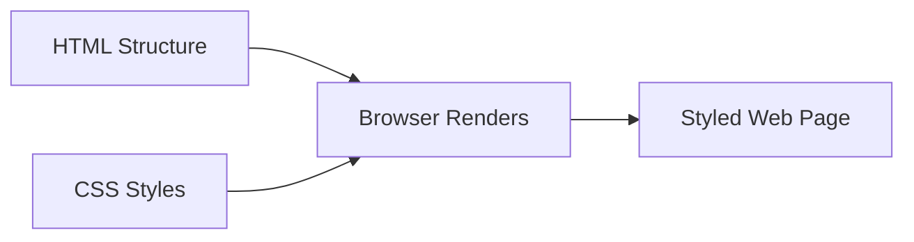

---

### JavaScript Fundamentals — variables, functions, arrays, objects

**Explanation:**
JavaScript is the programming language that adds interactivity to web pages. Angular is built with TypeScript (which compiles to JavaScript), so understanding JavaScript fundamentals is essential.

**Key Concepts:**
- Variables: `let`, `const`, `var`
- Functions: regular functions, arrow functions
- Arrays: `[1, 2, 3]` with methods like `map()`, `filter()`, `forEach()`
- Objects: `{ name: 'John', age: 30 }` for storing related data

**Code Sample:**
```javascript
// Variables
let userName = "John";
const age = 30;

// Functions
function greet(name) {
  return `Hello, ${name}!`;
}

// Arrow function (common in Angular)
const greetArrow = (name) => `Hello, ${name}!`;

// Arrays
const numbers = [1, 2, 3, 4, 5];
const doubled = numbers.map(n => n * 2); // [2, 4, 6, 8, 10]

// Objects
const user = {
  name: "John",
  age: 30,
  email: "john@example.com"
};
```

**Data Flow:**
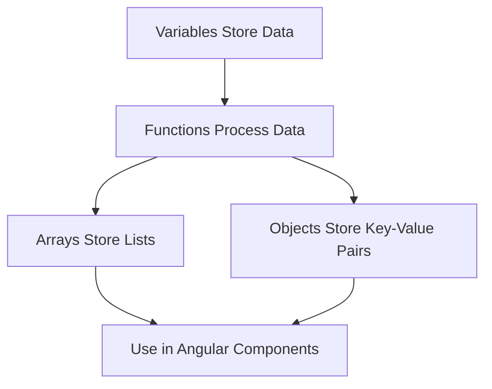

---

### TypeScript Basics — typed JavaScript used in Angular (interfaces, types, classes)

**Explanation:**
TypeScript adds type safety to JavaScript. Angular uses TypeScript to catch errors early and make code more maintainable. Key features include interfaces (shape of objects), types (custom type definitions), and classes (blueprints for objects).

**Key Concepts:**
- Types: `string`, `number`, `boolean`, `any`, `void`
- Interfaces: define object shapes
- Classes: object-oriented programming with constructors and methods
- Type annotations: `let name: string = "John"`

**Code Sample:**
```typescript
// Basic Types
let name: string = "John";
let age: number = 30;
let isActive: boolean = true;

// Interface (defines object shape)
interface User {
  id: number;
  name: string;
  email: string;
  isActive?: boolean; // Optional property
}

// Using interface
const user: User = {
  id: 1,
  name: "John",
  email: "john@example.com"
};

// Class
class UserService {
  private users: User[] = [];

  addUser(user: User): void {
    this.users.push(user);
  }

  getUsers(): User[] {
    return this.users;
  }
}
```

**TypeScript Flow:**
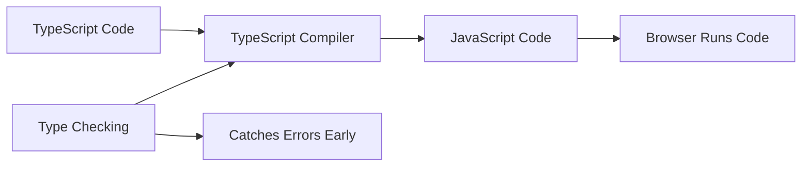

---

### Node.js + npm — runtime + package manager needed to install Angular tooling

**Explanation:**
Node.js is a JavaScript runtime that runs on your computer (not just in the browser). npm (Node Package Manager) is used to install and manage Angular and other JavaScript libraries. Angular CLI requires Node.js to run.

**Key Concepts:**
- Node.js: executes JavaScript outside the browser
- npm: package manager for installing libraries
- `package.json`: lists project dependencies
- `node_modules/`: folder containing installed packages

**Installation Flow:**
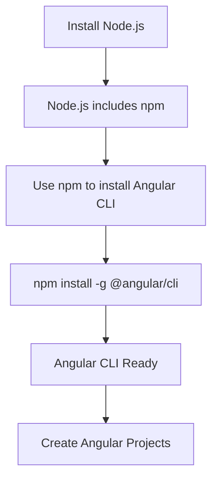

**Code Sample:**
```bash
# Check if Node.js is installed
node --version

# Check if npm is installed
npm --version

# Install Angular CLI globally
npm install -g @angular/cli

# Verify installation
ng version
```

**Package Management Flow:**
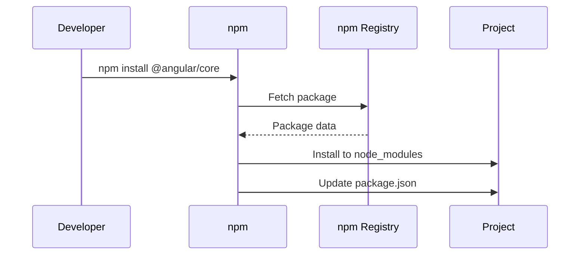

## 1) Setup & Installation

### Install Node.js (LTS) — required to run Angular tools

**Explanation:**
Node.js LTS (Long Term Support) is the stable version recommended for Angular development. It provides the JavaScript runtime environment needed to run Angular CLI and build tools.

**Why LTS?**
- Stable and reliable
- Long-term support and security updates
- Compatible with Angular tooling

**Installation Steps:**
1. Visit [nodejs.org](https://nodejs.org)
2. Download LTS version (recommended)
3. Run installer (Windows/Mac) or use package manager (Linux)
4. Verify installation

**Code Sample:**
```bash
# Check Node.js version (should be 18.x or 20.x LTS)
node --version

# Check npm version (comes with Node.js)
npm --version
```

**Installation Flow:**
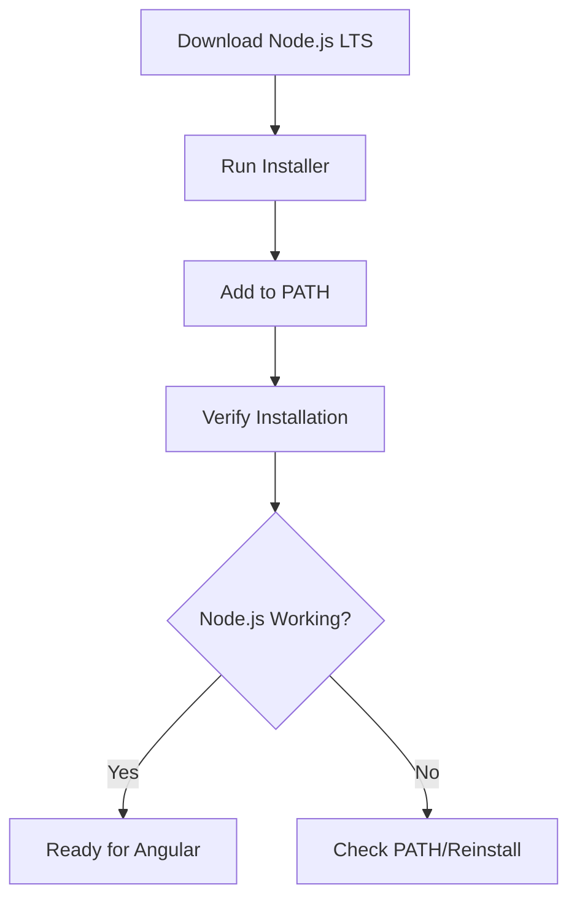

---

### Install Angular CLI — command-line tool to create/run/build Angular apps

**Explanation:**
Angular CLI (Command Line Interface) is a powerful tool that automates common development tasks. It generates components, services, modules, and handles building/testing your application.

**Key Commands:**
- `ng new` - Create new project
- `ng generate` (or `ng g`) - Generate components, services, etc.
- `ng serve` - Run development server
- `ng build` - Build for production
- `ng test` - Run tests

**Code Sample:**
```bash
# Install Angular CLI globally
npm install -g @angular/cli

# Verify installation
ng version

# Get help
ng help
```

**CLI Architecture:**
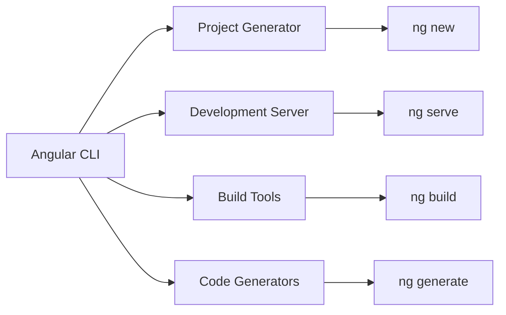

---

### Create New Project — ng new generates a starter Angular app

**Explanation:**
The `ng new` command creates a complete Angular project structure with all necessary configuration files, dependencies, and a sample component to get you started.

**What Gets Created:**
- Project folder structure
- Configuration files (`angular.json`, `tsconfig.json`, etc.)
- Sample app component
- Dependencies in `package.json`
- Basic routing setup (if selected)

**Code Sample:**
```bash
# Create new Angular project
ng new my-angular-app

# During creation, you'll be asked:
# - Would you like to add Angular routing? (Yes/No)
# - Which stylesheet format? (CSS/SCSS/SASS/Less)

# Navigate to project
cd my-angular-app
```

**Project Creation Flow:**
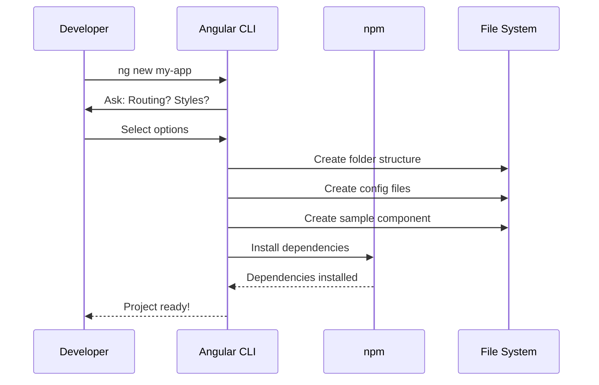

**Project Structure Created:**
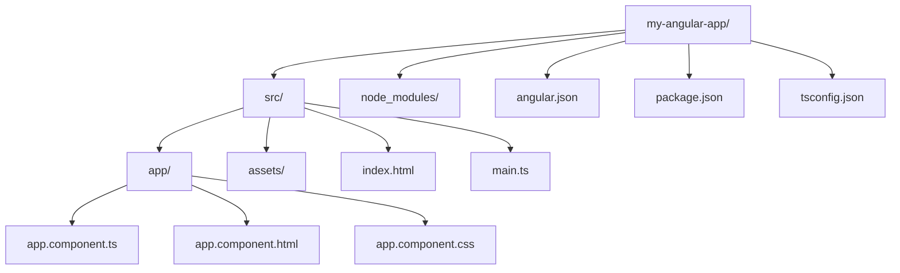

---

### Run Dev Server — ng serve runs the app locally with live reload

**Explanation:**
`ng serve` starts a development server that compiles your Angular app and serves it locally. It watches for file changes and automatically reloads the browser (Hot Module Replacement).

**Features:**
- Live reload on file changes
- Source maps for debugging
- Fast compilation
- Accessible at `http://localhost:4200` by default

**Code Sample:**
```bash
# Start development server
ng serve

# Or with options
ng serve --port 4200 --open

# --port: specify port (default: 4200)
# --open: automatically open browser
```

**Development Server Flow:**
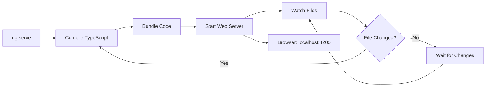

**Request Flow:**
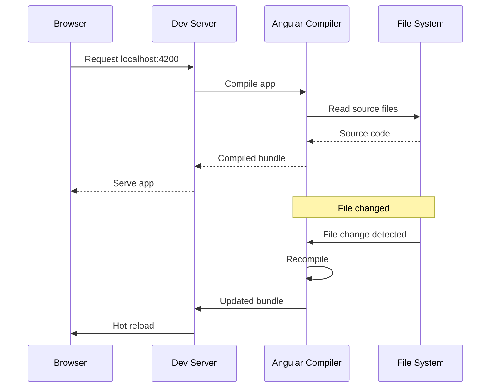

---

### Project Structure Overview — know where components, assets, configs live

**Explanation:**
Understanding the Angular project structure helps you navigate and organize your code effectively. Each folder and file has a specific purpose.

**Key Directories:**
- `src/` - Source code
- `src/app/` - Application components, services, modules
- `src/assets/` - Static files (images, fonts, etc.)
- `node_modules/` - Installed dependencies
- Root config files - Build and TypeScript configuration

**Detailed Structure:**
```
my-angular-app/
├── src/                          # Source code
│   ├── app/                      # Main application folder
│   │   ├── app.component.ts      # Root component TypeScript
│   │   ├── app.component.html    # Root component template
│   │   ├── app.component.css     # Root component styles
│   │   └── app.config.ts         # App configuration
│   ├── assets/                   # Static assets
│   │   └── .gitkeep
│   ├── index.html                # Main HTML file
│   ├── main.ts                   # Application entry point
│   └── styles.css                # Global styles
├── node_modules/                 # Dependencies (auto-generated)
├── angular.json                  # Angular CLI configuration
├── package.json                  # Project dependencies
├── tsconfig.json                 # TypeScript configuration
└── README.md                     # Project documentation
```

**File Purpose Flow:**
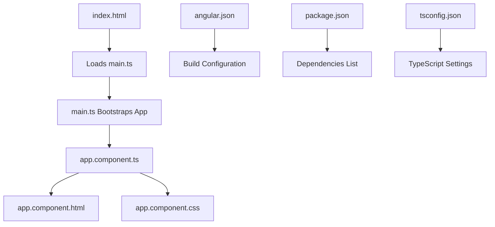

**Component File Relationship:**
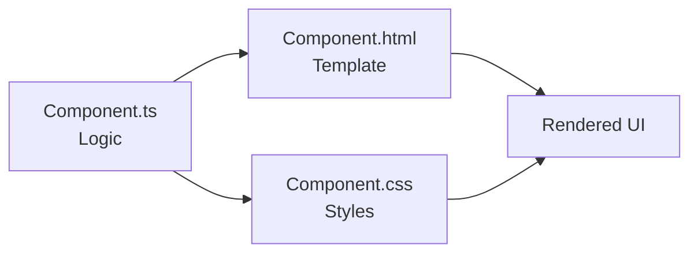

**Code Sample - Understanding Entry Point:**
```typescript
// main.ts - Application entry point
import { bootstrapApplication } from '@angular/platform-browser';
import { AppComponent } from './app/app.component';
import { appConfig } from './app/app.config';

bootstrapApplication(AppComponent, appConfig)
  .catch(err => console.error(err));
```

```typescript
// app.component.ts - Root component
import { Component } from '@angular/core';

@Component({
  selector: 'app-root',
  templateUrl: './app.component.html',
  styleUrls: ['./app.component.css']
})
export class AppComponent {
  title = 'my-angular-app';
}
```

```html
<!-- app.component.html - Root template -->
<div class="container">
  <h1>{{ title }}</h1>
  <p>Welcome to Angular!</p>
</div>
```

## 2) Angular Core Concepts (What/Why)

### What is Angular? — a framework to build large, structured web apps

**Explanation:**
Angular is a comprehensive framework (not just a library) for building dynamic, single-page web applications. It provides structure, tools, and patterns to create maintainable, scalable applications.

**Key Features:**
- Component-based architecture
- Two-way data binding
- Dependency injection
- Built-in routing
- TypeScript support
- CLI tooling

**Angular vs Other Frameworks:**
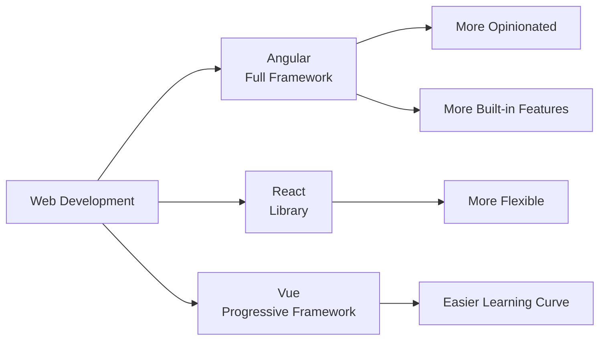

**Angular Architecture:**
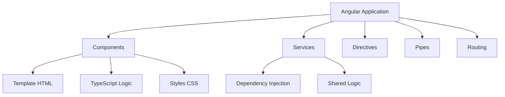

---

### SPA (Single Page App) — app runs in browser; routing swaps views without full reload

**Explanation:**
A Single Page Application (SPA) loads once and dynamically updates content without full page reloads. Angular handles routing client-side, making navigation fast and smooth.

**Traditional vs SPA:**
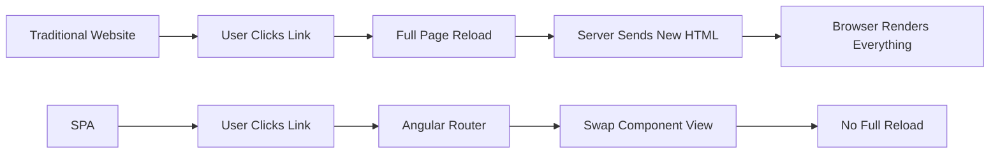

**SPA Flow:**
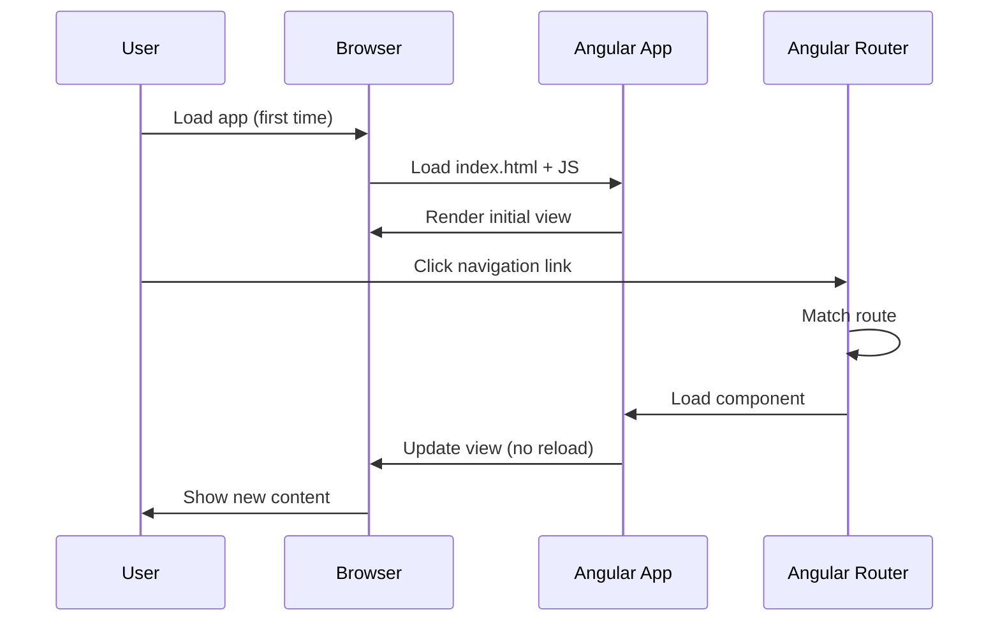

**Code Sample - SPA Routing:**
```typescript
// app.config.ts - Configure routes
import { ApplicationConfig } from '@angular/core';
import { provideRouter } from '@angular/router';
import { routes } from './app.routes';

export const appConfig: ApplicationConfig = {
  providers: [
    provideRouter(routes) // Enables SPA routing
  ]
};
```

```typescript
// app.routes.ts - Define routes
import { Routes } from '@angular/router';
import { HomeComponent } from './home/home.component';
import { AboutComponent } from './about/about.component';

export const routes: Routes = [
  { path: '', component: HomeComponent },
  { path: 'about', component: AboutComponent }
];
```

---

### Modules vs Standalone — ways to organize features (modern Angular prefers standalone)

**Explanation:**
Angular offers two ways to organize code: NgModules (traditional) and Standalone components (modern). Standalone is the recommended approach in Angular 14+ as it's simpler and more flexible.

**Comparison:**
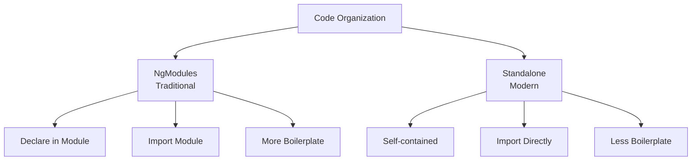

**Module vs Standalone Flow:**
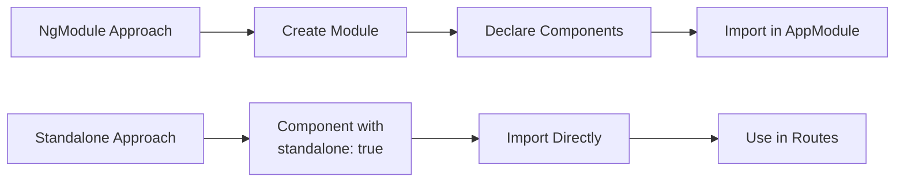

**Code Sample - NgModule (Traditional):**
```typescript
// app.module.ts (NgModules - older approach)
import { NgModule } from '@angular/core';
import { BrowserModule } from '@angular/platform-browser';
import { AppComponent } from './app.component';
import { UserComponent } from './user/user.component';

@NgModule({
  declarations: [AppComponent, UserComponent],
  imports: [BrowserModule],
  providers: [],
  bootstrap: [AppComponent]
})
export class AppModule { }
```

**Code Sample - Standalone (Modern):**
```typescript
// app.component.ts (Standalone - recommended)
import { Component } from '@angular/core';
import { CommonModule } from '@angular/common';
import { UserComponent } from './user/user.component';

@Component({
  selector: 'app-root',
  standalone: true, // Standalone component
  imports: [CommonModule, UserComponent], // Import what you need
  templateUrl: './app.component.html',
  styleUrls: ['./app.component.css']
})
export class AppComponent {
  title = 'My App';
}
```

---

### Component — reusable UI block (HTML + TS + CSS)

**Explanation:**
A component is the fundamental building block of Angular applications. It combines HTML (template), TypeScript (logic), and CSS (styles) into a reusable, self-contained unit.

**Component Structure:**
```mermaid
graph TD
    A[Component] --> B[TypeScript File<br/>.component.ts]
    A --> C[Template File<br/>.component.html]
    A --> D[Style File<br/>.component.css]
    
    B --> E[Class with Logic]
    B --> F[@Component Decorator]
    
    C --> G[HTML with Angular Syntax]
    
    D --> H[Scoped Styles]
```

**Component Lifecycle:**
```mermaid
graph TD
    A[Component Created] --> B[ngOnInit]
    B --> C[Component Rendered]
    C --> D[User Interacts]
    D --> E[ngOnChanges<br/>if inputs change]
    E --> C
    D --> F[ngOnDestroy<br/>when removed]
```

**Code Sample - Complete Component:**
```typescript
// user.component.ts
import { Component, Input, OnInit } from '@angular/core';

@Component({
  selector: 'app-user',
  standalone: true,
  templateUrl: './user.component.html',
  styleUrls: ['./user.component.css']
})
export class UserComponent implements OnInit {
  @Input() userName: string = '';
  @Input() userAge: number = 0;

  ngOnInit(): void {
    console.log('Component initialized');
  }

  greet(): string {
    return `Hello, ${this.userName}!`;
  }
}
```

```html
<!-- user.component.html -->
<div class="user-card">
  <h2>{{ userName }}</h2>
  <p>Age: {{ userAge }}</p>
  <p>{{ greet() }}</p>
  <button (click)="onClick()">Click Me</button>
</div>
```

```css
/* user.component.css */
.user-card {
  border: 1px solid #ccc;
  padding: 20px;
  border-radius: 8px;
  margin: 10px;
}

.user-card h2 {
  color: #333;
}
```

**Component Usage Flow:**
```mermaid
sequenceDiagram
    participant Parent as Parent Component
    participant Angular as Angular Framework
    participant Child as Child Component

    Parent->>Angular: Use <app-user>
    Angular->>Child: Create instance
    Child->>Child: ngOnInit()
    Child->>Angular: Render template
    Angular->>Parent: Display component
```

---

### Template — HTML with Angular syntax

**Explanation:**
A template is HTML enhanced with Angular-specific syntax like interpolation `{{ }}`, property binding `[ ]`, event binding `( )`, and directives like `*ngIf` and `*ngFor`.

**Template Features:**
```mermaid
graph LR
    A[Template] --> B[Interpolation<br/>{{ value }}]
    A --> C[Property Binding<br/>[property]]
    A --> D[Event Binding<br/>(event)]
    A --> E[Directives<br/>*ngIf, *ngFor]
    A --> F[Pipes<br/>| pipe]
```

**Template Processing Flow:**
```mermaid
graph TD
    A[Template HTML] --> B[Angular Compiler]
    B --> C[Parse Angular Syntax]
    C --> D[Create Component View]
    D --> E[Bind Data]
    E --> F[Render DOM]
    F --> G[Update on Changes]
```

**Code Sample:**
```html
<!-- Example template with various Angular features -->
<div class="container">
  <!-- Interpolation -->
  <h1>Welcome, {{ userName }}!</h1>
  
  <!-- Property Binding -->
  
  <button [disabled]="isLoading">Submit</button>
  
  <!-- Event Binding -->
  <button (click)="handleClick()">Click Me</button>
  <input (input)="onInput($event)">
  
  <!-- Structural Directives -->
  <div *ngIf="isVisible">This is visible</div>
  <ul>
    <li *ngFor="let item of items">{{ item.name }}</li>
  </ul>
  
  <!-- Pipes -->
  <p>Date: {{ currentDate | date:'short' }}</p>
  <p>Price: {{ price | currency:'USD' }}</p>
</div>
```

---

### Decorator — metadata like @Component() that tells Angular how to use a class

**Explanation:**
Decorators are special functions that add metadata to classes, methods, or properties. The `@Component()` decorator tells Angular that a class is a component and provides configuration.

**Decorator Types:**
```mermaid
graph TD
    A[Decorators] --> B[@Component<br/>Marks as Component]
    A --> C[@Injectable<br/>Marks as Service]
    A --> D[@Input<br/>Accepts Parent Data]
    A --> E[@Output<br/>Emits Events]
    A --> F[@Directive<br/>Marks as Directive]
```

**Decorator Flow:**
```mermaid
sequenceDiagram
    participant Dev as Developer
    participant Decorator as @Component
    participant Angular as Angular Framework

    Dev->>Decorator: Add @Component to class
    Decorator->>Angular: Register metadata
    Angular->>Angular: Store selector, template, styles
    Angular->>Angular: Treat class as component
```

**Code Sample:**
```typescript
import { Component, Input, Output, EventEmitter } from '@angular/core';

// @Component decorator provides metadata
@Component({
  selector: 'app-button',        // How to use in HTML: <app-button>
  templateUrl: './button.component.html',  // Template file
  styleUrls: ['./button.component.css'],   // Style files
  standalone: true
})
export class ButtonComponent {
  // @Input decorator - accepts data from parent
  @Input() label: string = 'Click';
  @Input() disabled: boolean = false;

  // @Output decorator - emits events to parent
  @Output() clicked = new EventEmitter<void>();

  onClick(): void {
    if (!this.disabled) {
      this.clicked.emit();
    }
  }
}
```

**Decorator Metadata Structure:**
```mermaid
graph LR
    A[@Component] --> B[selector]
    A --> C[templateUrl]
    A --> D[styleUrls]
    A --> E[standalone]
    A --> F[imports]
    
    B --> G[HTML Tag Name]
    C --> H[Template File]
    D --> I[Style Files]
```

---

### Data Binding — connect TS data to UI (sync between logic and template)

**Explanation:**
Data binding creates a connection between component data (TypeScript) and the template (HTML). Angular supports one-way and two-way binding to keep the UI and data synchronized.

**Binding Types:**
```mermaid
graph TD
    A[Data Binding] --> B[One-Way Binding]
    A --> C[Two-Way Binding]
    
    B --> D[TS → HTML<br/>Interpolation {{ }}]
    B --> E[TS → HTML<br/>Property [ ]]
    B --> F[HTML → TS<br/>Event ( )]
    
    C --> G[TS ↔ HTML<br/>[(ngModel)]]
```

**Data Binding Flow:**
```mermaid
sequenceDiagram
    participant TS as TypeScript
    participant Angular as Angular
    participant HTML as Template

    Note over TS,HTML: One-Way: TS → HTML
    TS->>Angular: Data changes
    Angular->>HTML: Update view
    
    Note over TS,HTML: One-Way: HTML → TS
    HTML->>Angular: User action (click, input)
    Angular->>TS: Trigger method
    
    Note over TS,HTML: Two-Way: TS ↔ HTML
    TS->>Angular: Data changes
    Angular->>HTML: Update view
    HTML->>Angular: User input
    Angular->>TS: Update data
```

**Code Sample - All Binding Types:**
```typescript
// component.ts
export class DataBindingComponent {
  // One-way: TS → HTML
  title: string = 'Hello Angular';
  imageUrl: string = 'assets/logo.png';
  isActive: boolean = true;
  
  // Two-way binding data
  userName: string = 'John';
  
  // Event handler
  onClick(): void {
    console.log('Button clicked!');
    this.isActive = !this.isActive;
  }
  
  onInput(event: Event): void {
    const input = event.target as HTMLInputElement;
    console.log('Input value:', input.value);
  }
}
```

```html
<!-- component.html -->
<div>
  <!-- Interpolation: TS → HTML -->
  <h1>{{ title }}</h1>
  
  <!-- Property Binding: TS → HTML -->
  
  <button [disabled]="!isActive">Submit</button>
  
  <!-- Event Binding: HTML → TS -->
  <button (click)="onClick()">Toggle</button>
  <input (input)="onInput($event)">
  
  <!-- Two-Way Binding: TS ↔ HTML -->
  <input [(ngModel)]="userName">
  <p>You typed: {{ userName }}</p>
</div>
```

**Change Detection Flow:**
```mermaid
graph TD
    A[Data Changes] --> B[Angular Detects Change]
    B --> C[Update Binding]
    C --> D[Re-render Affected Parts]
    D --> E[DOM Updated]
    
    F[User Action] --> G[Event Fired]
    G --> H[Component Method Called]
    H --> A
```

## 3) Basic Syntax in Templates (Daily-use)

### Interpolation {{ }} — show TS value in HTML

**Explanation:**
Interpolation is the simplest way to display component data in templates. Use double curly braces `{{ }}` to embed TypeScript expressions that Angular evaluates and displays.

**How It Works:**
```mermaid
graph LR
    A[Component Property] --> B[{{ expression }}]
    B --> C[Angular Evaluates]
    C --> D[Display in HTML]
```

**Code Sample:**
```typescript
// component.ts
export class InterpolationComponent {
  title: string = 'Welcome';
  count: number = 42;
  isActive: boolean = true;
  user: { name: string; age: number } = {
    name: 'John',
    age: 30
  };
  
  getGreeting(): string {
    return `Hello, ${this.user.name}!`;
  }
}
```

```html
<!-- component.html -->
<div>
  <!-- Simple property -->
  <h1>{{ title }}</h1>
  
  <!-- Number -->
  <p>Count: {{ count }}</p>
  
  <!-- Boolean (shows true/false) -->
  <p>Active: {{ isActive }}</p>
  
  <!-- Object property -->
  <p>User: {{ user.name }}, Age: {{ user.age }}</p>
  
  <!-- Method call -->
  <p>{{ getGreeting() }}</p>
  
  <!-- Expression -->
  <p>Total: {{ count * 2 }}</p>
  
  <!-- Conditional expression -->
  <p>Status: {{ isActive ? 'Online' : 'Offline' }}</p>
</div>
```

**Interpolation Flow:**
```mermaid
sequenceDiagram
    participant Component
    participant Angular
    participant Template
    participant Browser

    Component->>Angular: title = "Welcome"
    Angular->>Template: Find {{ title }}
    Angular->>Angular: Evaluate expression
    Angular->>Browser: Render "Welcome"
    
    Note over Component: title changes to "Hello"
    Component->>Angular: title = "Hello"
    Angular->>Browser: Update to "Hello"
```

---

### Property Binding [prop] — set element property from TS

**Explanation:**
Property binding uses square brackets `[ ]` to set HTML element properties or Angular component/directive properties from TypeScript. It's one-way: data flows from component to template.

**When to Use:**
- Set element attributes: `[src]`, `[href]`, `[disabled]`
- Pass data to child components: `[user]="currentUser"`
- Set CSS classes conditionally: `[class.active]="isActive"`

**Property Binding Flow:**
```mermaid
graph LR
    A[Component Property] --> B[[property]="value"]
    B --> C[Angular Updates]
    C --> D[DOM Element Property]
```

**Code Sample:**
```typescript
// component.ts
export class PropertyBindingComponent {
  imageUrl: string = 'https://example.com/image.jpg';
  buttonDisabled: boolean = false;
  linkUrl: string = 'https://angular.io';
  isHighlighted: boolean = true;
  dynamicClass: string = 'btn-primary';
  
  toggleButton(): void {
    this.buttonDisabled = !this.buttonDisabled;
  }
}
```

```html
<!-- component.html -->
<div>
  <!-- Image source -->
  
  
  <!-- Button disabled state -->
  <button [disabled]="buttonDisabled">Submit</button>
  <button (click)="toggleButton()">Toggle</button>
  
  <!-- Link href -->
  <a [href]="linkUrl" target="_blank">Visit Angular</a>
  
  <!-- CSS class binding -->
  <div [class.highlight]="isHighlighted">Highlighted content</div>
  <div [class]="dynamicClass">Dynamic class</div>
  
  <!-- Style binding -->
  <div [style.color]="isHighlighted ? 'red' : 'black'">
    Colored text
  </div>
  <div [style.font-size.px]="16">Font size</div>
  
  <!-- Child component input -->
  <app-user [name]="'John'" [age]="30"></app-user>
</div>
```

**Property Binding vs Interpolation:**
```mermaid
graph TD
    A[Display Value] --> B[Use Interpolation<br/>{{ value }}]
    A --> C[Set Property] --> D[Use Property Binding<br/>[property]="value"]
    
    B --> E[Text Content]
    D --> F[Element Attributes]
    D --> G[Component Inputs]
```

---

### Event Binding (event) — run TS method on UI actions

**Explanation:**
Event binding uses parentheses `( )` to listen to DOM events (clicks, inputs, etc.) and execute component methods. Data flows from template to component.

**Common Events:**
- `(click)` - Mouse click
- `(input)` - Input field changes
- `(change)` - Form control changes
- `(keyup)`, `(keydown)` - Keyboard events
- `(focus)`, `(blur)` - Focus events

**Event Binding Flow:**
```mermaid
sequenceDiagram
    participant User
    participant DOM as DOM Element
    participant Angular
    participant Component

    User->>DOM: Click button
    DOM->>Angular: Event fired
    Angular->>Component: Call method
    Component->>Component: Execute logic
    Component->>Angular: Update if needed
    Angular->>DOM: Re-render
```

**Code Sample:**
```typescript
// component.ts
export class EventBindingComponent {
  message: string = '';
  count: number = 0;
  inputValue: string = '';
  
  onClick(): void {
    this.message = 'Button was clicked!';
    this.count++;
  }
  
  onInput(event: Event): void {
    const target = event.target as HTMLInputElement;
    this.inputValue = target.value;
  }
  
  onKeyUp(event: KeyboardEvent): void {
    if (event.key === 'Enter') {
      console.log('Enter pressed!');
    }
  }
  
  onMouseEnter(): void {
    console.log('Mouse entered');
  }
  
  onSubmit(event: Event): void {
    event.preventDefault();
    console.log('Form submitted');
  }
}
```

```html
<!-- component.html -->
<div>
  <!-- Click event -->
  <button (click)="onClick()">Click Me</button>
  <p>{{ message }}</p>
  <p>Clicked {{ count }} times</p>
  
  <!-- Input event -->
  <input 
    type="text" 
    (input)="onInput($event)"
    placeholder="Type something">
  <p>You typed: {{ inputValue }}</p>
  
  <!-- Keyboard events -->
  <input 
    type="text"
    (keyup)="onKeyUp($event)"
    placeholder="Press Enter">
  
  <!-- Mouse events -->
  <div (mouseenter)="onMouseEnter()" 
       (mouseleave)="onMouseLeave()">
    Hover over me
  </div>
  
  <!-- Form submission -->
  <form (submit)="onSubmit($event)">
    <input type="text" name="username">
    <button type="submit">Submit</button>
  </form>
  
  <!-- Inline event handling -->
  <button (click)="count = count + 1">
    Increment: {{ count }}
  </button>
</div>
```

**Event Object Usage:**
```mermaid
graph LR
    A[Event Fired] --> B[$event Object]
    B --> C[Event Properties]
    C --> D[event.target]
    C --> E[event.type]
    C --> F[event.key]
```

---

### Two-way Binding [(ngModel)] — input ↔ TS sync (forms)

**Explanation:**
Two-way binding combines property binding `[ ]` and event binding `( )` into `[(ngModel)]`. It keeps the component property and form input value synchronized in both directions.

**How Two-way Binding Works:**
```mermaid
graph LR
    A[Component Property] -->|Updates| B[Input Value]
    B -->|User Types| C[Component Property]
    A -.->|Sync| C
    C -.->|Sync| A
```

**Two-way Binding Flow:**
```mermaid
sequenceDiagram
    participant Component
    participant Angular
    participant Input as Input Field

    Component->>Angular: userName = "John"
    Angular->>Input: Set value to "John"
    
    Note over Input: User types "Jane"
    Input->>Angular: Value changed
    Angular->>Component: Update userName to "Jane"
    Component->>Angular: userName = "Jane"
    Angular->>Input: Confirm sync
```

**Code Sample:**
```typescript
// component.ts
import { FormsModule } from '@angular/forms';

@Component({
  standalone: true,
  imports: [FormsModule], // Required for ngModel
  // ...
})
export class TwoWayBindingComponent {
  userName: string = '';
  email: string = '';
  age: number = 0;
  isSubscribed: boolean = false;
  
  onSubmit(): void {
    console.log({
      userName: this.userName,
      email: this.email,
      age: this.age,
      isSubscribed: this.isSubscribed
    });
  }
}
```

```html
<!-- component.html -->
<form (ngSubmit)="onSubmit()">
  <!-- Text input -->
  <div>
    <label>Name:</label>
    <input type="text" [(ngModel)]="userName" name="userName">
    <p>Current value: {{ userName }}</p>
  </div>
  
  <!-- Email input -->
  <div>
    <label>Email:</label>
    <input type="email" [(ngModel)]="email" name="email">
  </div>
  
  <!-- Number input -->
  <div>
    <label>Age:</label>
    <input type="number" [(ngModel)]="age" name="age">
  </div>
  
  <!-- Checkbox -->
  <div>
    <label>
      <input type="checkbox" [(ngModel)]="isSubscribed" name="isSubscribed">
      Subscribe to newsletter
    </label>
  </div>
  
  <button type="submit">Submit</button>
</form>
```

**Note:** Two-way binding is shorthand for:
```html
<!-- This: -->
<input [(ngModel)]="userName">

<!-- Is equivalent to: -->
<input [ngModel]="userName" (ngModelChange)="userName = $event">
```

---

### Template Reference #ref — access element value quickly

**Explanation:**
Template reference variables (using `#` or `ref-`) create a reference to a DOM element or Angular component in the template. You can access it directly without using two-way binding.

**When to Use:**
- Get input value without binding
- Access child component methods
- Pass element to methods

**Template Reference Flow:**
```mermaid
graph LR
    A[#myRef] --> B[Create Reference]
    B --> C[Access in Template]
    C --> D[myRef.value]
    C --> E[Pass to Method]
```

**Code Sample:**
```typescript
// component.ts
export class TemplateRefComponent {
  onSubmit(inputRef: HTMLInputElement): void {
    console.log('Input value:', inputRef.value);
    // Use value without binding
  }
  
  logElement(element: HTMLElement): void {
    console.log('Element:', element);
  }
}
```

```html
<!-- component.html -->
<div>
  <!-- Reference to input element -->
  <input #nameInput type="text" placeholder="Enter name">
  <button (click)="onSubmit(nameInput)">Submit</button>
  
  <!-- Access value directly -->
  <input #emailInput type="email" placeholder="Email">
  <p>You entered: {{ emailInput.value }}</p>
  
  <!-- Reference to component -->
  <app-user #userComponent></app-user>
  <button (click)="userComponent.someMethod()">Call Method</button>
  
  <!-- Reference to any element -->
  <div #myDiv (click)="logElement(myDiv)">
    Click me to log element
  </div>
  
  <!-- Using ref- prefix (alternative syntax) -->
  <input ref-username type="text">
  <button (click)="onSubmit(username)">Submit</button>
</div>
```

**Template Reference vs Two-way Binding:**
```mermaid
graph TD
    A[Need Input Value] --> B{When to Access?}
    B -->|On Submit Only| C[Use Template Reference<br/>#ref]
    B -->|Always Sync| D[Use Two-way Binding<br/>[(ngModel)]]
    
    C --> E[Less Overhead]
    D --> F[Automatic Sync]
```

---

### Pipes | — format data in template (date, currency, custom)

**Explanation:**
Pipes transform data in templates. They format values for display without changing the original data. Angular provides built-in pipes and you can create custom ones.

**Pipe Flow:**
```mermaid
graph LR
    A[Raw Data] --> B[Pipe |]
    B --> C[Formatted Output]
    C --> D[Display in Template]
```

**Common Built-in Pipes:**
```mermaid
graph TD
    A[Pipes] --> B[Date Pipe<br/>| date]
    A --> C[Currency Pipe<br/>| currency]
    A --> D[UpperCase/LowerCase<br/>| uppercase]
    A --> E[JSON Pipe<br/>| json]
    A --> F[Slice Pipe<br/>| slice]
    A --> G[Async Pipe<br/>| async]
```

**Code Sample - Built-in Pipes:**
```typescript
// component.ts
export class PipesComponent {
  currentDate: Date = new Date();
  price: number = 99.99;
  message: string = 'Hello Angular';
  user: object = { name: 'John', age: 30 };
  items: string[] = ['Apple', 'Banana', 'Cherry', 'Date'];
  percentage: number = 0.85;
}
```

```html
<!-- component.html -->
<div>
  <!-- Date pipe -->
  <p>Today: {{ currentDate | date }}</p>
  <p>Short: {{ currentDate | date:'short' }}</p>
  <p>Full: {{ currentDate | date:'fullDate' }}</p>
  <p>Custom: {{ currentDate | date:'MM/dd/yyyy' }}</p>
  
  <!-- Currency pipe -->
  <p>Price: {{ price | currency }}</p>
  <p>USD: {{ price | currency:'USD' }}</p>
  <p>EUR: {{ price | currency:'EUR':'symbol':'1.2-2' }}</p>
  
  <!-- Uppercase/Lowercase -->
  <p>Upper: {{ message | uppercase }}</p>
  <p>Lower: {{ message | lowercase }}</p>
  <p>Title: {{ message | titlecase }}</p>
  
  <!-- JSON pipe (for debugging) -->
  <pre>{{ user | json }}</pre>
  
  <!-- Slice pipe (array/string) -->
  <p>First 3: {{ items | slice:0:3 }}</p>
  <p>Text: {{ message | slice:0:5 }}</p>
  
  <!-- Decimal pipe -->
  <p>Number: {{ percentage | number:'1.2-2' }}</p>
  <p>Percent: {{ percentage | percent }}</p>
  
  <!-- Chaining pipes -->
  <p>{{ currentDate | date:'fullDate' | uppercase }}</p>
</div>
```

**Code Sample - Custom Pipe:**
```typescript
// truncate.pipe.ts
import { Pipe, PipeTransform } from '@angular/core';

@Pipe({
  name: 'truncate',
  standalone: true
})
export class TruncatePipe implements PipeTransform {
  transform(value: string, limit: number = 20, trail: string = '...'): string {
    if (!value) return '';
    return value.length > limit 
      ? value.substring(0, limit) + trail 
      : value;
  }
}
```

```typescript
// component.ts
import { TruncatePipe } from './truncate.pipe';

@Component({
  standalone: true,
  imports: [TruncatePipe],
  // ...
})
export class MyComponent {
  longText: string = 'This is a very long text that needs to be truncated';
}
```

```html
<!-- component.html -->
<p>{{ longText | truncate:30 }}</p>
<!-- Output: "This is a very long text th..." -->
```

**Pipe Chaining Flow:**
```mermaid
graph LR
    A[Data] --> B[Pipe 1]
    B --> C[Pipe 2]
    C --> D[Pipe 3]
    D --> E[Final Output]
    
    F[date pipe] --> G[uppercase pipe]
    G --> H[Display]
```

## 4) Directives (Control the UI)

### Structural Directives — change DOM structure (*ngIf, *ngFor, *ngSwitch)

**Explanation:**
Structural directives change the DOM structure by adding, removing, or manipulating elements. They use the `*` prefix and are the most powerful directives in Angular.

**Key Structural Directives:**
- `*ngIf` - Conditionally add/remove elements
- `*ngFor` - Loop through arrays to create elements
- `*ngSwitch` - Multi-conditional rendering

**Structural Directive Flow:**
```mermaid
graph TD
    A[Structural Directive] --> B[*ngIf]
    A --> C[*ngFor]
    A --> D[*ngSwitch]
    
    B --> E[Add/Remove Element]
    C --> F[Create Multiple Elements]
    D --> G[Conditional Rendering]
```

**Code Sample - *ngIf:**
```typescript
// component.ts
export class NgIfComponent {
  isLoggedIn: boolean = true;
  userRole: string = 'admin';
  items: any[] = [];
  
  toggleLogin(): void {
    this.isLoggedIn = !this.isLoggedIn;
  }
}
```

```html
<!-- component.html -->
<div>
  <!-- Basic *ngIf -->
  <div *ngIf="isLoggedIn">
    <p>Welcome! You are logged in.</p>
  </div>
  
  <!-- *ngIf with else -->
  <div *ngIf="isLoggedIn; else loginPrompt">
    <p>Dashboard content</p>
  </div>
  <ng-template #loginPrompt>
    <p>Please log in to continue.</p>
  </ng-template>
  
  <!-- *ngIf with then/else -->
  <div *ngIf="isLoggedIn; then loggedIn; else loggedOut"></div>
  <ng-template #loggedIn>
    <p>User is logged in</p>
  </ng-template>
  <ng-template #loggedOut>
    <p>User is logged out</p>
  </ng-template>
  
  <!-- Check array length -->
  <div *ngIf="items.length > 0">
    <p>You have {{ items.length }} items</p>
  </div>
</div>
```

**Code Sample - *ngFor:**
```typescript
// component.ts
export class NgForComponent {
  users: { id: number; name: string; email: string }[] = [
    { id: 1, name: 'John', email: 'john@example.com' },
    { id: 2, name: 'Jane', email: 'jane@example.com' },
    { id: 3, name: 'Bob', email: 'bob@example.com' }
  ];
  
  items: string[] = ['Apple', 'Banana', 'Cherry'];
  
  trackByUserId(index: number, user: any): number {
    return user.id;
  }
}
```

```html
<!-- component.html -->
<div>
  <!-- Basic *ngFor -->
  <ul>
    <li *ngFor="let item of items">{{ item }}</li>
  </ul>
  
  <!-- *ngFor with index -->
  <ul>
    <li *ngFor="let user of users; let i = index">
      {{ i + 1 }}. {{ user.name }} - {{ user.email }}
    </li>
  </ul>
  
  <!-- *ngFor with trackBy (performance optimization) -->
  <ul>
    <li *ngFor="let user of users; trackBy: trackByUserId">
      {{ user.name }}
    </li>
  </ul>
  
  <!-- *ngFor with first, last, even, odd -->
  <div *ngFor="let user of users; let first = first; let last = last; let even = even; let odd = odd"
       [class.first]="first"
       [class.last]="last"
       [class.even]="even"
       [class.odd]="odd">
    {{ user.name }}
  </div>
  
  <!-- Nested *ngFor -->
  <div *ngFor="let user of users">
    <h3>{{ user.name }}</h3>
    <ul>
      <li *ngFor="let item of items">{{ item }}</li>
    </ul>
  </div>
</div>
```

**Code Sample - *ngSwitch:**
```typescript
// component.ts
export class NgSwitchComponent {
  status: string = 'active';
  userRole: string = 'admin';
  
  changeStatus(newStatus: string): void {
    this.status = newStatus;
  }
}
```

```html
<!-- component.html -->
<div>
  <!-- Basic *ngSwitch -->
  <div [ngSwitch]="status">
    <p *ngSwitchCase="'active'">Status: Active</p>
    <p *ngSwitchCase="'inactive'">Status: Inactive</p>
    <p *ngSwitchCase="'pending'">Status: Pending</p>
    <p *ngSwitchDefault>Status: Unknown</p>
  </div>
  
  <!-- *ngSwitch with user roles -->
  <div [ngSwitch]="userRole">
    <div *ngSwitchCase="'admin'">
      <h2>Admin Dashboard</h2>
      <button>Delete User</button>
      <button>Manage Settings</button>
    </div>
    <div *ngSwitchCase="'user'">
      <h2>User Dashboard</h2>
      <button>View Profile</button>
    </div>
    <div *ngSwitchCase="'guest'">
      <h2>Guest View</h2>
      <p>Please log in for full access</p>
    </div>
    <div *ngSwitchDefault>
      <p>Invalid role</p>
    </div>
  </div>
</div>
```

**Structural Directive Processing Flow:**
```mermaid
sequenceDiagram
    participant Template
    participant Angular
    participant DOM

    Template->>Angular: *ngIf="condition"
    Angular->>Angular: Evaluate condition
    alt Condition is true
        Angular->>DOM: Create element
    else Condition is false
        Angular->>DOM: Remove element
    end
    
    Template->>Angular: *ngFor="let item of items"
    Angular->>Angular: Loop through items
    Angular->>DOM: Create element for each item
```

---

### Attribute Directives — change look/behavior ([ngClass], [ngStyle])

**Explanation:**
Attribute directives change the appearance or behavior of existing elements without changing the DOM structure. They modify element properties, classes, or styles.

**Key Attribute Directives:**
- `[ngClass]` - Dynamically add/remove CSS classes
- `[ngStyle]` - Dynamically set inline styles

**Attribute Directive Flow:**
```mermaid
graph LR
    A[Attribute Directive] --> B[[ngClass]]
    A --> C[[ngStyle]]
    
    B --> D[Add/Remove Classes]
    C --> E[Set Inline Styles]
    
    D --> F[Change Appearance]
    E --> F
```

**Code Sample - [ngClass]:**
```typescript
// component.ts
export class NgClassComponent {
  isActive: boolean = true;
  isDisabled: boolean = false;
  currentTheme: string = 'dark';
  status: 'success' | 'error' | 'warning' = 'success';
  
  toggleActive(): void {
    this.isActive = !this.isActive;
  }
}
```

```html
<!-- component.html -->
<div>
  <!-- [ngClass] with object syntax -->
  <button [ngClass]="{ 'active': isActive, 'disabled': isDisabled }">
    Click Me
  </button>
  
  <!-- [ngClass] with string -->
  <div [ngClass]="currentTheme">
    Themed content
  </div>
  
  <!-- [ngClass] with array -->
  <div [ngClass]="['base-class', 'additional-class', status]">
    Multiple classes
  </div>
  
  <!-- [ngClass] with conditional object -->
  <div [ngClass]="{
    'success': status === 'success',
    'error': status === 'error',
    'warning': status === 'warning'
  }">
    Status message
  </div>
  
  <!-- Combining with class binding -->
  <div class="base" 
       [ngClass]="{ 'highlight': isActive }"
       [class.special]="isActive">
    Combined classes
  </div>
</div>
```

```css
/* component.css */
.active {
  background-color: #007bff;
  color: white;
}

.disabled {
  opacity: 0.5;
  cursor: not-allowed;
}

.success {
  background-color: #28a745;
  color: white;
}

.error {
  background-color: #dc3545;
  color: white;
}

.warning {
  background-color: #ffc107;
  color: black;
}
```

**Code Sample - [ngStyle]:**
```typescript
// component.ts
export class NgStyleComponent {
  fontSize: number = 16;
  textColor: string = 'black';
  backgroundColor: string = 'white';
  isHighlighted: boolean = false;
  
  dynamicStyles: { [key: string]: string } = {
    'color': 'blue',
    'font-weight': 'bold',
    'text-decoration': 'underline'
  };
}
```

```html
<!-- component.html -->
<div>
  <!-- [ngStyle] with object syntax -->
  <p [ngStyle]="{ 'font-size': fontSize + 'px', 'color': textColor }">
    Dynamic styled text
  </div>
  
  <!-- [ngStyle] with conditional styles -->
  <div [ngStyle]="{
    'background-color': isHighlighted ? 'yellow' : 'transparent',
    'padding': isHighlighted ? '10px' : '0px'
  }">
    Conditional styling
  </div>
  
  <!-- [ngStyle] with property object -->
  <div [ngStyle]="dynamicStyles">
    Predefined styles
  </div>
  
  <!-- Individual style properties -->
  <div [style.color]="textColor"
       [style.font-size.px]="fontSize"
       [style.background-color]="backgroundColor">
    Individual properties
  </div>
  
  <!-- Combining ngStyle with ngClass -->
  <div [ngClass]="{ 'card': true }"
       [ngStyle]="{ 'border': '1px solid #ccc', 'border-radius': '8px' }">
    Combined styling
  </div>
</div>
```

**Attribute Directive Processing Flow:**
```mermaid
sequenceDiagram
    participant Component
    participant Angular
    participant DOM

    Component->>Angular: [ngClass]="{ 'active': isActive }"
    Angular->>Angular: Evaluate conditions
    Angular->>DOM: Add/remove classes
    
    Component->>Angular: [ngStyle]="{ 'color': textColor }"
    Angular->>Angular: Evaluate styles
    Angular->>DOM: Apply inline styles
```

---

### Built-in vs Custom Directive — when you create your own UI behavior

**Explanation:**
Angular provides built-in directives, but you can create custom directives to add specific behaviors to elements. Custom directives are useful for reusable UI behaviors that don't need a full component.

**When to Use Custom Directives:**
- Reusable behavior without template
- DOM manipulation
- Event handling patterns
- Shared styling logic

**Directive Types Comparison:**
```mermaid
graph TD
    A[Directives] --> B[Built-in Directives]
    A --> C[Custom Directives]
    
    B --> D[*ngIf, *ngFor, *ngSwitch]
    B --> E[[ngClass], [ngStyle]]
    
    C --> F[Attribute Directives]
    C --> G[Structural Directives]
    
    F --> H[Modify Element]
    G --> I[Change DOM Structure]
```

**Code Sample - Custom Attribute Directive:**
```typescript
// highlight.directive.ts
import { Directive, ElementRef, Input, OnInit, OnDestroy, Renderer2 } from '@angular/core';

@Directive({
  selector: '[appHighlight]',
  standalone: true
})
export class HighlightDirective implements OnInit, OnDestroy {
  @Input() appHighlight: string = 'yellow';
  @Input() defaultColor: string = 'transparent';
  
  private mouseEnterListener?: () => void;
  private mouseLeaveListener?: () => void;
  
  constructor(
    private el: ElementRef,
    private renderer: Renderer2
  ) {}
  
  ngOnInit(): void {
    this.setBackgroundColor(this.defaultColor);
  }
  
  ngOnDestroy(): void {
    // Clean up listeners if needed
  }
  
  @HostListener('mouseenter') onMouseEnter(): void {
    this.setBackgroundColor(this.appHighlight || 'yellow');
  }
  
  @HostListener('mouseleave') onMouseLeave(): void {
    this.setBackgroundColor(this.defaultColor);
  }
  
  private setBackgroundColor(color: string): void {
    this.renderer.setStyle(this.el.nativeElement, 'background-color', color);
  }
}
```

```typescript
// component.ts
import { HighlightDirective } from './highlight.directive';

@Component({
  standalone: true,
  imports: [HighlightDirective],
  // ...
})
export class MyComponent { }
```

```html
<!-- component.html -->
<div>
  <!-- Using custom directive -->
  <p appHighlight="yellow" defaultColor="transparent">
    Hover over me to highlight
  </p>
  
  <div appHighlight="lightblue" defaultColor="white">
    Another highlighted element
  </div>
</div>
```

**Code Sample - Custom Structural Directive:**
```typescript
// unless.directive.ts
import { Directive, Input, TemplateRef, ViewContainerRef } from '@angular/core';

@Directive({
  selector: '[appUnless]',
  standalone: true
})
export class UnlessDirective {
  private hasView = false;
  
  constructor(
    private templateRef: TemplateRef<any>,
    private viewContainer: ViewContainerRef
  ) {}
  
  @Input() set appUnless(condition: boolean) {
    if (!condition && !this.hasView) {
      this.viewContainer.createEmbeddedView(this.templateRef);
      this.hasView = true;
    } else if (condition && this.hasView) {
      this.viewContainer.clear();
      this.hasView = false;
    }
  }
}
```

```html
<!-- component.html -->
<div>
  <!-- Custom structural directive (opposite of *ngIf) -->
  <div *appUnless="isLoggedIn">
    <p>Please log in</p>
  </div>
</div>
```

**Directive Creation Flow:**
```mermaid
sequenceDiagram
    participant Dev as Developer
    participant Directive as Custom Directive
    participant Angular
    participant DOM

    Dev->>Directive: Create directive class
    Dev->>Directive: Add @Directive decorator
    Directive->>Angular: Register directive
    Angular->>DOM: Apply directive behavior
    DOM->>Angular: Element events
    Angular->>Directive: Handle events
    Directive->>DOM: Update element
```

**When to Use Each:**
```mermaid
graph TD
    A[Need UI Behavior] --> B{Has Template?}
    B -->|Yes| C[Use Component]
    B -->|No| D{Modify DOM Structure?}
    D -->|Yes| E[Custom Structural Directive]
    D -->|No| F[Custom Attribute Directive]
    
    C --> G[Full UI Block]
    E --> H[*appUnless, *appRepeat]
    F --> I[appHighlight, appTooltip]
```

## 5) Components Communication (How components talk)

### @Input() — parent → child data

**Explanation:**
`@Input()` allows a parent component to pass data down to a child component. The child component receives and can use this data in its template and logic.

**Data Flow:**
```mermaid
graph LR
    A[Parent Component] -->|Passes Data| B[@Input Property]
    B --> C[Child Component]
    C --> D[Uses Data in Template]
```

**Communication Flow:**
```mermaid
sequenceDiagram
    participant Parent
    participant Angular
    participant Child

    Parent->>Angular: <app-child [data]="parentData">
    Angular->>Child: Set @Input() data
    Child->>Child: Use data in template/logic
    Note over Child: Data updates when parent changes
```

**Code Sample:**
```typescript
// child.component.ts
import { Component, Input, OnChanges, SimpleChanges } from '@angular/core';

@Component({
  selector: 'app-child',
  standalone: true,
  template: `
    <div class="child">
      <h3>Child Component</h3>
      <p>Name: {{ userName }}</p>
      <p>Age: {{ userAge }}</p>
      <p>Status: {{ isActive ? 'Active' : 'Inactive' }}</p>
      <p>User Object: {{ user | json }}</p>
    </div>
  `
})
export class ChildComponent implements OnChanges {
  // Basic input
  @Input() userName: string = '';
  
  // Input with alias
  @Input('userAge') age: number = 0;
  
  // Input with default value
  @Input() isActive: boolean = false;
  
  // Input with object
  @Input() user: { name: string; email: string } = { name: '', email: '' };
  
  // Watch for input changes
  ngOnChanges(changes: SimpleChanges): void {
    if (changes['userName']) {
      console.log('Name changed:', changes['userName'].currentValue);
    }
  }
}
```

```typescript
// parent.component.ts
import { Component } from '@angular/core';
import { ChildComponent } from './child/child.component';

@Component({
  selector: 'app-parent',
  standalone: true,
  imports: [ChildComponent],
  template: `
    <div class="parent">
      <h2>Parent Component</h2>
      <input [(ngModel)]="name" placeholder="Enter name">
      <input type="number" [(ngModel)]="age" placeholder="Enter age">
      <button (click)="toggleActive()">Toggle Status</button>
      
      <!-- Pass data to child -->
      <app-child 
        [userName]="name"
        [userAge]="age"
        [isActive]="active"
        [user]="userObject">
      </app-child>
    </div>
  `
})
export class ParentComponent {
  name: string = 'John Doe';
  age: number = 30;
  active: boolean = true;
  
  userObject = {
    name: 'John Doe',
    email: 'john@example.com'
  };
  
  toggleActive(): void {
    this.active = !this.active;
  }
}
```

**Input Property Binding Flow:**
```mermaid
graph TD
    A[Parent Property] --> B[Property Binding]
    B --> C[@Input Decorator]
    C --> D[Child Property]
    D --> E[Child Template]
    
    F[parentData] --> G[[data]="parentData"]
    G --> H[@Input data]
    H --> I[childData]
```

---

### @Output() + EventEmitter — child → parent events

**Explanation:**
`@Output()` with `EventEmitter` allows a child component to send data or events up to its parent component. The parent can listen to these events and react accordingly.

**Event Flow:**
```mermaid
graph LR
    A[Child Component] -->|Emits Event| B[@Output EventEmitter]
    B --> C[Parent Component]
    C --> D[Handles Event]
```

**Communication Flow:**
```mermaid
sequenceDiagram
    participant Child
    participant Angular
    participant Parent

    Child->>Child: User action (click, etc.)
    Child->>Angular: this.eventEmitter.emit(data)
    Angular->>Parent: (event)="handleEvent($event)"
    Parent->>Parent: Execute handler method
```

**Code Sample:**
```typescript
// child.component.ts
import { Component, Output, EventEmitter } from '@angular/core';

@Component({
  selector: 'app-child',
  standalone: true,
  template: `
    <div class="child">
      <h3>Child Component</h3>
      <input [(ngModel)]="message" placeholder="Enter message">
      <button (click)="sendMessage()">Send to Parent</button>
      <button (click)="notifyParent()">Notify Parent</button>
      <button (click)="deleteItem()">Delete</button>
    </div>
  `
})
export class ChildComponent {
  message: string = '';
  
  // Basic output event
  @Output() messageSent = new EventEmitter<string>();
  
  // Output with custom event name
  @Output('notify') notification = new EventEmitter<void>();
  
  // Output with data object
  @Output() itemDeleted = new EventEmitter<{ id: number; name: string }>();
  
  sendMessage(): void {
    if (this.message.trim()) {
      this.messageSent.emit(this.message);
      this.message = '';
    }
  }
  
  notifyParent(): void {
    this.notification.emit();
  }
  
  deleteItem(): void {
    this.itemDeleted.emit({ id: 1, name: 'Sample Item' });
  }
}
```

```typescript
// parent.component.ts
import { Component } from '@angular/core';
import { ChildComponent } from './child/child.component';

@Component({
  selector: 'app-parent',
  standalone: true,
  imports: [ChildComponent],
  template: `
    <div class="parent">
      <h2>Parent Component</h2>
      <p>Received message: {{ receivedMessage }}</p>
      <p>Notification count: {{ notificationCount }}</p>
      <p>Deleted item: {{ deletedItem | json }}</p>
      
      <!-- Listen to child events -->
      <app-child 
        (messageSent)="onMessageReceived($event)"
        (notify)="onNotification()"
        (itemDeleted)="onItemDeleted($event)">
      </app-child>
    </div>
  `
})
export class ParentComponent {
  receivedMessage: string = '';
  notificationCount: number = 0;
  deletedItem: any = null;
  
  onMessageReceived(message: string): void {
    this.receivedMessage = message;
    console.log('Message received:', message);
  }
  
  onNotification(): void {
    this.notificationCount++;
    alert('Notification received from child!');
  }
  
  onItemDeleted(item: { id: number; name: string }): void {
    this.deletedItem = item;
    console.log('Item deleted:', item);
  }
}
```

**Two-Way Binding with @Input/@Output:**
```typescript
// child.component.ts
import { Component, Input, Output, EventEmitter } from '@angular/core';

@Component({
  selector: 'app-counter',
  standalone: true,
  template: `
    <div>
      <button (click)="decrement()">-</button>
      <span>{{ count }}</span>
      <button (click)="increment()">+</button>
    </div>
  `
})
export class CounterComponent {
  @Input() count: number = 0;
  @Output() countChange = new EventEmitter<number>();
  
  increment(): void {
    this.count++;
    this.countChange.emit(this.count);
  }
  
  decrement(): void {
    this.count--;
    this.countChange.emit(this.count);
  }
}
```

```html
<!-- parent.component.html -->
<!-- Two-way binding with custom component -->
<app-counter [(count)]="counterValue"></app-counter>
<p>Parent counter: {{ counterValue }}</p>
```

**Output Event Flow:**
```mermaid
graph TD
    A[Child Action] --> B[EventEmitter.emit]
    B --> C[@Output Decorator]
    C --> D[Parent Event Binding]
    D --> E[Parent Handler Method]
    
    F[User Clicks] --> G[childMethod]
    G --> H[this.output.emit]
    H --> I[(output)="parentMethod"]
```

---

### Shared Service — sibling/any → any communication using a common service

**Explanation:**
A shared service acts as a central communication hub. Multiple components can inject the same service instance to share data and communicate with each other, regardless of their relationship in the component tree.

**Service Communication Flow:**
```mermaid
graph TD
    A[Service] --> B[Component A]
    A --> C[Component B]
    A --> D[Component C]
    
    B -->|Update Data| A
    A -->|Notify| C
    A -->|Notify| D
```

**Service Architecture:**
```mermaid
sequenceDiagram
    participant CompA as Component A
    participant Service as Shared Service
    participant CompB as Component B

    CompA->>Service: Update data
    Service->>Service: Store/Process data
    Service->>CompB: Notify subscribers
    CompB->>Service: Get updated data
```

**Code Sample:**
```typescript
// data.service.ts
import { Injectable } from '@angular/core';
import { BehaviorSubject, Observable } from 'rxjs';

@Injectable({
  providedIn: 'root' // Singleton service
})
export class DataService {
  // Private BehaviorSubject to store current value
  private messageSubject = new BehaviorSubject<string>('Initial message');
  
  // Public Observable for components to subscribe
  public message$: Observable<string> = this.messageSubject.asObservable();
  
  // Private data store
  private users: any[] = [];
  private usersSubject = new BehaviorSubject<any[]>([]);
  public users$: Observable<any[]> = this.usersSubject.asObservable();
  
  // Methods to update data
  setMessage(message: string): void {
    this.messageSubject.next(message);
  }
  
  getMessage(): string {
    return this.messageSubject.value;
  }
  
  addUser(user: any): void {
    this.users.push(user);
    this.usersSubject.next([...this.users]);
  }
  
  getUsers(): any[] {
    return this.users;
  }
}
```

```typescript
// component-a.component.ts
import { Component, OnInit, OnDestroy } from '@angular/core';
import { Subscription } from 'rxjs';
import { DataService } from './data.service';

@Component({
  selector: 'app-component-a',
  standalone: true,
  template: `
    <div>
      <h3>Component A</h3>
      <input [(ngModel)]="inputMessage" placeholder="Enter message">
      <button (click)="sendMessage()">Send Message</button>
      <p>Received: {{ receivedMessage }}</p>
    </div>
  `
})
export class ComponentA implements OnInit, OnDestroy {
  inputMessage: string = '';
  receivedMessage: string = '';
  private subscription?: Subscription;
  
  constructor(private dataService: DataService) {}
  
  ngOnInit(): void {
    // Subscribe to message changes
    this.subscription = this.dataService.message$.subscribe(
      message => {
        this.receivedMessage = message;
      }
    );
  }
  
  ngOnDestroy(): void {
    // Clean up subscription
    this.subscription?.unsubscribe();
  }
  
  sendMessage(): void {
    this.dataService.setMessage(this.inputMessage);
    this.inputMessage = '';
  }
}
```

```typescript
// component-b.component.ts
import { Component, OnInit, OnDestroy } from '@angular/core';
import { Subscription } from 'rxjs';
import { DataService } from './data.service';

@Component({
  selector: 'app-component-b',
  standalone: true,
  template: `
    <div>
      <h3>Component B</h3>
      <p>Message from service: {{ message }}</p>
      <ul>
        <li *ngFor="let user of users">{{ user.name }}</li>
      </ul>
    </div>
  `
})
export class ComponentB implements OnInit, OnDestroy {
  message: string = '';
  users: any[] = [];
  private subscriptions: Subscription[] = [];
  
  constructor(private dataService: DataService) {}
  
  ngOnInit(): void {
    // Subscribe to message
    const messageSub = this.dataService.message$.subscribe(
      msg => this.message = msg
    );
    this.subscriptions.push(messageSub);
    
    // Subscribe to users
    const usersSub = this.dataService.users$.subscribe(
      users => this.users = users
    );
    this.subscriptions.push(usersSub);
  }
  
  ngOnDestroy(): void {
    // Clean up all subscriptions
    this.subscriptions.forEach(sub => sub.unsubscribe());
  }
}
```

**Service Communication Patterns:**
```mermaid
graph TD
    A[Shared Service] --> B[BehaviorSubject]
    A --> C[Observable]
    A --> D[Methods]
    
    B --> E[Store Current Value]
    C --> F[Subscribe to Changes]
    D --> G[Update Data]
    
    E --> H[Components Get Data]
    F --> I[Components React to Changes]
    G --> J[Trigger Updates]
```

---

### Content Projection (ng-content) — pass HTML content into a component

**Explanation:**
Content projection (using `<ng-content>`) allows you to pass HTML content from a parent component into a child component. This is useful for creating reusable wrapper components.

**Content Projection Flow:**
```mermaid
graph LR
    A[Parent HTML] --> B[Child Component]
    B --> C[ng-content]
    C --> D[Rendered Content]
```

**Projection Types:**
```mermaid
graph TD
    A[Content Projection] --> B[Single Slot]
    A --> C[Multi-Slot]
    A --> D[Conditional]
    
    B --> E[<ng-content>]
    C --> F[<ng-content select>
    D --> G[*ngIf with ng-content]
```

**Code Sample - Single Slot Projection:**
```typescript
// card.component.ts
import { Component } from '@angular/core';

@Component({
  selector: 'app-card',
  standalone: true,
  template: `
    <div class="card">
      <div class="card-header">
        <h3>{{ title }}</h3>
      </div>
      <div class="card-body">
        <!-- Projected content goes here -->
        <ng-content></ng-content>
      </div>
      <div class="card-footer" *ngIf="showFooter">
        <ng-content select="[footer]"></ng-content>
      </div>
    </div>
  `,
  styles: [`
    .card {
      border: 1px solid #ccc;
      border-radius: 8px;
      padding: 16px;
      margin: 16px;
    }
    .card-header {
      border-bottom: 1px solid #eee;
      margin-bottom: 16px;
    }
    .card-footer {
      border-top: 1px solid #eee;
      margin-top: 16px;
      padding-top: 16px;
    }
  `]
})
export class CardComponent {
  @Input() title: string = 'Card Title';
  @Input() showFooter: boolean = false;
}
```

```html
<!-- parent.component.html -->
<app-card title="User Profile" [showFooter]="true">
  <!-- This content is projected into ng-content -->
  <p>Name: John Doe</p>
  <p>Email: john@example.com</p>
  <p>Age: 30</p>
  
  <!-- Footer content with selector -->
  <div footer>
    <button>Edit</button>
    <button>Delete</button>
  </div>
</app-card>
```

**Code Sample - Multi-Slot Projection:**
```typescript
// tab-container.component.ts
import { Component } from '@angular/core';

@Component({
  selector: 'app-tab-container',
  standalone: true,
  template: `
    <div class="tab-container">
      <div class="tab-headers">
        <button 
          *ngFor="let tab of tabs" 
          (click)="selectTab(tab)"
          [class.active]="activeTab === tab">
          {{ tab }}
        </button>
      </div>
      <div class="tab-content">
        <!-- Project header content -->
        <ng-content select="[tab-header]"></ng-content>
        
        <!-- Project body content -->
        <ng-content select="[tab-body]"></ng-content>
        
        <!-- Default projection (no selector) -->
        <ng-content></ng-content>
      </div>
    </div>
  `
})
export class TabContainerComponent {
  tabs: string[] = ['Tab 1', 'Tab 2', 'Tab 3'];
  activeTab: string = 'Tab 1';
  
  selectTab(tab: string): void {
    this.activeTab = tab;
  }
}
```

```html
<!-- parent.component.html -->
<app-tab-container>
  <div tab-header>
    <h2>Custom Header</h2>
  </div>
  
  <div tab-body>
    <p>This is the body content</p>
  </div>
  
  <p>This is default projected content</p>
</app-tab-container>
```

**Content Projection Processing Flow:**
```mermaid
sequenceDiagram
    participant Parent
    participant Angular
    participant Child
    participant DOM

    Parent->>Angular: <app-child>Content</app-child>
    Angular->>Child: Find <ng-content>
    Angular->>Child: Insert parent content
    Child->>DOM: Render with projected content
```

**Use Cases for Content Projection:**
```mermaid
graph TD
    A[Content Projection Use Cases] --> B[Wrapper Components]
    A --> C[Layout Components]
    A --> D[Modal/Dialog]
    A --> E[Card Components]
    
    B --> F[app-container]
    C --> G[app-layout]
    D --> H[app-modal]
    E --> I[app-card]
```

6) Services & Dependency Injection (DI)

Service — reusable logic (API calls, state, utilities)

Dependency Injection — Angular provides service instances automatically

Provider Scope — app-wide vs feature vs component-level instance

7) Routing (Multiple pages inside SPA)

Router Basics — map URL → component

RouterLink — navigation without page reload

Route Params — pass id like /users/10

Query Params — filters like ?page=2

Guards — protect routes (auth/role checks)

Lazy Loading — load features only when needed for performance

8) Forms (User input)

Template-driven Forms — easiest, uses ngModel

Reactive Forms — scalable, uses FormGroup, FormControl

Validation — required, minLength, custom validators

Form Submission Patterns — loading states, error handling

9) HTTP & APIs

HttpClient — Angular’s way to call REST APIs

CRUD Calls — GET, POST, PUT, DELETE

Interceptors — attach tokens, handle errors globally

Environment Config — dev/prod API base URLs

CORS Basics — common backend integration issue

10) RxJS Essentials (Enough for beginners)

Observable — stream of async values (HTTP, events)

subscribe() — receive data from observable

Operators (basic) — map, tap, switchMap, catchError

Async Pipe — subscribe automatically in template

Subject/BehaviorSubject — simple state updates across app

11) State Management (Beginner → Next step)

Component State — local UI state

Service State — shared state using BehaviorSubject

When to use NgRx — large apps, complex state + debugging needs

12) Styling & UI

Component Styles — scoped CSS per component

Global Styles — app-wide styles

View Encapsulation — how Angular scopes styles

UI Libraries — Angular Material / Tailwind / Bootstrap basics

Responsive UI Basics — mobile-friendly layouts

13) Build, Deploy & Best Practices

Build — ng build generates production bundle

Production Optimization — minification, caching, budgets

Linting & Formatting — consistent code style

Testing Basics — unit tests (Jasmine/Karma) + e2e ideas

Folder Structure & Naming — readable, scalable project organization

One Practical Use Case (to learn Angular end-to-end)
“Simple Task Manager” (Beginner Project)

You will learn Angular by building:

Task List Page — show tasks using *ngFor

Add Task Form — input + validation

Edit / Delete — button events + update UI

Task Service — store tasks in memory first, then move to API

Routing — /tasks, /tasks/:id

HTTP Integration (optional) — connect to a fake API (later a real backend)

Polish — filters (completed/pending), search, local storage
