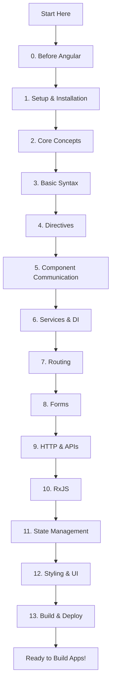

# Angular Learning Roadmap - Complete Guide

Welcome to the comprehensive Angular learning roadmap! This guide will take you from beginner to advanced Angular developer.

## 📚 Table of Contents

### 🎯 Getting Started

- [0. Before Angular (Prerequisites)](./00-before-angular.md)
  - HTML/CSS Basics
  - JavaScript Fundamentals
  - TypeScript Basics
  - Node.js + npm

### 🚀 Core Learning Path

1. [Setup & Installation](./01-setup-and-installation.md)
   - Install Node.js
   - Install Angular CLI
   - Create New Project
   - Run Dev Server
   - Project Structure

2. [Angular Core Concepts](./02-angular-core-concepts-whatwhy.md)
   - What is Angular?
   - SPA (Single Page App)
   - Modules vs Standalone
   - Component
   - Template
   - Decorator
   - Data Binding

3. [Basic Syntax in Templates](./03-basic-syntax-in-templates-daily-use.md)
   - Interpolation `{{ }}`
   - Property Binding `[prop]`
   - Event Binding `(event)`
   - Two-way Binding `[(ngModel)]`
   - Template Reference `#ref`
   - Pipes `|`

4. [Directives](./04-directives-control-the-ui.md)
   - Structural Directives (*ngIf, *ngFor, *ngSwitch)
   - Attribute Directives ([ngClass], [ngStyle])
   - Built-in vs Custom Directives

5. [Component Communication](./05-components-communication-how-components-talk.md)
   - @Input() - Parent → Child
   - @Output() + EventEmitter - Child → Parent
   - Shared Service
   - Content Projection (ng-content)

6. [Services & Dependency Injection](./06-services-and-dependency-injection-di.md)
   - Service
   - Dependency Injection
   - Provider Scope

7. [Routing](./07-routing-multiple-pages-inside-spa.md)
   - Router Basics
   - RouterLink
   - Route Params
   - Query Params
   - Guards
   - Lazy Loading

8. [Forms](./08-forms-user-input.md)
   - Template-driven Forms
   - Reactive Forms
   - Validation
   - Form Submission Patterns

### 🔧 Advanced Topics

9. [HTTP & APIs](./09-http-and-apis.md)
   - HttpClient
   - CRUD Calls
   - Interceptors
   - Environment Config
   - CORS Basics

10. [RxJS Essentials](./10-rxjs-essentials-enough-for-beginners.md)
    - Observable
    - subscribe()
    - Operators (map, tap, switchMap, catchError)
    - Async Pipe
    - Subject/BehaviorSubject

11. [State Management](./11-state-management-beginner-next-step.md)
    - Component State
    - Service State
    - When to use NgRx

12. [Styling & UI](./12-styling-and-ui.md)
    - Component Styles
    - Global Styles
    - View Encapsulation
    - UI Libraries
    - Responsive UI Basics

13. [Build, Deploy & Best Practices](./13-build-deploy-and-best-practices.md)
    - Build
    - Production Optimization
    - Linting & Formatting
    - Testing Basics
    - Folder Structure & Naming

## 🗺️ Learning Path

## 📖 How to Use This Guide

1. **Start from the beginning** - Follow the numbered sequence
2. **Read each section** - Don't skip prerequisites
3. **Practice** - Try the code examples
4. **Build projects** - Apply what you learn
5. **Reference** - Come back to specific topics as needed

## 🎯 Learning Goals by Section

| Section | What You'll Learn | Time Estimate |
|---------|------------------|---------------|
| 0. Before Angular | Prerequisites (HTML, CSS, JS, TS) | 1-2 weeks |
| 1. Setup | Get Angular running on your machine | 1 day |
| 2. Core Concepts | Understand Angular fundamentals | 1 week |
| 3. Basic Syntax | Write your first Angular templates | 3-5 days |
| 4. Directives | Control UI dynamically | 2-3 days |
| 5. Communication | Make components work together | 3-4 days |
| 6. Services & DI | Organize and share code | 2-3 days |
| 7. Routing | Build multi-page apps | 1 week |
| 8. Forms | Handle user input | 1 week |
| 9. HTTP & APIs | Connect to backends | 1 week |
| 10. RxJS | Handle async operations | 1-2 weeks |
| 11. State Management | Manage app-wide state | 1 week |
| 12. Styling | Make beautiful UIs | 3-5 days |
| 13. Build & Deploy | Ship your app | 2-3 days |

## 🔗 Quick Navigation

- [← Previous: Before Angular](./00-before-angular.md) | [Next: Setup & Installation →](./01-setup-and-installation.md)

---

**Happy Learning! 🎉**
