# Azure DevOps & Extensions: End-to-End Mastery Guide

**From ideation → development → marketplace publishing**

This document is your single, well-organized reference to become an **elite** in Azure DevOps and its extension ecosystem. Use it again and again: each part links to your detailed chapter docs and gives you a clear path from beginner to master. **Every important term is defined** and **every important idea has a 2–3 line “in brief & deep” note** so anyone can understand and go both brief and deep.

---

## How to Use This Guide

- **First pass:** Read Part I (Foundations & Ideation), then Part II in order (Levels 0 → 10).
- **Reference:** Use the **Quick Reference** and **Mastery Roadmap** at the end to revisit topics and self-assess.
- **Deep dive:** Each level points to the corresponding chapter file (e.g. `chapter1.md`, `chapter4.md`) for step-by-step builds and code.
- **Capstone:** Use the **Capstone Projects** section to prove mastery with real products.
- **Definitions:** Use the **Glossary** below to look up any term; use the **In brief & deep** notes to lock in understanding.

---

# Glossary: Definitions of Every Term

Use this section whenever you see a term you want to understand clearly. Each definition is short; the “In brief & deep” notes later add 2–3 lines of context.

### A–C

| Term | Definition |
|------|------------|
| **Artifacts** | Azure DevOps package feeds (NuGet, npm, Maven, etc.) where build outputs or external packages are stored and consumed by pipelines. |
| **Assets** | The actual files your extension ships: HTML, JavaScript/CSS, React bundles, images, icons. Listed in the manifest so they are included in the VSIX. |
| **Backlog** | The ordered list of work items (e.g. user stories, bugs) a team plans to do; used on Boards for planning and prioritization. |
| **Build** | A single run of a pipeline that compiles, tests, and/or publishes artifacts; often called a “build run” or “run.” |
| **Circuit breaker** | A pattern that stops calling a failing service after N failures, shows a “busy” message, and only retries after a cooldown to avoid hammering the API. |
| **Contribution** | One “thing” your extension adds to Azure DevOps: e.g. a Hub, a tab, a widget, a menu action. Each has a type, target(s), and properties (e.g. uri). |
| **Contribution type** | The kind of contribution (e.g. `ms.vss-web.hub`, `ms.vss-web.tab`). Tells the host how to render and host your UI. |
| **Continuation token** | A value returned in a response (e.g. header `x-ms-continuationtoken`) that you send back to get the next page of results; you loop until no token. |
| **Context** | The current “where and who” (e.g. project, team, user, PR id). Your extension gets it from the SDK (e.g. getWebContext()) after SDK.ready(). |
| **CRUD** | Create, Read, Update, Delete; the basic operations on data (e.g. documents in ExtensionDataService). |

### D–G

| Term | Definition |
|------|------------|
| **Dashboard** | A customizable page of widgets (tiles) showing charts, queries, build status, etc. Extensions can add widgets via the widget contribution. |
| **Dashboard widget** | A tile users add to a dashboard; your extension provides the HTML/UI and optional configuration page. |
| **Documents** | In ExtensionDataService, a document is a JSON object stored in a named collection; you can create, read, update, delete by id. |
| **Extension** | A packaged set of contributions (Hub, widget, tab, action, etc.) defined by a manifest and shipped as a VSIX; extends Azure DevOps UI and behavior. |
| **ExtensionDataManager** | The client object you get from ExtensionDataService; used to read/write settings and documents for your extension (scoped to user or collection). |
| **ExtensionDataService** | Azure DevOps service that provides storage for your extension (key-value settings and document collections); accessed via SDK.getService(). |
| **getClient()** | Function from azure-devops-extension-api that returns a REST client (e.g. WorkItemTrackingRestClient); auth is handled for you. |
| **getAppToken()** | SDK method that returns a token signed with your extension’s identity; use it when your extension calls your own backend so the backend can verify the caller. |
| **Graph (API)** | Azure DevOps APIs for identity and group membership (users, groups, descriptors); often used for permission or “who is in this group” checks. |

### H–M

| Term | Definition |
|------|------------|
| **Hub** | A full-page view inside Azure DevOps (e.g. under Repos or Boards); your extension contributes a Hub by providing a URI to an HTML page. |
| **Host** | The Azure DevOps web app that loads your extension inside an iframe and provides the SDK, context, and host services (dialog, navigation, etc.). |
| **Idempotency** | Handling the same request/event more than once so it has the same effect as once (e.g. store event id and ignore duplicates); critical for webhooks. |
| **Key namespacing** | Building storage keys that include org/project/team (e.g. `settings:team:{projectId}:{teamId}`) because Extension Data has no built-in “project-only” scope. |
| **Manifest** | The file `vss-extension.json` at the root of your extension; defines id, publisher, version, contributions, files, scopes, and other metadata. |
| **Marketplace** | The Visual Studio Marketplace where Azure DevOps extensions are published; users install from here (or you share privately with an org). |
| **Master/detail** | A UI pattern: a list (master) on one side and details for the selected item on the other; very common in hubs. |

### O–R

| Term | Definition |
|------|------------|
| **Org (organization)** | The top-level Azure DevOps account (e.g. `dev.azure.com/myorg`); contains projects, and extensions are installed at org level. |
| **PAT (Personal Access Token)** | A token that acts like a password for API access; must be kept secret. Never store in extension data or ask users to paste in UI. |
| **Pipeline** | The definition (YAML or classic) of build/release steps; a “run” is one execution. Extensions can show pipeline status or add actions. |
| **Policy** | Branch/PR rules (e.g. required reviewers, build validation); extensions can read policy evaluations to show “pass/fail” on a PR. |
| **PR (Pull Request)** | A request to merge a branch into another; extensions can add tabs (e.g. Quality Gate) or actions (e.g. “Run check”) on the PR page. |
| **Project** | A container under an org for repos, pipelines, boards, and test plans; permissions are often defined at project level. |
| **Publisher** | The Marketplace identity that owns an extension (publisher id in the manifest); you create it when you first publish. |
| **Release** | In “classic” pipelines, a release is a deployment pipeline (e.g. to staging/production); distinct from a single build run. |
| **Repo (repository)** | A Git repository in Azure DevOps; holds source code, branches, and PRs. |
| **REST client** | A typed JavaScript client for an Azure DevOps area (e.g. WorkItemTrackingRestClient); you get it via getClient() and it handles auth and URLs. |
| **Retry-After** | An HTTP header (or in response body) that tells you how many seconds to wait before retrying; you must honor it when present (e.g. on 429). |
| **RBAC** | Role-Based Access Control; defining roles (e.g. Reader, Operator, Admin) and checking permissions before allowing actions. |

### S

| Term | Definition |
|------|------------|
| **Scope (storage)** | In Extension Data: “User” (per user) or “Default” (project collection–shared). There is no built-in project-only scope; use key namespacing. |
| **Scope (permission)** | A permission your extension requests in the manifest (e.g. vso.work, vso.code); admins see these at install and must approve. |
| **SDK** | Azure DevOps Extension SDK (azure-devops-extension-sdk); provides init(), ready(), getAccessToken(), getWebContext(), and host services. |
| **SemVer** | Semantic Versioning: major.minor.patch (e.g. 1.2.3); major = breaking, minor = new feature, patch = fix. Marketplace requires version to increase on each publish. |
| **Service Connection** | A pipeline configuration that stores credentials (e.g. Azure, GitHub) so pipelines can connect to external systems securely. |
| **Service Hook** | An Azure DevOps feature: when an event occurs (e.g. PR created), a subscription sends a payload to a consumer (e.g. webhook URL, Service Bus). |
| **Settings** | In ExtensionDataService, key-value pairs (getValue/setValue); good for config; scoped to User or Project Collection. |
| **Status Policy** | A branch policy that blocks PR completion until a specific PR status (e.g. “quality-gate”) reports success; used for real merge gating. |
| **Subscription** | In Service Hooks, a subscription defines which events (e.g. git.pullrequest.created) go to which consumer (e.g. your webhook URL) and optional filters. |

### T–Z

| Term | Definition |
|------|------------|
| **Target** | The place in the Azure DevOps UI where a contribution appears (e.g. ms.vss-code-web.pr-tabs for a PR tab). Each contribution has a type and target(s). |
| **Tenant** | In multi-tenant apps, one “customer” (e.g. one Azure DevOps org); tenant isolation means Org A’s data is never visible to Org B. |
| **Throttling** | When Azure DevOps limits how many requests you can make; it may return HTTP 429 or send Retry-After; your code must back off and retry. |
| **tfx-cli** | Command-line tool to create and publish VSIX packages; e.g. `tfx extension create`, `tfx extension publish`. |
| **Token** | In this guide: access token (for calling Azure DevOps APIs) or app token (for your extension to call your backend). Never log or store insecurely. |
| **Variable Group** | A set of pipeline variables (often secrets) stored in a library and linked to pipelines; used for config and secrets. |
| **Virtualization** | Rendering only the visible rows of a long list (not all 10k DOM nodes); keeps the UI fast (e.g. FixedHeightList in azure-devops-ui). |
| **VSIX** | The packaged extension file (e.g. myext-1.0.0.vsix); it’s a zip containing the manifest and all files listed in “files”; you publish this to the Marketplace. |
| **WIQL** | Work Item Query Language; SQL-like language for querying work items; query execution returns work item IDs only—you then fetch details by ID. |
| **Work item** | A single unit of work (User Story, Bug, Task, etc.) with fields, state, and links; the core entity on Boards. |
| **Work Item Tracking (WIT)** | The Azure DevOps area for work items: queries, fields, updates, links; API area and scope name (vso.work). |
| **XSS** | Cross-Site Scripting; injecting malicious script into a page. Defend by never rendering unsanitized user/API content as HTML. |
| **429** | HTTP status “Too Many Requests”; Azure DevOps returns it when you are throttled; you must wait (e.g. Retry-After) and retry with backoff. |

---

# Part I — Foundations & Ideation

## 1. Azure DevOps Basics (You Must Have This First)

Before building extensions, be a **power user** of Azure DevOps.

**In brief & deep:** Azure DevOps is Microsoft’s cloud service for source control, CI/CD, work tracking, and testing. Your extension runs inside it and uses its projects, repos, work items, and APIs—so knowing how they fit together (org → project → repo/boards/pipelines) is the foundation for every extension you build.

---

### 1.1 Core Concepts

| Concept | What to Know |
|--------|----------------|
| **Projects** | Container for repos, pipelines, boards, test plans. |
| **Repos** | Git repos, branches, PRs, policies. |
| **Pipelines** | Build/release (YAML or classic). |
| **Artifacts** | Feeds, packages. |
| **Boards** | Work items, queries, backlogs, sprints. |
| **Test Plans** | Test cases, runs, results. |

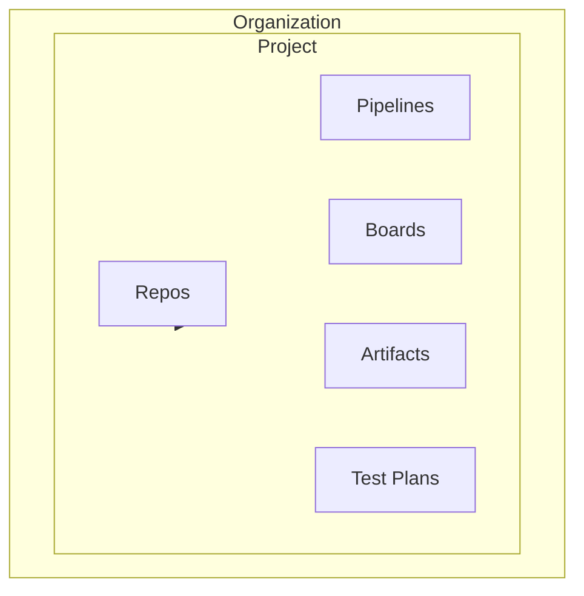

**In brief & deep:** A **Project** is the unit of organization: everything (repos, pipelines, boards) lives under it. **Repos** and **Pipelines** are where code and builds live; **Boards** and **Work items** are where planning and tracking live. Extensions usually operate in the context of “current project” and “current user,” which the SDK gives you after init/ready.

---

### 1.2 Permissions Model

- **Org → Project → Team → Users/Groups**
- Permissions: Allow / Deny / Inherit; **Deny wins**.
- Effective access = object + parents + group memberships.

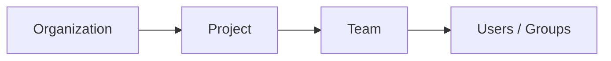

**In brief & deep:** Permissions flow from org down to project, then team and users. A **Deny** anywhere overrides **Allow**; effective access is the combination of the object, its parents, and the user’s group memberships. Your extension runs as the current user—so even if the extension has a scope, the user may get 403 if they lack permission on that resource.

---

### 1.3 Work Items

- Types (User Story, Bug, Task, etc.), fields, relations, links.
- Queries and WIQL (Work Item Query Language).
- Boards and backlogs (planning, triage, drag-and-drop).

**In brief & deep:** **Work items** are the units of work (stories, bugs, tasks) with fields (title, state, assigned to) and links (parent/child, related). **WIQL** is the query language; running a query returns **work item IDs only**—you then call the API to get full details for those IDs. Boards and backlogs are views over work items for planning and sprint management.

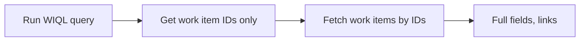

---

### 1.4 Service Connections, Variable Groups, Environments

- How pipelines connect to external systems and use secrets.
- Variable groups and environment approvals.

**In brief & deep:** **Service connections** store credentials (e.g. Azure, GitHub) so pipelines can call external systems. **Variable groups** hold pipeline variables (including secrets). **Environments** (e.g. staging, production) can have approvals and checks. Extensions don’t store these—but understanding them helps when you build pipeline-related or audit features.

### ✅ Foundation Build

**Create a sample project end-to-end:** repo → pipeline → boards → release.

*Details: see `chapter0.md` (Level 0).*

---

## 2. Extension Ideation: From Idea to Scope

**In brief & deep:** Ideation is deciding *what* your extension does and *where* it appears. The manifest declares contributions (Hub, widget, tab, action); each contribution has a **type** (what it is) and a **target** (where it shows). Getting this right up front avoids “I built it but it doesn’t show up” and keeps scope clear for users and admins.

---

### 2.1 What Is an Azure DevOps Extension?

An extension is:

1. **A manifest** — `vss-extension.json` (identity, targets, contributions, files).
2. **Contributions** — What you add: Hub, Dashboard widget, menu action, work item section, PR tab, etc.
3. **Assets** — HTML/JS/CSS (or React bundles) and images packaged in the extension.
4. **A VSIX package** — The file you publish to the Marketplace (or share privately).

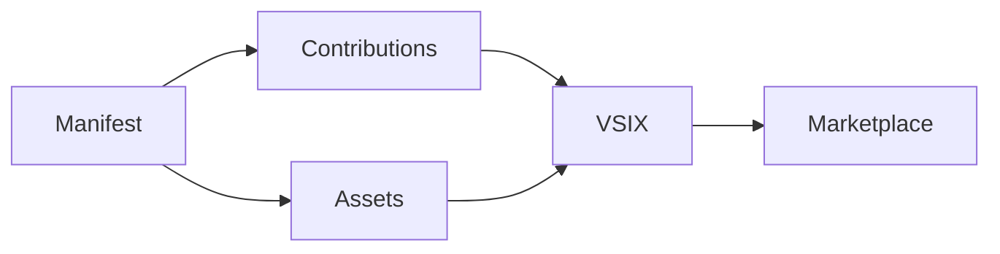

**In brief & deep:** The **manifest** is the contract: it tells Azure DevOps who you are (id, publisher, version), what you add (contributions with type + target + uri), and what files to package (files). The **VSIX** is the zip that gets installed; if a file isn’t in “files,” it won’t be in the package. Contributions are the only way your UI or actions appear in the product.

---

### 2.2 Where Extensions Can Appear

| Contribution Type | Where It Lives | Example |
|-------------------|----------------|---------|
| **Hub** | Full page under a hub group (e.g. Code, Boards) | Custom reports, tools |
| **Dashboard widget** | Dashboard tiles | Team metrics, query results |
| **Work item form** | Group, page, or custom control on work item | SLA, checklist, custom field |
| **PR tab / PR action** | Pull request page | Quality Gate, security scan |
| **Pipeline** | Build/release summary, menus | Release readiness, links |
| **Service Hook consumer** | Service Hooks wizard | Custom webhook target |

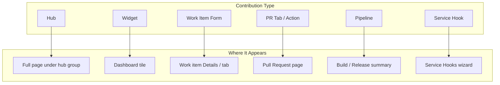

### 2.3 Ideation Checklist

Before coding, answer:

- **Who is this for?** (Org admins, developers, Scrum masters?)
- **What job does it do?** (One clear main job.)
- **Where does it live?** (Hub, PR tab, widget, etc.)
- **What is the success metric?** (e.g. "Reduce PR review time by 20%", "Policy compliance")

**In brief & deep:** One extension should do one main job well. “Who” and “where” drive your contribution type and target; “success metric” drives how you describe and measure the extension. This checklist becomes your overview text, permissions justification, and support story later.

*Product mindset: see `chapter9.md` (Level 9 — Decide what you're shipping).*

---

# Part II — Development (Levels 0–10)

## Level 0 — Foundations (Power User)

**Goal:** Use Azure DevOps confidently so extension context (projects, repos, work items, pipelines) is natural.

**Build:** Create a sample project end-to-end: repo → pipeline → boards → release.

**In brief & deep:** Level 0 is not coding—it’s being a power user. You need to know where projects, repos, pipelines, and boards live and how work items and PRs flow. When you build extensions, the SDK gives you “current project” and “current user”; if you’ve never used the product end-to-end, that context won’t mean much.

**Ref:** `chapter0.md`, `Azure Devops.md` (Level 0 section).

---

## Level 1 — Extension Fundamentals (Hello World → Real)

**Goal:** Ship two working extensions: a **Simple Hub** and a **Simple Dashboard Widget**.

**In brief & deep:** Level 1 is “Hello World” that actually runs inside Azure DevOps. You learn the four pieces: manifest (who/what/where), contributions (Hub + Widget), assets (HTML/JS that loads in an iframe), and VSIX (the package). The single most important habit: **init first, then wait for ready** before using context—otherwise you get blank pages or “undefined” errors.

---

### 1.1 Extension Architecture

- **Manifest** (`vss-extension.json`): identity (id, publisher, version), targets, contributions, files.
- **Contributions:** Hub (`ms.vss-web.hub`), Widget (`ms.vss-dashboards-web.widget`), etc.
- **Scopes:** Organization vs Project context.
- **VSIX:** What gets packaged and published.

**In brief & deep:** The manifest is the only place Azure DevOps learns about your extension: identity (so the Marketplace and host can identify it), targets (where it can run, usually Microsoft.VisualStudio.Services), contributions (each Hub or Widget has a type, target, and uri). Scopes declare what APIs you need; if you don’t list a file in “files,” it won’t be in the VSIX.

---

### 1.2 Dev Setup

- **Node.js** (LTS), editor (e.g. VS Code).
- **tfx-cli:** `npm i -g tfx-cli` or `npx tfx-cli extension create`.
- **TypeScript basics:** types, async/await, import/export.

**In brief & deep:** You need Node to run the packaging tool (tfx-cli) and to build if you use TypeScript/React later. tfx-cli is the official way to create a .vsix from your folder. You can start with plain HTML/JS; TypeScript becomes important when you add REST clients and complex state.

---

### 1.3 SDK Must-Knows

- `SDK.init()` then `SDK.ready()` — **always wait for ready before using context.**
- Context: `getUser()`, `getHost()`, `getWebContext()` (project, team).
- Widget: `VSS.init()`, `VSS.require()`, `VSS.register()`, `notifyLoadSucceeded()`.

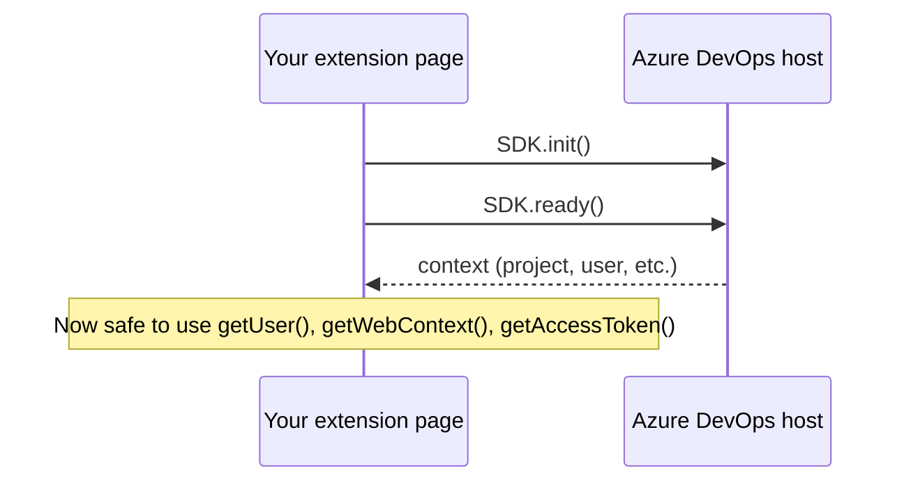

**In brief & deep:** Your page runs in an iframe; the host doesn’t consider it “loaded” until you call init and (for Hub) ready. **getUser/getHost/getWebContext** give you the current user, org name, and project/team—everything else (calling APIs, showing “current project”) depends on this. For widgets, VSS.init + register + notifyLoadSucceeded follow the same idea: tell the host when you’re ready.

### ✅ Level 1 Builds

1. **Simple Hub** — Page showing "Hello, &lt;user&gt;" + org + project.
2. **Simple Dashboard Widget** — Tile with title + project name.

**Ref:** `chapter1.md` (full step-by-step: manifest, hub.html, widget, packaging, publish, debug).

---

## Level 2 — UI Mastery Inside Azure DevOps

**Goal:** Build a **Hub app** with list → detail, add/edit dialog, loading/empty/error states, accessibility, and performance basics.

**In brief & deep:** Level 2 is where your extension stops looking like a demo and starts feeling like a real app. You adopt React + azure-devops-ui so the UI matches the host, and you handle the four states every data-driven UI needs: loading, empty, error, and data. You also learn host modal dialogs (the “real” Azure DevOps modal) and list virtualization so large lists don’t kill the browser.

---

### 2.1 UI Stack

- **React + TypeScript** (recommended).
- **azure-devops-ui** — DevOps look and feel; **React 16.8+** (e.g. 16.14.x) for compatibility.
- **SDK readiness:** `SDK.init({ loaded: false })` then `SDK.notifyLoadSucceeded()` after first render/data.

**In brief & deep:** azure-devops-ui is the same component library Azure DevOps uses—so your Hub looks native (theming, fonts, spacing). It requires React 16.8+ (hooks); 16.14.x is a safe choice. **loaded: false** tells the host “don’t show my content yet”; you call **notifyLoadSucceeded()** when your first render or first data load is done so the host hides the spinner.

---

### 2.2 Patterns

- List + detail (master/detail).
- Embedded dialog vs **host modal dialog** (`ms.vss-web.control` + dialog service).
- State: idle | loading | ready | error; loading/empty/error UX.
- Caching (in-memory for Level 2).

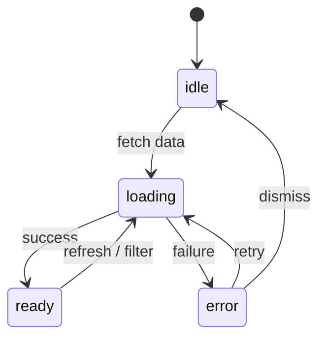

**In brief & deep:** Master/detail means: list on one side, selected item’s details on the other (or below). An **embedded** dialog lives inside your iframe; a **host modal** is the real Azure DevOps modal that blocks the whole page—use it when you want “real” modal behavior (e.g. Add/Edit). Always design for four states: idle, loading, ready, error—so the user never sees a blank screen or unhandled failure.

---

### 2.3 Accessibility & Performance

- Keyboard navigation, ARIA, focus management in dialogs.
- Virtualized lists (e.g. `FixedHeightList` in azure-devops-ui).

**In brief & deep:** Accessibility means: keyboard-only users can reach every control, focus moves into the dialog when it opens and back to the trigger when it closes, and important elements have labels/ARIA. Virtualization means only visible rows are in the DOM—so a list of 10k items doesn’t create 10k DOM nodes and stays scrollable and responsive.

### ✅ Level 2 Build

Hub with: list view, detail view, add/edit dialog, loading/empty/error states, optional host modal dialog.

**Ref:** `chapter2.md` (structure, Common.tsx, hub.tsx, list/detail, dialogs, state, a11y, perf).

---

## Level 3 — Data Storage & Configuration

**Goal:** Store data correctly (user/org/project/team) and build **configuration UIs** (widget config, project/org settings).

**In brief & deep:** Level 3 is where your extension becomes “stateful”: it remembers settings per user, per project, or per team. Extension Data gives you key-value (settings) and document collections; there is no built-in “project-only” scope, so you implement it by **key namespacing** (e.g. include projectId and teamId in the key). You also add configuration pages so users and admins can change behavior without editing code.

---

### 3.1 Extension Data Storage

- **ExtensionDataService** → **ExtensionDataManager** (client APIs).
- **Settings** (key-value) vs **Documents** (collections, CRUD).
- **Scopes:** Project Collection (shared) vs User. No built-in "project-only" — use **key namespacing**: e.g. `settings:team:{projectId}:{teamId}`.

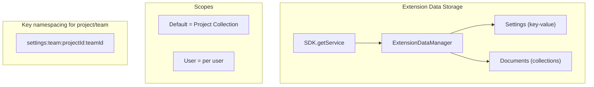

**In brief & deep:** You get the manager via SDK.getService(ExtensionDataService) then getExtensionDataManager(extensionId, token). **Settings** are simple getValue/setValue; **documents** live in named collections and support create/read/update/delete by id. “Project Collection” scope is shared by everyone in the org; “User” is per user. To get “per project” or “per team,” you build keys like `settings:team:{projectId}:{teamId}` and store in Default scope.

---

### 3.2 Configuration Experiences

- **Widget configuration** — `ms.vss-dashboards-web.widget-configuration`, load + onSave.
- **Project Settings hub** — target `ms.vss-web.project-admin-hub-group`.
- **Org Settings hub** — target `ms.vss-web.collection-admin-hub-group`.

**In brief & deep:** A **widget config** contribution is the page that opens when the user clicks “Configure” on a widget; you implement load(widgetSettings, context) and onSave() returning Valid or Invalid. **Project Settings** and **Org Settings** hubs are full pages under Project Settings and Organization Settings; only admins see them—use them for “team-wide” or “org-wide” configuration.

---

### 3.3 Security

- **Never store secrets** (PATs, passwords, tokens) in extension data. PAT = password.

**In brief & deep:** Extension Data is not encrypted for secrets; it’s for preferences and config. Storing a PAT or API key there is like storing a password in plain text. Use host-provided tokens (getAccessToken) for Azure DevOps APIs, and for your own backend use getAppToken and validate it server-side—never ask users to paste PATs into your UI.

### ✅ Level 3 Build

Widget + configuration page storing settings **per project/team** (widget instance + ExtensionDataService with project/team key).

**Ref:** `chapter3.md` (ExtensionDataService, scopes, config contributions, security).

---

## Level 4 — Azure DevOps REST APIs (Core Power)

**Goal:** Call any Azure DevOps API from the extension: auth, getClient, pagination, throttling, and a real feature (Work Item Assistant or PR Quality Panel).

**In brief & deep:** Level 4 is where your extension stops being “UI only” and starts reading and writing Azure DevOps data. You use **getClient()** so auth is handled for you, declare only the **scopes** you need in the manifest, and handle **pagination** (continuation tokens) and **throttling** (429, Retry-After) so the extension works in large orgs. WIT (work items) and Git/Policy (PRs) are the first APIs to master.

---

### 4.1 Authentication

- **Host-provided tokens:** Use **REST clients** (auth automatic) or `SDK.getAccessToken()` for direct calls.
- **Scopes in manifest:** e.g. `vso.work`, `vso.code`, `vso.build` — request **minimum** required.

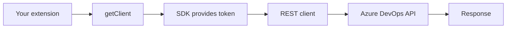

**In brief & deep:** When you use the official REST clients (e.g. getClient(WorkItemTrackingRestClient)), the client gets a token from the SDK and sets the Authorization header—you don’t touch the token. If you call a REST endpoint directly (e.g. fetch), you use SDK.getAccessToken() and set Bearer in the header. Scopes in the manifest are what admins approve at install; request only what you need so approval is easier and risk is lower.

---

### 4.2 API Surfaces (Learn in This Order)

1. **Work Item Tracking (WIT)** — Queries/WIQL (returns IDs only; then fetch by IDs), fields, PATCH updates, relations/links.
2. **Git + PRs + Policies** — Repos, PR metadata, policy evaluations.
3. **Pipelines / Builds / Releases** — Runs, definitions, logs.
4. **Artifacts / Feeds** — vso.packaging.
5. **Test Plans** — vso.test.
6. **Graph / Identity** — vso.graph.
7. **Service Hooks** — Subscriptions, webhooks.

### 4.3 Production-Grade

- **Pagination:** `x-ms-continuationtoken` — loop until no token.
- **Throttling:** Honor **Retry-After**; handle **429** with backoff.
- **Incremental fetch:** e.g. "changes since last time" + cache.

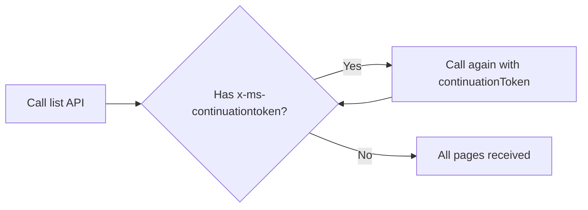

**In brief & deep:** Many list APIs return a continuation token in the response (e.g. header x-ms-continuationtoken); you pass it back in the next request to get the next page—repeat until no token. Throttling means Azure DevOps may return HTTP 429 or send Retry-After; your code must wait (use Retry-After if present, else exponential backoff) and retry. Incremental fetch (“give me items updated since X”) plus caching keeps the UI fast and avoids hammering the API.

### ✅ Level 4 Build (Choose One)

- **Work Item Assistant:** bulk update fields, templates, link related items.
- **PR Quality Panel:** policy status, missing items/checklists, fix steps.

**Ref:** `chapter4.md` (getClient, scopes, WIT/Git/Policy APIs, pagination, retry, capstones).

---

## Level 5 — Contribution Points Deep Dive (Where Mastery Shows)

**Goal:** Place UI in the **exact** places users work: work item form, boards, **PR tabs**, pipelines.

**In brief & deep:** Level 5 is about **placement**: your UI appears exactly where users already work (PR page, work item form, backlog, pipeline). You choose the right **contribution type** (tab, action, form group, etc.) and **target ID** (the host location); the host then injects your page and passes **context** (e.g. pullRequestId, repositoryId for a PR tab). Getting type + target + context right is what makes an extension feel native.

---

### 5.1 Contribution Planning

For each contribution decide:

- **Contribution type** (e.g. `ms.vss-web.tab`, `ms.vss-web.action`).
- **Target ID** (e.g. `ms.vss-code-web.pr-tabs`, `ms.vss-work-web.work-item-form`).
- **Properties** (e.g. uri to your HTML/React app).
- **Context** (e.g. `PullRequestTabExtensionConfig`: pullRequestId, repositoryId).
- **Scopes** — minimal set.

**In brief & deep:** Before coding, fill in: type (what you’re adding), target (where it appears), properties (uri and display name), and what context the host will pass (e.g. PR tab gets pullRequestId and repositoryId). Scopes must include the APIs you’ll call (e.g. vso.code, vso.work for a Quality Gate tab). This planning prevents “it doesn’t show up” or “I don’t have the PR id” issues.

### 5.2 Key Targets

| Area | Targets (examples) |
|------|---------------------|
| Work item | `ms.vss-work-web.work-item-form`, work-item-form-group, work-item-form-page, work-item-form-control, work-item-context-menu |
| Boards/Backlog | backlog-item-menu, backlog-board-card-item-menu, product-backlog-tabs, iteration-backlog-tabs |
| PR | **ms.vss-code-web.pr-tabs**, **ms.vss-code-web.pull-request-action-menu** |
| Pipeline | completed-build-menu, pipelines-header-menu |

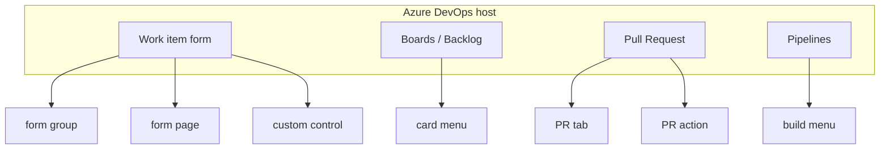

### 5.3 Real Enforcement: PR Status + Status Policy

- **UI tab** = great UX and "fix steps"; it does **not** block merge by itself.
- To **gate merges:** post **Pull Request Status** (pending/succeeded/failed); use a **Status Policy** to require success.

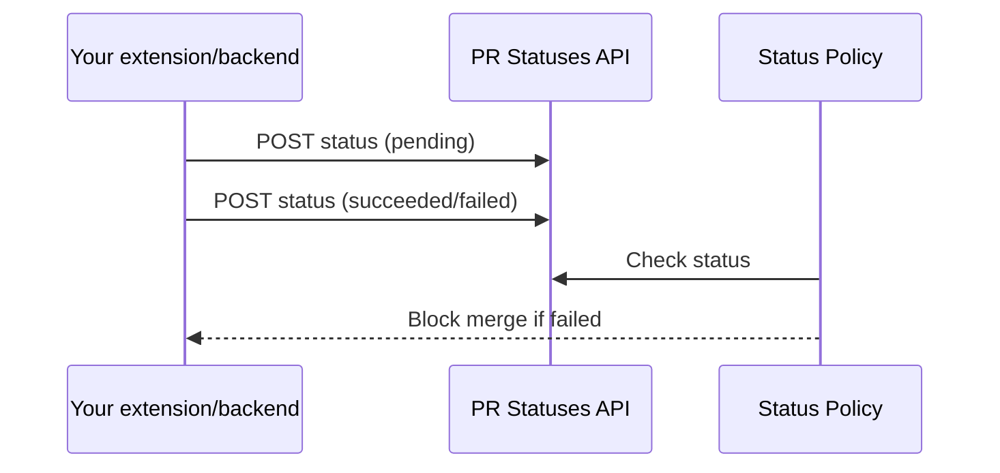

**In brief & deep:** A PR tab is just a view—users can still merge if they ignore it. To **actually block** merge, you post a **PR status** (via the Pull Request Statuses API) with a unique context name (e.g. "quality-gate"); then the org admin adds a **Status Policy** on the branch that requires that status to be “succeeded.” The tab then becomes the “explain why it failed and how to fix it” surface; the policy does the enforcement.

### ✅ Level 5 Build: Quality Gate PR Panel

- **PR tab** that: checks linked work items, policy compliance, shows pass/fail + fix steps.
- Optional: post PR status + Status Policy for real gating (often with a small backend).

**Ref:** `chapter5.md` (contribution mindset, work item/boards/PR/pipeline targets, Quality Gate build, PR Status).

---

## Level 6 — Events & Automation (Beyond UI)

**Goal:** **Always-on** behavior: Service Hooks → backend → process → optionally post PR status + audit trail.

**In brief & deep:** Level 6 is “automation without a user opening your UI.” When something happens in Azure DevOps (e.g. PR created), a **Service Hook subscription** sends a payload to your **webhook**; your backend validates it, processes it (e.g. run checks), and can post a **PR status** back. You must respond quickly (return 200 and process async), validate with a shared secret, and use **idempotency** (event id) so retries don’t double-process.

---

### 6.1 Service Hooks

- **Flow:** Publisher → Subscription (filters) → Consumer (e.g. Webhooks, Azure Service Bus, Storage).
- **Events:** e.g. `git.pullrequest.created`, `workitem.created`, `build.complete`.
- **Create subscription:** UI (Project Settings → Service hooks) or REST (Subscriptions API).

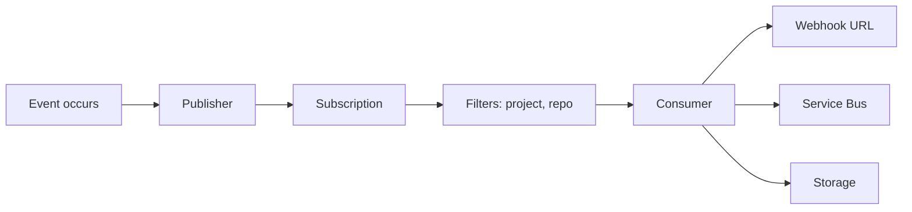

**In brief & deep:** A **publisher** emits events (e.g. “PR created”); a **subscription** says “when this event happens for this project/repo, send to this consumer.” The consumer can be a webhook URL (your backend), Azure Service Bus, or Storage. You create subscriptions in the UI (Service hooks) or via the Subscriptions REST API; webhooks cannot target localhost—you need a public HTTPS URL.

---

### 6.2 Webhook Receiver (Security + Reliability)

- **HTTPS only;** no localhost in production.
- **Shared secret** (header) to validate requests.
- **Idempotency:** store event ID; ignore duplicates (retries, replays).
- **Respond fast:** validate → enqueue → return 200; process async.

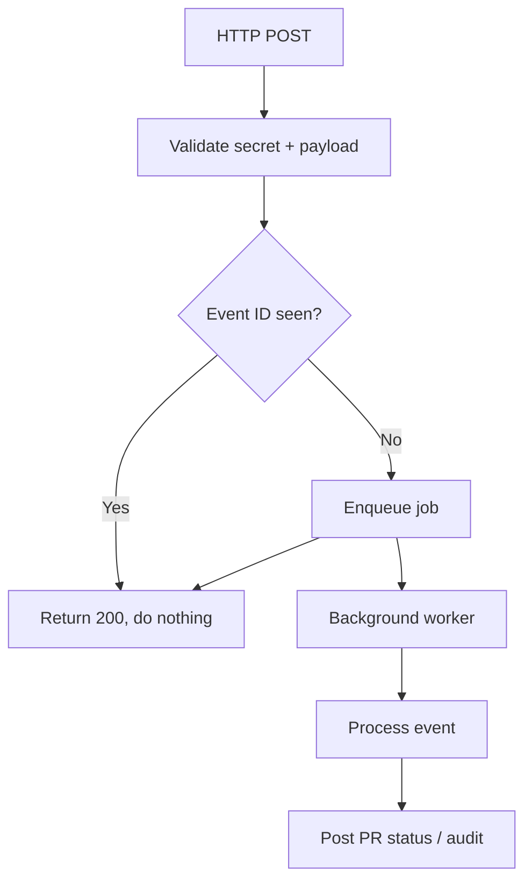

**In brief & deep:** Your receiver must use **HTTPS** so the payload isn’t sent in the clear. Add a **shared secret** in a header (e.g. X-MySecret) and reject requests that don’t match. **Idempotency** means: store the event id from the payload; if you’ve already processed it, return 200 and do nothing—so Azure DevOps retries or replays don’t run the same logic twice. Return **200 quickly** (after validation and enqueue); do heavy work in a background worker so you don’t time out and trigger retries.

---

### 6.3 Backend

- When: webhooks, heavy work, external integrations, audit, posting status back.
- Options: Azure Functions (recommended), Node/Express, or hybrid.
- Storage: e.g. tenants, audit_events, processed_events.
- **Token strategy:** OAuth app (multi-tenant) or PAT (internal only, locked down).

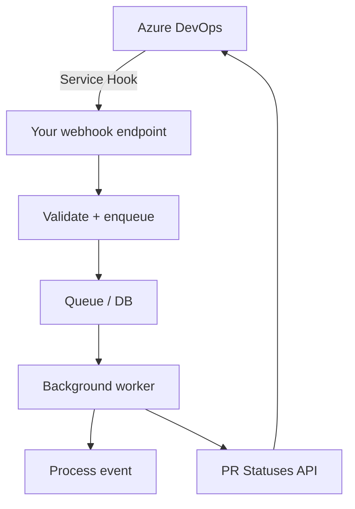

**In brief & deep:** You need a backend when: events must be processed without a user (webhooks), work is heavy (e.g. scanning), or you post status back to Azure DevOps (your backend needs a token). **Azure Functions** is a good fit (HTTP trigger → queue → worker). Store at least: which org/project, event id (for idempotency), and audit (what you did). For posting back, use OAuth for multi-tenant or a locked-down PAT for internal use only.

---

### 6.4 Posting Back to ADO

- **Pull Request Statuses API** — POST status with unique `context.name`; Status Policy can block merge.

**In brief & deep:** The Pull Request Statuses API lets you create a status (pending → succeeded or failed) with a **context.name** that uniquely identifies your check (e.g. "quality-gate"). Branch policies can then add a **Status Policy** that blocks merge until that context reports success. Your backend calls the API with a token (PAT or OAuth) so the status is posted even when no user has the PR tab open.

### ✅ Level 6 Build

Extension + backend: subscribe to **PR created** → webhook receiver → process → post PR status + write audit trail.

**Ref:** `chapter6.md` (Service Hooks, webhook security, backend design, PR status, optional custom consumer).

---

## Level 7 — Security & Enterprise Hardening

**Goal:** Make the extension **trustworthy**: least privilege, permission checks, tenant isolation, no secrets in storage, threat awareness.

**In brief & deep:** Level 7 is about **trust**: enterprise admins want to know what your extension can access (scopes), that you check user permissions before sensitive actions, that you never store secrets in extension data, and that one org’s data can never leak to another (tenant isolation). You also defend against XSS, webhook spoofing, and dependency vulnerabilities so the extension is safe to install in locked-down orgs.

---

### 7.1 Two Gates

- **Extension scopes** (manifest) — what the extension *can* do; admins approve at install.
- **Azure DevOps permissions** — what the *user* may do; always check before sensitive actions.

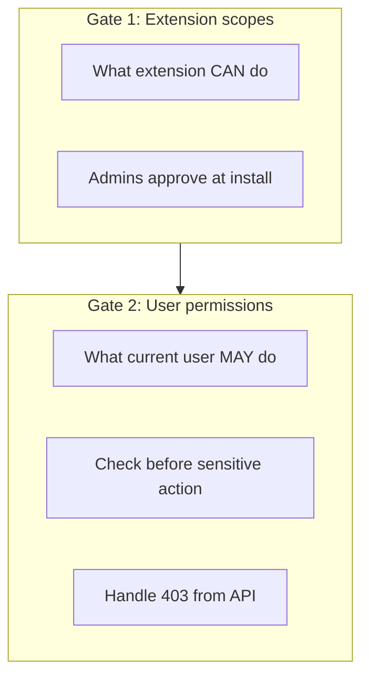

**In brief & deep:** **Scopes** are the extension’s capability boundary: “this extension can read/write work items.” Admins see them at install. **Permissions** are the user boundary: “this user may edit work items in this project.” Even if the extension has vso.work_write, the current user might not—so before bulk update or admin actions, check permission (e.g. Security API hasPermissionsBatch) and always handle 403 from the API.

---

### 7.2 Practices

- **Minimize scopes;** avoid high-privilege scopes unless necessary (and document).
- **Permission checks:** Use Security API (e.g. hasPermissionsBatch) before enabling actions; handle 403 gracefully.
- **Secrets:** Never in ExtensionDataService; no PAT in UI; backend: validate getAppToken().
- **Tenant isolation:** Every key/document includes org + project; never cross-tenant reads.

**In brief & deep:** Request only the scopes you need so approval is easier and risk is lower. Before showing “Bulk update” or “Configure,” call the permission API and disable the feature if the user lacks permission; still handle 403 from the API as the final truth. Never store PATs or passwords in Extension Data; for extension→backend calls use getAppToken() and validate the token on the server. Every stored key or document must include org (and project) so Org A can never read Org B’s data.

---

### 7.3 Compliance & Threats

- **Logging:** No tokens/PII in logs; do log tenant, action, result, correlation ID.
- **Threats:** XSS (sanitize, no unsafe HTML), API misuse (confirmations, dry-run, audit), webhook spoofing (secret + idempotency), dependency vulnerabilities (lockfile, audit, Dependabot).

**In brief & deep:** Log enough to debug and audit (tenant, action, result, correlation id) but **never** log tokens, full payloads, or PII. **XSS**: never render unsanitized user or API content as HTML (no dangerouslySetInnerHTML without sanitization). **API misuse**: require confirmation for destructive actions, offer dry-run, and keep an audit trail. **Webhook spoofing**: validate shared secret and use idempotency. **Dependencies**: commit lockfiles, run npm audit, use Dependabot/Renovate.

### ✅ Level 7 Build

Add **RBAC** (e.g. Reader / Operator / Admin) and **secure configuration** (Project Settings, permission checks, audit trail).

**Ref:** `chapter7.md` (scopes, permissions, secrets, tenant isolation, RBAC, SECURITY.md).

---

## Level 8 — Performance, Reliability, and Scale

**Goal:** Extensions that stay **fast and reliable** with 10k+ work items and heavy usage.

**In brief & deep:** Level 8 is about **scale and resilience**: your extension must feel fast in large orgs (10k+ work items) and not break when the API throttles or fails. You use **two-phase fetch** (get IDs first, then details for visible rows), **virtualization** so long lists don’t create thousands of DOM nodes, **caching** (in-memory and optionally Extension Data), and **retry/circuit breaker** so transient failures don’t spam the user or the API.

---

### 8.1 Performance

- **Two-phase fetch:** Get minimal index (e.g. IDs) first; fetch details only for what’s visible.
- **Pagination:** Support **continuation tokens** everywhere the API offers them.
- **Background fetch:** Show UI immediately; load data progressively; use AbortController when filters change.
- **Caching:** L1 (in-memory), L2 (ExtensionDataService), L3 (backend when needed).
- **Virtualization:** Virtualized lists (e.g. FixedHeightList) for large tables.

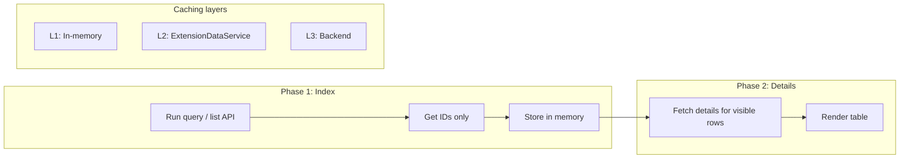

**In brief & deep:** **Two-phase fetch** means: first call returns only IDs (or minimal metadata); then you fetch full details only for the rows the user sees (and maybe the next page). That keeps the first paint fast and avoids loading 10k work item bodies at once. **Continuation tokens** let you page through large result sets without missing data. **Virtualization** renders only visible rows so the DOM stays small and scrolling stays smooth. **Caching** (L1 in memory, L2 in Extension Data, L3 in backend) avoids repeated heavy calls.

---

### 8.2 Reliability

- **Retry/backoff:** Honor Retry-After; on 429, exponential backoff.
- **Circuit breaker:** After N failures, stop calling; show "Service busy"; retry after cooldown.
- **Concurrency:** Limit concurrent API calls (e.g. 2–4); batch where possible.

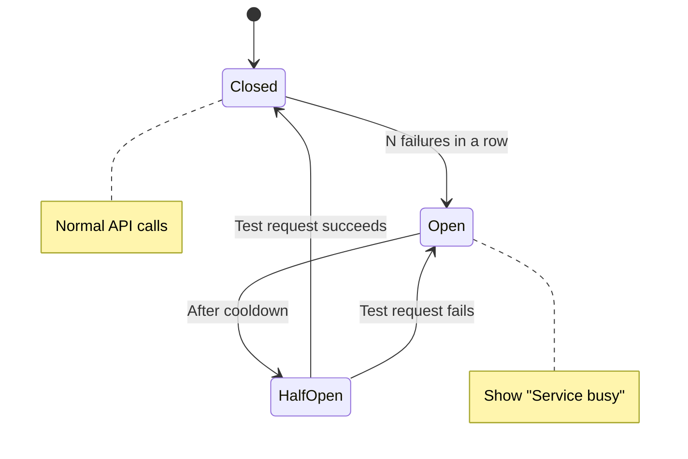

**In brief & deep:** When Azure DevOps returns **429** or sends **Retry-After**, your code must wait (use Retry-After if present, else exponential backoff) and retry—otherwise you keep hammering and stay throttled. A **circuit breaker** stops calling after N consecutive failures, shows "Service busy," and only retries after a cooldown so the user and the API get relief. **Concurrency limits** (e.g. max 2–4 in-flight API calls) prevent your own code from causing throttling.

---

### 8.3 Observability

- Structured logs (feature, action, duration, result, cache hit, throttled).
- Metrics: call counts, cache hit rate, p95 duration, throttle count.

**In brief & deep:** **Structured logs** (JSON or key-value) make it easy to search and aggregate: feature name, action (e.g. fetch-index), duration, result (success/fail), cache hit/miss, throttled (true/false). **Metrics** you care about: how many API calls per minute, cache hit rate, p95 duration for report load, and how often you got 429 or Retry-After—so you can tune and debug in production.

### ✅ Level 8 Build

**Reporting Hub:** filters, summary tiles (fast), virtualized table, continuation tokens, caching, retry/circuit breaker.

**Ref:** `chapter8.md` (two-phase fetch, caching, virtualization, retry, circuit breaker, observability).

---

## Level 9 — Marketplace & Productization (Masters Ship Products)

**Goal:** Package, version, publish, document, and support an extension like a **product**.

**In brief & deep:** Level 9 is **shipping**: packaging a clean VSIX (under 50 MB), versioning so every publish increases the version, maintaining dev vs prod extensions so you don’t test risky builds on real users, and writing listing content and docs so users and admins trust and adopt the extension. Support and release notes matter as much as code for long-term success.

---

### 9.1 Packaging & Versioning

- **VSIX:** `npx tfx-cli extension create`; keep **&lt; 50 MB** (bundle, tree-shake, no test/screenshots in package).
- **Version:** SemVer; **version must increase** on every publish (use `--rev-version` or Git-driven bumps).
- **Dev vs Prod:** Maintain **two extensions** (e.g. `myext` and `myext-dev`) with separate manifests; test on dev, ship prod.

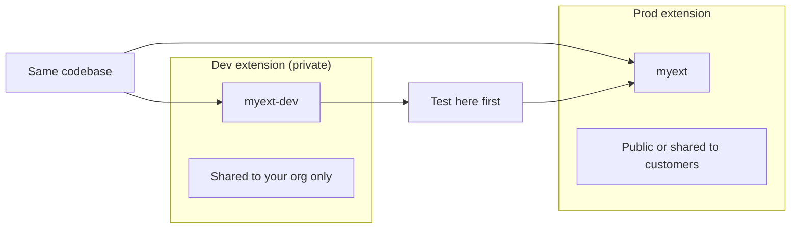

**In brief & deep:** The **VSIX** is built from your folder; only files listed in the manifest “files” section are included—so exclude tests, storybooks, and duplicate assets to keep size under 50 MB (Microsoft recommends optimizing if larger). The Marketplace **rejects** a publish if the version doesn’t increase; use **--rev-version** to auto-bump patch or use Changesets/semantic-release. **Dev vs prod** means two extension IDs (e.g. myext-dev and myext) with separate manifests so you test on dev and only publish prod when ready.

---

### 9.2 Distribution

- **Private by default;** share with org to install.
- **Public:** Verified publisher; manifest `public: true` or galleryFlags; may require demo/review.

**In brief & deep:** New extensions are **private** by default—they don’t appear in public search. You **share** them with specific orgs so those orgs can install. To make an extension **public**, you need a **verified publisher** and set public: true (or galleryFlags) in the manifest; Microsoft may require a demo or content review. Public listing increases visibility but also scrutiny (docs, support, compatibility).

---

### 9.3 Publishing

- **PAT:** All accessible organizations + **Marketplace (publish)** scope.
- **Service principal** for enterprise automation.
- Command pattern: `tfx extension publish --publisher ... --manifest-globs ... --share-with ...`

**In brief & deep:** To publish via CLI you need a **PAT** with **All accessible organizations** (publishing APIs are org-agnostic) and **Marketplace (publish)** scope—missing either causes publish to fail. The command is `tfx extension publish --publisher &lt;id&gt; --manifest-globs vss-extension.json --share-with &lt;org&gt;`. For automation, use a **service principal** and token flow instead of a long-lived PAT when possible.

---

### 9.4 Listing & Docs

- **Overview,** screenshots (e.g. 1366×768), links: support, get started, privacy, license.
- **Docs pack:** Setup, Permissions & scopes, Troubleshooting, FAQ.
- **Release notes:** Added, Changed, Fixed, Security, Breaking, Upgrade notes, Support.

**In brief & deep:** The **overview** and **screenshots** (recommended 1366×768) are what users see first—make them clear and consistent. **Links** (support, get started, privacy, license) reduce support load and build trust. **Docs** should cover: how to install and configure, what scopes you request and why, common problems and fixes, and an FAQ (e.g. “Does it work on Azure DevOps Server?”). **Release notes** for every version (Added/Changed/Fixed/Security/Breaking/Support) show you maintain the extension.

---

### 9.5 Support & Maintenance

- Support channel and response expectations.
- Deprecation: announce, keep 1–2 versions, migration path, then remove in major.
- Use Marketplace reporting (acquisitions, uninstalls, reviews).

**In brief & deep:** Define **where** users ask questions (e.g. GitHub Issues, email) and **how fast** you aim to respond; document this in the listing. When you **deprecate** a feature, say so in the UI and docs, keep it working for 1–2 versions, provide a migration path, then remove in a major version. Use the **Marketplace reporting hub** (acquisitions, uninstalls, uninstall reasons, reviews) to improve the product and respond to feedback.

### ✅ Level 9 Build

Polish **one** extension to market-ready: dev/prod manifests, clean VSIX, listing, docs, release notes, support plan.

**Ref:** `chapter9.md` (product mindset, packaging, versioning, listing, pricing/BYOL, docs, support, checklist).

---

## Level 10 — Advanced Ecosystem (True Master Tier)

**Goal:** **Product-team** habits: tests, monorepo, CI/CD for multiple extensions.

**In brief & deep:** Level 10 is **product engineering**: you stop fearing refactors (tests catch regressions), share code across extensions (monorepo with core/api/ui packages), and ship reliably (CI builds, tests, packages VSIX, and optionally publishes). You abstract the SDK behind an adapter so tests don't depend on the real host, and you test logic, UI behavior, API wrappers, and webhook contracts so the extension stays maintainable.

---

### 10.1 Testing

- **Unit:** Pure logic, rules engine, pagination, retry, config validation (Jest/Vitest).
- **UI:** Component behavior (React Testing Library); mock platform/SDK via **adapter** (don’t mock SDK directly).
- **Integration:** API wrapper layer with mocked HTTP (nock/msw); paging, throttling, partial failure.
- **Contract:** Webhook payloads; idempotency, secret validation, schema evolution.

**In brief & deep:** **Unit tests** cover pure logic (rules engine, pagination, retry, config)—no network or DOM. **UI tests** cover component behavior (loading/empty/error/data) with React Testing Library; you **mock your platform adapter** (not the SDK directly) so tests don't depend on Azure DevOps. **Integration tests** cover your API wrapper with mocked HTTP (nock/msw) for paging and throttling. **Contract tests** for webhooks validate payload parsing, idempotency, and secret validation so backend changes don't break silently.

---

### 10.2 Monorepo

- **Shared packages:** `core` (logging, retry, context, storage keys), `api` (clients, paging), `ui` (Loading/Empty/Error, VirtualizedTable), `test-utils` (mocks, fixtures).
- **Tooling:** pnpm workspaces, Turborepo (or Nx); shared TS/ESLint/Prettier.

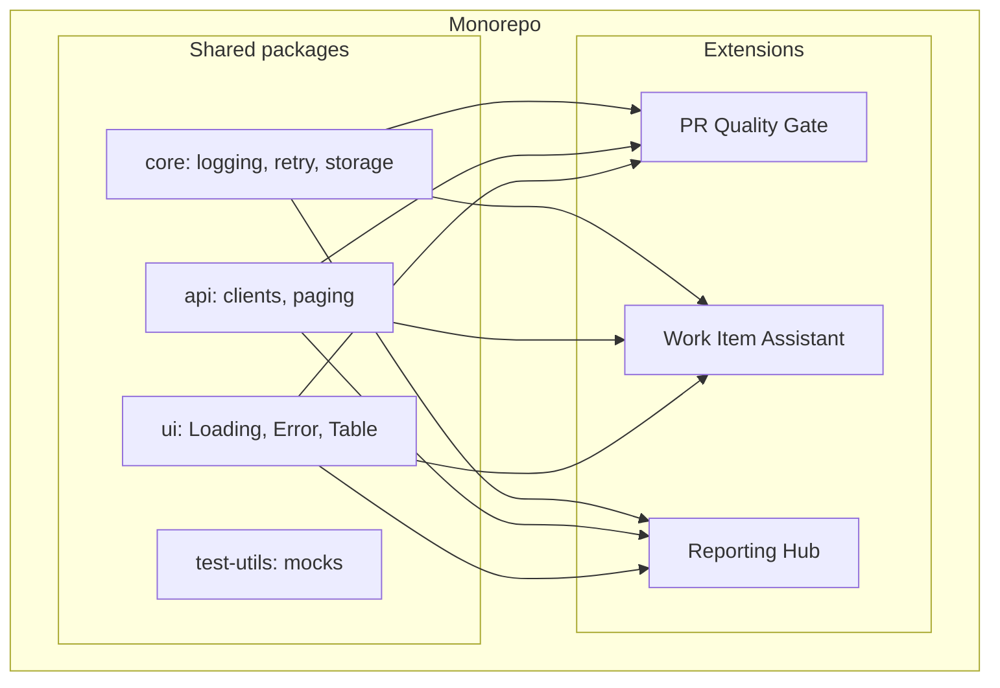

**In brief & deep:** A **monorepo** holds multiple extensions and shared packages in one repo. **core** = logging, retry, context, storage key helpers. **api** = getClient wrappers, paging, throttling. **ui** = shared components (Loading/Empty/Error, VirtualizedTable). **test-utils** = mocks and fixtures. pnpm workspaces + Turborepo (or Nx) give you one install, one build, and cached tests; shared TS/ESLint/Prettier keep style and types consistent.

---

### 10.3 CI/CD

- **Version:** --rev-version at publish or Changesets/semantic-release.
- **Package:** One command builds all extensions and produces VSIX (size check &lt; 50 MB).
- **Publish:** Dev first (e.g. main), then prod (manual approval); PAT with Marketplace publish + All orgs.

**In brief & deep:** **Version** must increase every publish; use --rev-version at publish time or Changesets/semantic-release for Git-driven SemVer. **Package** = one script that builds packages, builds each extension, runs tfx extension create, and outputs VSIX (and optionally fails if size &gt; 50 MB). **Publish** = run tests first, then publish dev extension (e.g. on main), then prod only after manual approval; PAT must have All orgs + Marketplace (publish) scope.

---

### ✅ Level 10 Build

**Monorepo** with 2–3 extensions (e.g. PR Quality Gate, Work Item Assistant, Reporting Hub) sharing core/api/ui; tests; pipeline that builds, tests, packages, and optionally publishes.

**Ref:** `chapter10.md` (testing strategy, SDK adapter, monorepo layout, scripts, pipeline skeleton).

---

# Part III — Marketplace Publishing (End-to-End)

**In brief & deep:** Part III is the **shipping checklist**: before you publish, you confirm dev/prod manifests, versioning, VSIX size, scopes, listing content, docs, and support. The publish flow is: package (tfx extension create) → publish (tfx extension publish with PAT) → install in org → verify. Going public requires a verified publisher and often a demo or review; maintaining quality (docs, support, compatibility) keeps the extension trusted.

---

## 1. Pre-Publish Checklist

- [ ] Dev and prod manifests (separate extension IDs).
- [ ] Version increases every publish (SemVer + --rev-version or automation).
- [ ] VSIX &lt; 50 MB; no secrets in code or extension data.
- [ ] Scopes minimal and documented; permission checks where needed.
- [ ] Overview, screenshots, support/get started/privacy/license links.
- [ ] Setup, permissions, troubleshooting, FAQ docs.
- [ ] Release notes template; support channel defined.

## 2. Publish Flow

1. **Package:** `npx tfx-cli extension create` (from extension directory).
2. **Publish:** `tfx extension publish --publisher &lt;ID&gt; --manifest-globs vss-extension.json --share-with &lt;org&gt;` (add `--rev-version` for auto bump).
3. **Install:** In org, install from Marketplace (or private share); configure if needed.
4. **Verify:** Use extension in real project; check permissions and behavior.

```mermaid
flowchart LR
    Pkg[Package\n tfx extension create] --> Pub[Publish\n tfx extension publish]
    Pub --> Inst[Install\n Org admin]
    Inst --> Ver[Verify\n Use in project]
```

**In brief & deep:** **Package** creates the .vsix from your folder using the manifest’s “files” section. **Publish** uploads to the Marketplace; you need a PAT with All orgs + Marketplace (publish). **--share-with** makes the extension installable by that org. **Install** is done by the org admin from the Marketplace (or from your private share). **Verify** means using the extension in a real project and checking that scopes and behavior match expectations.

---

## 3. Going Public

- Verified publisher; extension meets Marketplace policies.
- Set `public: true` or galleryFlags; submit for review if required.
- Maintain quality: docs, support, compatibility, deprecation strategy.

**In brief & deep:** **Going public** means your extension appears in public search and any org can install it. You need a **verified publisher** (Microsoft verifies your identity) and the extension must meet Marketplace policies (works with Azure DevOps, owned by you, maintained). Set public: true or galleryFlags in the manifest; Microsoft may request a demo or content review. After going public, maintain docs, support, and compatibility so the extension stays trusted.

*Full detail: `chapter9.md`.*

---

# Quick Reference

```mermaid
flowchart LR
    subgraph Lifecycle["Extension lifecycle"]
        I[Ideation] --> D[Development]
        D --> P[Package VSIX]
        P --> Pub[Publish]
        Pub --> M[Marketplace / Install]
    end
```

**In brief & deep:** The Quick Reference is your **cheat sheet**: manifest sections (identity, targets, contributions, files, scopes), SDK rules (init → ready, notifyLoadSucceeded, getClient), scope-to-need mapping, and contribution type ↔ target examples. Use it when you’re coding and need to recall “what’s the PR tab target?” or “what scope do I need for work items?” without re-reading a full chapter.

---

## Manifest (vss-extension.json) Core

| Section | Purpose |
|--------|---------|
| id, publisher, version, name, description | Identity |
| targets | Where it runs (e.g. Microsoft.VisualStudio.Services) |
| contributions | What you add (type, targets, properties, uri) |
| files | What’s in the VSIX (path, addressable, packagePath) |
| scopes | Permissions (vso.work, vso.code, vso.build, …) |
| content, links | Marketplace content and links |

**In brief & deep:** The manifest is the **single source of truth** for identity (who you are), targets (where the extension can run), contributions (what you add and where), files (what gets packaged), and scopes (what APIs you’re allowed to use). If a file isn’t in “files,” it won’t be in the VSIX; if a scope isn’t listed, your extension can’t call that API.

---

## SDK Golden Rules

- Call `SDK.init()` then `await SDK.ready()` before any context/API use.
- For host to show content: `SDK.init({ loaded: false })` then `SDK.notifyLoadSucceeded()` when ready.
- Use **getClient()** for REST where possible (auth handled); otherwise `SDK.getAccessToken()`.

**In brief & deep:** **init then ready** is non-negotiable: the host doesn’t give you context until the handshake is done. **loaded: false + notifyLoadSucceeded()** lets the host show a spinner until your first render or data load. **getClient()** gives you typed REST clients with auth handled; use it for WIT, Git, Policy, etc.; use getAccessToken() only when no client exists.

---

## Scopes (Minimal Set)

| Need | Scope(s) |
|------|----------|
| Work items (read/write) | vso.work / vso.work_write |
| Code, PRs, policies | vso.code |
| PR/commit status (post) | vso.code_status |
| Builds | vso.build |
| Releases | vso.release |
| Artifacts | vso.packaging |
| Test | vso.test |
| Identity/groups | vso.graph |

**In brief & deep:** Scopes are **permission requests**; admins see them at install and must approve. Request only what you need: vso.work for work items, vso.code for repos/PRs/policies, vso.code_status if you post PR status, vso.build for pipelines. High-privilege scopes (e.g. delete source, manage identities) get extra scrutiny—avoid unless the feature truly needs them.

---

## Contribution Types ↔ Targets (Examples)

| Contribution | Type | Target (example) |
|--------------|------|-------------------|
| Hub | ms.vss-web.hub | ms.vss-code-web.code-hub-group |
| Widget | ms.vss-dashboards-web.widget | ms.vss-dashboards-web.widget-catalog |
| PR tab | ms.vss-web.tab | ms.vss-code-web.pr-tabs |
| PR action | ms.vss-web.action | ms.vss-code-web.pull-request-action-menu |
| Work item group | ms.vss-work-web.work-item-form-group | ms.vss-work-web.work-item-form |
| Widget config | ms.vss-dashboards-web.widget-configuration | ms.vss-dashboards-web.widget-configuration |

```mermaid
flowchart LR
    Type[Contribution type] --> Target[Target ID]
    Target --> Where[Where it appears]
    Hub[ms.vss-web.hub] --> CodeHub[code-hub-group]
    Tab[ms.vss-web.tab] --> PRTabs[pr-tabs]
    Widget[ms.vss-dashboards-web.widget] --> Catalog[widget-catalog]
```

**In brief & deep:** Each contribution needs a **type** (what it is: hub, tab, widget, action) and a **target** (where it appears: e.g. pr-tabs, work-item-form). The target ID is a string the host uses to inject your UI; if the target is wrong, your contribution won’t show up. Use the official targets list (Microsoft Learn) when adding a new contribution.

---

## Reliability One-Liners

- **Pagination:** Follow `x-ms-continuationtoken` until absent.
- **Throttling:** On 429 or Retry-After, wait then retry with backoff.
- **Webhooks:** HTTPS, secret header, idempotency by event ID, respond 200 quickly and process async.

**In brief & deep:** **Pagination:** many list APIs return x-ms-continuationtoken; pass it back in the next request and loop until the header is absent—otherwise you miss data in large orgs. **Throttling:** on 429 or Retry-After, wait (use header if present, else exponential backoff) then retry. **Webhooks:** use HTTPS, validate a shared secret, store event id for idempotency, and return 200 quickly while processing in the background.

---

# Mastery Roadmap (Self-Assessment)

**In brief & deep:** The Mastery Roadmap is a **self-assessment table**: each level has one “key capability” you should be able to do confidently. Rate yourself (e.g. Not yet / Getting there / Confident) and revisit levels where you’re weak. Use the Ref column to open the chapter and practice until that capability is solid—then move to the next level or a capstone project.

---

Use this to revisit and rate yourself (e.g. 1–5 or Not yet / Getting there / Confident).

| Level | Key Capability | Ref |
|-------|----------------|-----|
| 0 | Use Azure DevOps as a power user (project, repo, pipeline, boards) | chapter0 |
| 1 | Ship a Hub + a Widget; manifest, SDK init/ready, package, share | chapter1 |
| 2 | Hub with list/detail, dialog, loading/empty/error, a11y | chapter2 |
| 3 | Widget + config page; ExtensionDataService; project/team keying | chapter3 |
| 4 | Call WIT/Git/Policy APIs; getClient; pagination; retry; Work Item or PR panel | chapter4 |
| 5 | PR tab (e.g. Quality Gate); correct targets; PR context; optional PR Status | chapter5 |
| 6 | Service Hook → backend → validate → process → PR status + audit | chapter6 |
| 7 | Least privilege scopes; permission checks; no secrets in storage; tenant isolation | chapter7 |
| 8 | Two-phase fetch; virtualization; caching; retry; circuit breaker | chapter8 |
| 9 | Dev/prod manifests; versioning; listing; docs; support; market-ready | chapter9 |
| 10 | Tests; monorepo (core/api/ui); CI/CD producing VSIX; multi-extension | chapter10 |

---

# Capstone Projects (Prove Mastery)

**In brief & deep:** Capstone projects **combine multiple levels** into one real product: PR Quality Suite (Levels 4–6), Delivery Dashboard (4 + 8), Ops Automation (6 + 7), Work Item Productivity (3–5). Picking two and building them end-to-end proves you can ideate, develop, and ship—and gives you portfolio pieces and deep understanding of the full stack.

---

Pick **two** to be very strong:

| Project | What It Combines | Chapters |
|---------|------------------|----------|
| **PR Quality Suite** | PR tab + policy insights + work item rules + checklist engine | 4, 5, 6 |
| **Delivery Dashboard** | Pipeline runs + work items + deployments in one hub | 4, 8 |
| **Ops Automation** | Service Hooks + backend + rules + notifications (e.g. Teams/Slack) | 6, 7 |
| **Work Item Productivity** | Templates, bulk edit, auto-linking, reporting | 3, 4, 5 |

---

# Document Map (Your Chapter Files)

**In brief & deep:** The Document Map tells you **which chapter file to open** for each topic. Each chapter has step-by-step builds, code patterns, and checklists; the mastery doc gives you the roadmap and definitions, the chapters give you the depth. Use the map when you want to “go deep” on a level or look up a specific contribution type or API.

---

| File | Content |
|------|---------|
| `chapter0.md` | Level 0 — Foundations outline |
| `chapter1.md` | Level 1 — Hub + Widget step-by-step, manifest, SDK, pack, publish, debug |
| `chapter2.md` | Level 2 — UI stack, hub structure, list/detail, dialogs, state, a11y, perf |
| `chapter3.md` | Level 3 — ExtensionDataService, scopes, config pages, security |
| `chapter4.md` | Level 4 — REST APIs, getClient, WIT/Git/Policy, pagination, retry, capstones |
| `chapter5.md` | Level 5 — Contribution points, targets, Quality Gate PR panel, PR Status |
| `chapter6.md` | Level 6 — Service Hooks, webhook security, backend, PR status, audit |
| `chapter7.md` | Level 7 — Security, scopes, permissions, RBAC, tenant isolation, threats |
| `chapter8.md` | Level 8 — Performance, two-phase fetch, caching, virtualization, reliability |
| `chapter9.md` | Level 9 — Packaging, versioning, listing, docs, support, market-ready |
| `chapter10.md` | Level 10 — Testing, monorepo, CI/CD, multi-extension |
| `Azure Devops.md` | Condensed level summary (all levels) |

---

*Use this guide repeatedly: follow the roadmap, tick off levels, build the capstones, and ship. You’ll have a clear path from ideation to marketplace and elite-level mastery of Azure DevOps extensions.*
